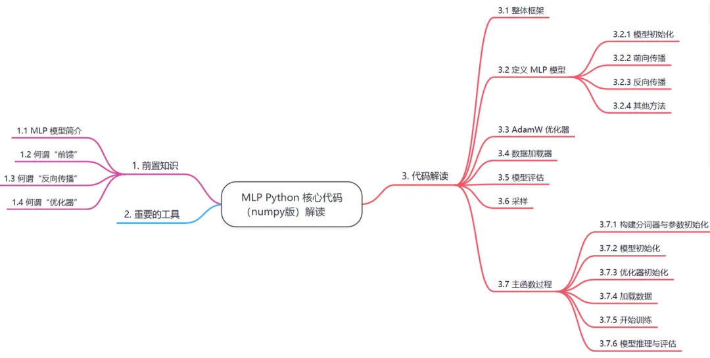
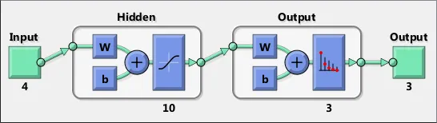

https://github.com/SmartFlowAI/LLM101n-CN/tree/master/mlp

* * *

代码目录结构树：

```
mlp  
|-- README.md  
|-- common.py  
|-- data  
|   |-- preprocess.py  
|   |-- test.txt  
|   |-- train.txt  
|   `-- val.txt  
|-- mlp_numpy.py  
`-- mlp_pytorch.py  

```

今天将和大家一起学习 LLM101n 课程中 MLP 部分的 Python 核心代码（numpy 版），即上面👆结构树中的 `mlp_numpy.py`。大家可以使用`git clone`命令克隆好仓库，结合源代码和本解读一起食用更佳哦~



# 1. 前置知识
## 1.1. MLP 模型简介

多层感知机（MLP，Multi-Layer Perceptron）属于**前馈**神经网络（Feedforward Neural Network）的一种。在**模型** **训练**过程中，需要通过**反向传播**算法计算梯度，将误差从输出层反向传播回输入层，用于更新网络参数。它包含至少三层节点：一个输入层，一个或多个隐藏层，以及一个输出层。每一层的节点都**全连接**到下一层的每个节点。MLP 模型通常用于解决分类和回归问题。

1.  输入节点（Input Nodes）：输入节点从外部世界提供信息，总称为「输入层」。在输入节点中，不进行任何的计算，仅向隐藏节点传递信息。
    
2.  隐藏节点（Hidden Nodes）：隐藏节点和外部世界没有直接联系（由此得名）。这些节点进行计算，并将信息从输入节点传递到输出节点。隐藏节点总称为「隐藏层」。尽管一个前馈神经网络只有一个输入层和一个输出层，但网络里可以没有隐藏层（如果没有隐藏层，激活函数选择 sigmoid，那么就变成逻辑回归了），也可以有多个隐藏层。
    
3.  输出节点（Output Nodes）：输出节点总称为「输出层」，负责计算，并从网络向外部世界传递信息。
    


## 1.2. 何谓“前馈”

“前馈”指的是信息在网络中的流动方向是单向的。具体来说，在**模型推理**过程中，每层的神经元将输入信号进行加权求和，通过**激活函数**生成输出信号，传递到下一层。在整个**推理过程**中，信息只沿着从输入到输出的方向传递，不存在反向的信息传播。

> 这种单向的信息流动方式与其他类型的神经网络，如循环神经网络（RNN）形成对比。在 RNN 中，信息可以在网络中循环传递，形成反馈回路。
> 例如，想象一个简单的前馈神经网络用于图像分类，图像数据作为输入进入网络，经过各层神经元的计算和处理，最终得到关于图像所属类别的输出，在这个过程中，信息不会从输出层或隐藏层反向流回输入层。



图示三层 MLP 的隐藏层包含 10 个神经元，激活函数为 sigmoid；输出层有 3 个神经元，激活函数为 softmax。本图采用以下 MATLAB 代码生成：net = patternnet; view(net)

以一个三层的 MLP 为例，前向计算公式为：

其中，为隐藏层，为输出层，为激活函数，加入激活函数可以避免网络退化。常见的激活函数有：Sigmoid，Tanh，ReLU。

1.3. 何谓“反向传播”
-------------

反向传播（Backpropagation）是一种在神经网络中用于计算梯度以优化模型参数的重要算法。在神经网络**训练过程**中，通过前向传播计算输出值 ，并通过与真实值比较计算误差，然后从后向前，逐层计算误差对于每个神经元参数（权重和偏置）的梯度，从而实现所有参数的更新。

以下计算图相对直观地展示了反向传播算法在一个三层 MLP 中的运算过程（从右下往左上逐层计算）。其中，表示与根据形状做必要的变化，然后相乘。主要原理是链式求导法则，不再赘述。

通过这个计算图不难发现，误差相对于每层参数的梯度之间是存在规律的，这也将极大便利代码的书写。值得注意的是，由于偏置的偏导为 1，因此更新偏置会相对容易一些。

MLP 反向传播算法的计算图

在上面的计算图中，激活函数是任意的。特别地，当激活函数均为时，每个参数的梯度计算公式如下：


理解了以上过程（尤其是计算图中的公式）之后就能够比较容易理解代码中的backwards过程了。后续还会结合上面的计算图来讲解代码。

1.4. 何谓“优化器”
------------

优化器（Optimizer）是用于调整模型参数以最小化损失函数或最大化目标函数的算法或方法。如果将模型训练的过程类比为寻找山脉海拔最低点的过程，那么梯度就是当前所处点的坡度，优化器的目的就是通过改变水平移动距离（即“步长”/“学习率”）、行进策略（如“动量”）等来更好、更快得实现目标。

常见的优化器包括梯度下降（Gradient Descent）、随机梯度下降（SGD）、Adam、RMSprop等。

> 本文仅简单介绍与后续代码解读相关的基础知识，更多关于神经网络的基本知识见往期内容：[《NLP 基础知识库 | 2 神经网络基础（一）》](https://mp.weixin.qq.com/s?__biz=Mzg2NzU4MDgzMA==&mid=2247507454&idx=2&sn=1196ba0c5a45d4e07ac0f1c9a29d74a5&chksm=cebbf30ff9cc7a1953a43bfe108881ba8d3da79269db08c876e80d136621ad4884b0f56c036f&token=102663897&lang=zh_CN&scene=21#wechat_redirect)

2. 重要的工具
========

在源文件里我们可以看到，MLP 的实现还借助了同目录下 `common.py` 文件的 `RNG` 和 `StepTimer` 模块。所以在介绍核心代码前，我们先来简单了解一下它们的功能。

其中的 `RNG` 模块类似 Python 中的 random 库，但它是确定的，并且可以完全控制；它使用一个种子值来初始化内部状态，用于生成随机数。`StepTimer` 模块是一个用于计时的类，它可以计算代码段的执行时间，并通过指数移动平均（EMA）来平滑计时结果。

关于 `RNG` 模块的详细解读已在往期内容[《LLM101n 硬核代码解读：手把手教你用PyTorch实现多层感知机MLP》](https://mp.weixin.qq.com/s?__biz=Mzg2NzU4MDgzMA==&mid=2247513832&idx=1&sn=3256d307b18818e6236ef54a7c5c6331&chksm=cebb9819f9cc110f54777da8a237700d2e6542cef0196320ae9a42c3b915209d275c3b83503c&token=102663897&lang=zh_CN&scene=21#wechat_redirect)中，这里不再赘述。关于 `StepTimer` 模块的模块还烦请自行查阅。

common.py 文件的 UML 类图（含父类）

# 3. 代码解读

3.1. 整体框架
---------

先看代码的整体结构，由numpy实现的MLP模型主要包含以下几部分代码：

1.  MLP 类：定义了模型结构，主要包含两个全连接层以及前向传播forward和反向传播backward的计算函数。
    
2.  AdamW 类：定义优化器
    
3.  dataloader：定义数据加载器
    
4.  eval_split：评估训练结果的函数
    
5.  softmax：激活函数
    
6.  sample_discrete：采样函数
    
7.  主函数：模型训练、测试与评估
    

首先需要明确一下本次的训练任务，这对后面代码的理解很有帮助。这是一个单词续写的任务，给定单词的前 n-1 个字符，预测第 n 个字符。在本次的训练任务中，是给定单词的 3 个字符，预测下一个字符。所以是一个 4-gram 的模型。这部分的超参数为：

```python
context_length = 3 # if 3 tokens predict the 4th, this is a 4-gram model  
embedding_size = 48  
```

即上下文长度为3，每个字符编码成长度为 48 的向量

3.2. 定义 MLP 模型
--------------

### 3.2.1. 模型初始化

首先来看 init 初始化部分。结合前面的内容，这是一个三层的 MLP 模型。模型输入的每个样本的 tokens 经过 embedding 处理被编码成一个 context_length*embedding_size 的一维向量，即每个字符编码成一个单独的向量，然后拼接到一起构成输入层。因此，这里的输入层的维度被初始化为 (context_length*embedding_size, )，即输入字符数编码后的向量维度。

在下面这段代码中，`self.wte`定义了词表中每一个字符对应的向量。`self.fc1_weights`就是输入层到隐藏层之间的矩阵参数，有了前面的基础这里就很好理解为什么是 [h, t*e] 维度了。`fc2_weights`就是隐藏层到输出层之间的矩阵参数。剩下的`fc1_bias,fc2_bias`就是偏置。

`self.cache`则是用来记录每一次前向传播计算得到的结果。

主要是以下这部分代码：

```python
class MLP:  
    def __init__(self, rng, vocab_size, context_length, embedding_size, hidden_size):  
        # v 是所有不重复 token 的数量（词汇表大小），t 是输入序列的长度  
        # e（self.embedding_size）是 token 嵌入向量的维度，h 是隐藏层神经元数量  
        v, t, e, h = vocab_size, context_length, embedding_size, hidden_size  
        self.embedding_size = embedding_size  
        # 初始化嵌入层 self.wte 的参数矩阵，满足标准正态分布  
        self.wte = np.asarray(rng.randn(v * e, mu=0, sigma=1.0), dtype=np.float32).reshape(v, e)  
        # 初始化全连接层 self.fc1 和 self.fc2 的参数矩阵，满足 r=scale 的均匀分布  
        scale = 1 / math.sqrt(e * t)  
        self.fc1_weights = np.asarray(rng.rand(t * e * h, -scale, scale), dtype=np.float32).reshape(h, t * e).T  
        self.fc1_bias = np.asarray(rng.rand(h, -scale, scale), dtype=np.float32)  
        scale = 1 / math.sqrt(h)  
        self.fc2_weights = np.asarray(rng.rand(h * v, -scale, scale), dtype=np.float32).reshape(v, h).T  
        self.fc2_bias = np.asarray(rng.rand(v, -scale, scale), dtype=np.float32)  
        # self.cache 缓存前向传播的激活值，用于反向传播  
        self.cache = {} 
```

> **Question：**
> 
> 为什么用 和 分别作为两个全连接层初始化时的 scale？
> 
> **Answer：**
> 
> 参数初始化的方法有很多种，作者使用的是基于固定方差 的参数初始化方法，更具体一点是均匀分布初始化。假设随机变量 在区间 内均匀分布，则其方差为：
> 
> 满足 时，则 的取值为：
> 
> 到这一步，关键就是如何设置方差 。我们知道要高效地训练神经网络，给参数选取一个合适的随机初始化区间是非常重要的。因此为了缓解梯度消失或爆炸问题，我们应尽可能**保持每个神经元的输入和输出的方差一致**。
> 
> 假设在我们的 MLP 中，第二个全连接层，即上述代码中的`self.fc2`里，有一个神经元 ，其接收前一层的 个神经元的输出 ，，则有：
> 
> 其中， 是激活函数， 是权重， 是偏置。为简单起见，这里令 ， 和 相互独立。计算 的方差：
> 
> 根据式(5)可知，输入 的方差在经过神经元 后，被放大或缩小了 倍。因为我们希望每个神经元的输入和输出的方差保持一致，所以将 设为 比较合理，即：
> 
> 满足 时，有：
> 
> 把式(7)代入式(2)：
> 
> 回到源代码里，从第 14 行我们可以知道第二个全连接层的**输入维度**是 ，所以用 作为它初始化时的 scale。同理， 是第一个全连接层初始化时的 scale，因为它的输入维度是 。

### 3.2.2. 前向传播

代码中使用到的是Tanh双曲正切激活函数。

下面来看前向传播的代码。这部分建议通过 debug 来看一遍每个参数的变化。

首先 idx 就是一个批次中的全部输入，targets 就是对应的标签。idx 是一个已经 encode 之后的 128*3 的二维矩阵（代码中 batch_size 为128，context_length 为 3），第 i 行就是输入的 3 个token，对应的标签就是 targets[i]。而输入层是 context_length*embedding_size 大小的一维向量，所以这里需要将idx[i]转换成embedding之后的向量。

然后就是根据前向传播公式计算输入层到输出层的结果。

```python
def forward(self, idx, targets=None):  
    # idx 是输入 token，是一个形状为（B, T）的数组，其中 B 是批次大小，T 是序列长度  
    # target 是样本标签，是一个形状为（B, ）的数组  
    B, T = idx.shape  
    # 使用嵌入表将 token 转换为对应的嵌入向量，emb 的形状为（B, T, embedding_size）  
    emb = self.wte[idx]    
    # 将每一个序列各自所有的嵌入向量拼接在一起成一个新的向量，其形状为(B, T * embedding_size)  
    emb = emb.reshape(B, -1)  
    # 将拼接后的向量通过第一个全连接层，这里使用 tanh 激活函数，hidden 形状为（B，h）  
    hidden = np.tanh(emb @ self.fc1_weights + self.fc1_bias)  
    # 计算最终的 logits，这是模型的原始输出，用于计算概率，其形状为（B，v），v 是标签数（词汇表大小）  
    logits = hidden @ self.fc2_weights + self.fc2_bias  
    # 缓存一些参数，以便在反向传播时使用  
    self.cache['idx'] = idx  
    self.cache['targets'] = targets  
    self.cache['emb'] = emb  
    self.cache['hidden'] = hidden  
    # 如果提供了标签 targets，那么计算损失值，具体使用的是交叉熵损失函数  
    loss = None  
    self.cache['probs'] = None  
    if targets is not None:  
        # 首先计算整个批次里每一组特征中的最大值，并从每组特征中减去这个最大值  
        logits_max = np.max(logits, axis=1, keepdims=True)  
        # 应用于 softmax 函数的数学等价形式，避免数值出现上下溢  
        exp_logits = np.exp(logits - logits_max)  
        # 计算概率分布  
        probs = exp_logits / np.sum(exp_logits, axis=1, keepdims=True)  
        # 从概率分布中取出每一样本标签对应的概率  
        probs_targets = probs[np.arange(len(targets)), targets]  
        # 计算负对数似然损失  
        nlls = -np.log(probs_targets)  
        # 计算平均损失作为整个批次的损失  
        loss = np.mean(nlls)  
        # 缓存概率分布，以供后续使用  
        self.cache['probs'] = probs  
  
    # 返回计算得到的logits和损失值（如果有的话）  
    return logits, loss  

```

以上代码中的 `if targets is not None`语句块即计算**交叉熵损失** (cross-entropy loss)。这里解释一下模型输出损失值的原理，为了方便学习，**下面讲解里的部分变量会与代码中相对应**。

交叉熵损失函数对于**某一样本** ，它的数学形式如下：


为真实值， 为预测概率值， 表示样本里第 个预测类别。 是已知的，就是代码里的`targets`变量，其存储着每一个样本的标签，剩下要求的就是每一个类别的预测值。目前我们只有模型的输出`logits`，但这不是样本中每一个类别的概率，所以为了求样本的概率分布，作者使用了 函数：


式(10)是 函数的标准形式， 是第 个样本预测第 个类别的概率值。但是我们注意到代码里还计算了`logits_max`（第23行），即每一个样本最大的输出值，并被所有的原输出减去。这么做是为了处理**数值上下溢**的情况，如果式(10)中的 过大，则分子过大，产生 ；相反 如果过小， 趋向于 0，导致分母趋向 0，出现除 0 错误，产生下溢。减去最大值后：


如此，由于指数 0 的存在，分子最大为 1，不会出现上溢；同时分母最小不会小于 1，也不会出现下溢了。式(11)才是作者真正使用的 函数形式。

计算得到概率分布`probs`后，从中取出每一样本**标签**对应的概率`probs_targets`，然后求负对数得`nlls`，该变量里的每一个元素 就是式(9)中的 。你一定会奇怪，这个计算过程和式(9)不太一样啊？这是因为在分类问题里，标签一般用独热编码表示，比如 代表类别为 2 的标签（下标从 0 开始）。这份代码的`targest`变量里同样也存储着每一个样本对应的标签在词汇表里的下标，这与独热编码的含义一样，前文的 在`targest`变量下则表示为 。回到式(9)，除了 时， 以外，其余的 都为 0，所以式(9)简化为：


最后计算平均损失`loss`作为整个批次的损失即可。

> **Question：** 代码中的 @ 是什么？
> 
> **Answer：** 在 Python 的 Numpy 库中，`@` 符号是一个特殊的操作符，用于执行矩阵乘法，它的作用与`np.dot()`函数一致。

### 3.2.3.反向传播

在本文中的3层MLP中，需要更新的参数主要为：`fc1_weights`, `fc1_bias`, `fc2_weights`, `fc2_bias`, `wte`，即 2 个权重矩阵和偏置，加上每个 token 的向量表示。

前文提到，损失函数使用的是交叉熵损失。对于每个样本 ，交叉熵损失的梯度可以表示为：

其中 代表以下代码中的 `logits`（即模型输出在 softmax 激活函数之前的值）。由于分类任务中真实标签一般用独热编码表示，因此交叉熵损失梯度还可以更简便易懂得表示为：


了解了交叉熵损失的梯度后，再结合【1.3】节中的计算图，就能很好地理解下面的代码了。

【1.3】节中的反向传播算法计算图

```python
def backward(self):  
    # 提取前向传播过程中缓存的激活值  
    idx = self.cache['idx']  # 输入 token 的索引，形状为（B, T）  
    targets = self.cache['targets']  # 标签的索引，形状为（B, ）  
    emb = self.cache['emb']  # 嵌入层的输出，形状为（B, T, embedding_size）  
    hidden = self.cache['hidden']  # 第一个全连接层的输出，形状为（B, h）  
    probs = self.cache['probs']  # 经过 softmax 函数转换后的概率分布，形状为（B, v）  
    B, T = idx.shape  
      
    dlogits = probs  # logits 的梯度初始化为概率分布  
    # 将预测为正确类别的 logit 的梯度减去 1，因为交叉熵损失的梯度是概率减去真实标签的独热编码  
    dlogits[np.arange(len(targets)), targets] -= 1  
    # 将梯度平均分配到每个样本上  
    dlogits /= len(targets)  
    # 反向传播通过 MLP 的第二个线性层  
    dfc2_weights = hidden.T @ dlogits  # 计算 fc2 层权重的梯度  
    dfc2_bias = np.sum(dlogits, axis=0)  # 计算 fc2 层偏置的梯度  
    dhidden = dlogits @ self.fc2_weights.T  # 计算隐藏层的梯度  
  
    # tanh 函数的导数是 1 - tanh 的平方，用于计算激活函数的梯度  
    dprehidden = dhidden * (1 - hidden ** 2)  
  
    # 反向传播通过 MLP 的第一个线性层  
    dfc1_weights = emb.T @ dprehidden  # 计算 fc1 层权重的梯度  
    dfc1_bias = np.sum(dprehidden, axis=0)  # 计算 fc1 层偏置的梯度  
    demb = (dprehidden @ self.fc1_weights.T).reshape(B, T, self.embedding_size)  # 计算嵌入层的梯度  
  
    # 反向传播通过嵌入层  
    dwte = np.zeros_like(self.wte)  # 初始化嵌入层权重的梯度为 0  
    # 循环遍历每个批次和时间步的 token，累加对应的梯度  
    for i in range(B):  
        for j in range(T):  
            dwte[idx[i, j]] += demb[i, j]  # 累加每个 token 对应的嵌入向量的梯度  
  
    # 返回所有参数的梯度  
    return {  
        'wte': dwte,    
        'fc1_weights': dfc1_weights,    
        'fc1_bias': dfc1_bias,    
        'fc2_weights': dfc2_weights,    
        'fc2_bias': dfc2_bias   
    }  

```

> **Question：** 代码第 16 行，为什么要将梯度平均分配到每个样本上？
> 
> **Answer：** 在 3.2.2 前向传播里，作者最后计算了平均损失作为整个批次的损失，然后是以这整个批次的损失去求相对于模型各参数的梯度，所以梯度公式前的 符号还在，即 。

### 3.2.4. 其他方法

`MLP`类里还有另外两个方法，`parameters`和`__call__`，前者返回模型的各层的参数，后者让用户可以直接以`model(idx, target)`的形式启动模型的前向传播。

3.3. AdamW 优化器
--------------

AdamW 是一种优化算法，它是 Adam 算法的扩展，通过将权重衰减直接应用于权重，而不是梯度，来促进网络参数的稀疏性，同时保持梯度下降的效率和稳定性。相关研究发表在 ICLR 2019，大家感兴趣的话可以去阅读原文：《Decoupled Weight Decay Regularization》（https://arxiv.org/abs/1711.05101）。

AdamW本质上就是在损失函数里面加入了L2正则项，然后计算梯度和更新参数的时候都需要考虑这个正则项。简单介绍一下该算法的原理，同样为了方便学习，**下面讲解里的部分变量会与代码中相对应**。首先计算梯度 和 的指数加权平均（即一阶矩估计和二阶矩估计）：


其中 和 分别为两个移动平均的衰减率，根据论文取值为 0.9 与 0.999。同时我们可以把 和 分别看作梯度的均值（一阶矩）和未减去均值的方差（二阶矩）。

假设 ，那么在迭代初期 和 的值会比真实的均值和方差要。特别是当 和 都接近于 1 时，偏差会很大，因此，需要对其进行修正：


其中 是算法截至目前执行的次数，最后算法的参数更新为：


其中 是学习率，后面会提到它是动态调整的； 是为了保持数值稳定性而设置的非常小的常数，根据论文取值为 1e-8； 是权重衰减项，作者初始化为 1e-4。

```python
class AdamW:  
    # 初始化  
    def __init__(self, params, lr=1e-3, beta1=0.9, beta2=0.999, weight_decay=1e-4, eps=1e-8):  
        self.params = params  # 模型参数  
        self.lr = lr  # 学习率  
        self.beta1 = beta1  # 一阶矩估计的指数衰减率  
        self.beta2 = beta2  # 二阶矩估计的指数衰减率  
        self.weight_decay = weight_decay  # 权重衰减项  
        self.eps = eps  # 用于数值稳定性的小常数  
        self.t = 0  # 记录优化器的步骤  
        # 初始化一阶矩估计和二阶矩估计为零  
        self.m = {k: np.zeros_like(v) for k, v in params.items()}  
        self.v = {k: np.zeros_like(v) for k, v in params.items()}  
  
    # 设置学习率  
    def set_lr(self, lr):  
        self.lr = lr    
          
    # 执行优化器的一步更新  
    def step(self, grads):  
        self.t += 1  # 增加步骤计数  
        for k in self.params.keys():  # 遍历所有参数  
            # 更新参数的一阶矩估计与二阶矩估计  
            self.m[k] = self.beta1 * self.m[k] + (1 - self.beta1) * grads[k]  
            self.v[k] = self.beta2 * self.v[k] + (1 - self.beta2) * grads[k]**2  
            # 计算一阶矩和二阶矩的无偏估计  
            m_hat = self.m[k] / (1 - self.beta1**self.t)  
            v_hat = self.v[k] / (1 - self.beta2**self.t)  
            # 更新参数  
            self.params[k] -= self.lr * (m_hat / (np.sqrt(v_hat) + self.eps) + self.weight_decay * self.params[k])  

```

需要知道的是，这里的grads就是通过反向传播函数backward返回的数据。AdamW优化器就是按照公式对每个参数进行了更新。所以AdamW优化器是必须得保存模型的全部参数，以及模型的全部梯度数据的。

3.4. 数据加载器
----------

作者将所有 token 组成一排，使用滑动窗口的形式从左到右依次截取每一个长度为`context_length`的 token 序列作为一个样本，同时相邻的下一个 token 作为这个样本的标签。

在以下代码中，关于“为什么代码里使用`yield`返回样本和标签？”/“为什么`while`语句不需要退出条件”，可以回顾一下上期内容：[《LLM101n 硬核代码解读：手把手教你用PyTorch实现多层感知机MLP》](https://mp.weixin.qq.com/s?__biz=Mzg2NzU4MDgzMA==&mid=2247513832&idx=1&sn=3256d307b18818e6236ef54a7c5c6331&chksm=cebb9819f9cc110f54777da8a237700d2e6542cef0196320ae9a42c3b915209d275c3b83503c&token=102663897&lang=zh_CN&scene=21#wechat_redirect)

```python
def dataloader(tokens, context_length, batch_size):  
    # 返回形状为（B, T）的输入和形状为（B, ）的标签  
    # tokens 是输入的 token 列表  
    # context_length 即上下文长度，指每个样本中的 token 数量  
    # batch_size: 每个批次的样本数量  
    n = len(tokens)  # tokens 的总数  
    inputs, targets = [], []  # 初始化存储输入序列和标签的列表  
    pos = 0  # 初始化滑动窗口的起始位置  
    while True:  # 循环用于生成批次数据  
        window = tokens[pos:pos + context_length + 1] # 窗口大小为 context_length + 1  
        inputs.append(window[:-1])  # 将窗口中除最后一个 token 外的所有 token 作为输入  
        targets.append(window[-1])  # 将窗口中的最后一个 token 作为标签  
        # 一旦收集到一个批次大小的数据，就返回  
        if len(inputs) == batch_size:  
            yield (np.array(inputs), np.array(targets))    
            inputs, targets = [], []  # 重置列表，为下一个批次做准备  
        # 滑动窗口向前移动，并在到达末尾时回到开头  
        pos += 1  
        if pos + context_length >= n:  
            pos = 0  # 如果超出总长度，重置位置到开头  

```

3.5. 模型评估
---------

每训练两百步就需要在训练集和验证集上计算一次损失，并打印出来。是要在所有数据上计算一遍损失，然后计算均值就得到了数据集上的平均损失。下面的代码同样使用dataloader逐批次的读取数据，按照批次计算损失。

```python
def eval_split(model, tokens, max_batches=None):  
    # 计算所给 tokens 的损失值  
    total_loss = 0  # 初始化总损失为 0  
    num_batches = len(tokens) // batch_size  # 计算可以生成的批次数量  
    if max_batches is not None:  
        num_batches = min(num_batches, max_batches)  # 如果指定了最大批次数，则取较小值  
    data_iter = dataloader(tokens, context_length, batch_size)  # 创建数据生成器  
    for _ in range(num_batches):  
        inputs, targets = next(data_iter)  # 从生成器获取一批数据  
        logits, loss = model(inputs, targets)  # 使用模型计算这批数据的logits和损失  
        total_loss += loss.item()  # 累加损失值  
    mean_loss = total_loss / num_batches  # 计算平均损失  
    return mean_loss  # 返回平均损失  

```

3.6.采样
------

接着作者编写了一个`sample_discrete` 函数用于根据给定的概率分布`probs`和一个随机数`coinf`进行采样，返回采样到的某一概率值对应的索引。该函数主要用于之后的模型推理，从模型预测中随机采样一个值作为输出。

```python
def sample_discrete(probs, coinf):  
    # 从离散分布中采样，probs 是一维numpy数组，形状为(V,)  
    cdf = 0.0  # 初始化累积分布函数  
    for i, prob in enumerate(probs):  
        cdf += prob  # 累加概率值到CDF  
        if coinf < cdf:  # 如果随机数小于CDF，则返回当前索引  
            return i  
    return len(probs) - 1  # 如果随机数大于CDF的最大值，返回最后一个索引，以防四舍五入误差  

```

3.7. 主函数过程
----------

### 3.7.1. 构建分词器与参数初始化

知道了这几个模块的作用之后，我们先来看看主函数是如何调用这些部分来训练MLP的。

在完整代码中，主函数从211行开始，首先是要训练一个Tokenizer，建立字符和token之间的映射。这里的Tokenizer设计的非常简单，核心思想就是**将字符位于由 26 个英文单词和换行符组成的有序列表里的下标作为这个字符的 token**，不过考虑到预料中不一定出现了全部 26 个字符，所以这里先统计了全部出现的字符，并进行排序，最排序得到的序号作为token。

```python
train_text = open('data/train.txt', 'r').read()  
# 检查训练集中的字符是否都是小写字母或换行符  
assert all(c == '\n' or ('a' <= c <= 'z') for c in train_text)  
uchars = sorted(list(set(train_text)))  # 输入中不重复的字符集合  
vocab_size = len(uchars)  # 词汇表大小  
char_to_token = {c: i for i, c in enumerate(uchars)}  # 从字符到 token 的映射  
token_to_char = {i: c for i, c in enumerate(uchars)}  # 从 token 到字符的映射  
EOT_TOKEN = char_to_token['\n']  # 将换行符 \n 指定为分隔符 <|endoftext|> token  
# 预先对所有类别的数据集进行 token 化  
test_tokens = [char_to_token[c] for c in open('data/test.txt', 'r').read()]  
val_tokens = [char_to_token[c] for c in open('data/val.txt', 'r').read()]  
train_tokens = [char_to_token[c] for c in open('data/train.txt', 'r').read()]  

```

然后定义了3个最重要的常量，

```python
context_length = 3  # 如果用 3 个 token 预测第 4 个，这是一个 4-gram 模型  
embedding_size = 48  # 嵌入层的大小  
hidden_size = 512  # 隐藏层的大小  

```

### 3.7.2. 模型初始化

这里定义了MLP模型的变量，传入了 `init_rng`, `vocab_size`, `context_length`, `embedding_size`, `hidden_size` 作为参数

```python
init_rng = RNG(1337)  # 初始化随机数生成器  
model = MLP(init_rng, vocab_size, context_length, embedding_size, hidden_size)  # 创建模型  

```

### 3.7.3. 优化器初始化

这里定义了一个学习率为7e-4，`weight_decay` 为1e-4的AdamW 优化器。

```python
learning_rate = 7e-4  # 初始学习率  
optimizer = AdamW(model.parameters(), lr=learning_rate, weight_decay=1e-4)  # 创建优化器  

```

### 3.7.4. 加载数据

这里设置了batch_size和训练的步数，并且加载了训练数据，训练批次将采用yield方式逐个批次产生

```python
timer = StepTimer()  # 计时器  
batch_size = 128  # 批处理大小  
num_steps = 50000  # 总训练步数  
print(f'num_steps {num_steps}, num_epochs {num_steps * batch_size / len(train_tokens):.2f}')  # 打印训练周期数  
train_data_iter = dataloader(train_tokens, context_length, batch_size)  # 创建训练数据生成器  

```

### 3.7.5. 开始训练

训练过程中，首先计算每次训练的学习率（lr），lr 由参数 `learning_rate` 递减到0，训练到最后一步时，lr 正好为0。

每训练 200 步或训练到最后一步，计算一次在训练集和验证集上的损失，然后通过日志输出。

然后获取下一批次的训练数据，调用模型进行前向计算，计算结构得到 logits 和 loss，接着调用模型的反向传播函数去更新参数，并返回最终的梯度，最后使用 AdamW 优化器来优化梯度。

不断重复这个过程，直到训练满 num_steps 步为止。

```python
for step in range(num_steps):  
    # 余弦学习率调度，从最大学习率递减到 0  
    lr = learning_rate * 0.5 * (1 + math.cos(math.pi * step / num_steps))  
    optimizer.set_lr(lr)  # 设置当前学习率  
    # 每过 200 轮输出当前的损失  
    last_step = step == num_steps - 1  
    if step % 200 == 0 or last_step:  
        train_loss = eval_split(model, train_tokens, max_batches=20)  # 在训练数据上评估损失  
        val_loss = eval_split(model, val_tokens)  # 在验证数据上评估损失  
        print(f'step {step:6d} | train_loss {train_loss:.6f} | val_loss {val_loss:.6f} | lr {lr:e} | time/step {timer.get_dt()*1000:.4f}ms')  
    with timer:  
        inputs, targets = next(train_data_iter)  # 获取下一批训练数据  
        logits, loss = model(inputs, targets)  # 模型前向传播  
        grads = model.backward()  # 计算梯度  
        optimizer.step(grads)  # 更新模型参数  

```

运行代码，我们能够看到代码在终端输出的训练过程如下：


### 3.7.6. 模型推理与评估

最后将训练好的模型进行一次推理，看一下效果，同时输出它在测试集上的评估结果。

```python
sample_rng = RNG(42)  # 初始化随机数生成器  
prompt = "\nrichard"  # 硬编码的文本提示  
context = [char_to_token[c] for c in prompt]  # 将提示转换为 token  
assert len(context) >= context_length  # 确保上下文足够长  
context = context[-context_length:]  # 裁剪到 context_length 大小  
print(prompt, end='', flush=True)    
# 采样 200 个随后的字符  
for _ in range(200):  
    context_array = np.array(context).reshape(1, -1)  # 转换为数组  
    logits, _ = model(context_array)  # 模型预测  
    probs = softmax(logits[0])  # 用 softmax 函数求出概率分布  
    coinf = sample_rng.random()  # 生成 [0, 1) 之间的随机数  
    next_token = sample_discrete(probs, coinf)  # 根据概率分布采样  
    context = context[1:] + [next_token]  # 更新 token 序列  
    print(token_to_char[next_token], end='', flush=True)  # 打印字符  
print()   
# 最后报告测试集损失评估结果  
test_loss = eval_split(model, test_tokens)   
print(f'test_loss {test_loss:.6f}') 
```

给出代码最终的输出，图片里只给出了模型部分的生成结果还有测试集的损失评估结果。


当然，换行符 `\n` 也是模型会预测的一种字符，所以我们能够看到输出的字符并不是在同一行。
