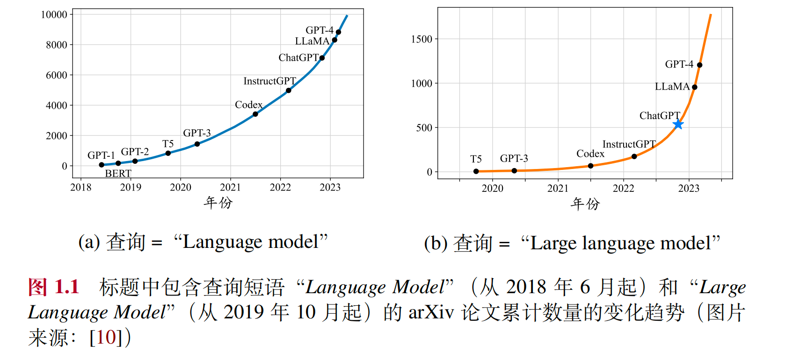
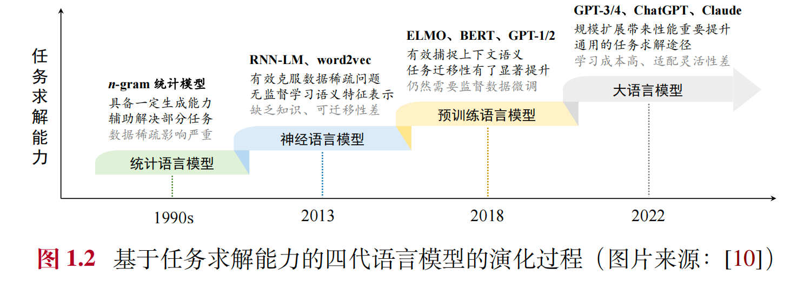

[摘自“大语言模型”一书中的引言部分](https://arxiv.org/abs/2303.18223)

# 语言模型的发展历程
一般来说，语言模型旨在对于人类语言的内在规律进行建模，从而准确预测词序列中未来（或缺失）词或词元（Token）的概率。根据所采用技术方法的不同，针对语言模型的研究工作可以分为以下四个主要发展阶段:

## 统计语言模型（Statistical Language Model, SLM）
在 20 世纪 90 年代兴起的统计语言模型是基于统计学习方法研发的。具体来说，统计语言模型使用马尔可夫假设（Markov Assumption）来建立语言序列的预测模型，通常是根据词序列中若干个连续的上下文单词来预测下一个词的出现概率，即根据一个固定长度的前缀来预测目标单词。具有固定上下文长度 𝑛 的统计语言模型通常被称为 𝑛 元（𝑛-gram）语言模型，如二元或三元语言模型。统计语言模型被广泛应用于信息检索（Information Retrieval, IR）和自然语言处理（Natural Language Processing, NLP）等领域的早期研究工作。对于高阶统计语言模型来说，随着阶数 𝑛 的增加，需要估计的转移概率项数将会指数级增长，经常会受到“维数灾难”（Curse of Dimensionality）的困扰。为了缓解数据稀疏问题，需要设计专门的语言模型平滑策略，如回退估计（Back-off Estimation）和古德-图灵估计（Good-Turing Estimation）。然而平滑方法对于高阶上下文的刻画能力仍然较弱，无法精确建模复杂的高阶语义关系。

## 神经语言模型（Neural Language Model, NLM）
神经语言模型使用神经网络来建模文本序列的生成，如循环神经网络（Recurrent Neural Networks, RNN）。图灵奖获得者 Yoshua Bengio 在一项早期工作中引入了分布式词表示（DistributedWord Representation）这一概念，并构建了基于聚合上下文特征（即分布式词向量）的目标词预测函数。分布式词表示使用低维稠密向量来表示词汇的语义，这与基于词典空间的稀疏词向量表示（One-Hot Representation）有着本质的不同，能够刻画更为丰富的隐含语义特征。同时，稠密向量的非零表征对于复杂语言模型的搭建非常友好，能够有效克服统计语言模型中的数据稀疏问题。分布式词向量又称为“词嵌入”（Word Embedding）。这种基于隐含语义特征表示的语言建模方法为自然语言处理任务提供了一种较为通用的解决途径。在这一系列工作中，word2vec是一个具有代表性的词嵌入学习模型，它构建了一个简化的浅层神经网络来学习分布式词表示，所学习到的词嵌入可以用作后续任务的语义特征提取器，在自然语言处理任务中得到了广泛使用，取得了显著的性能提升。这些创新性的研究工作将语言模型用于文本表示学习（超越了原始的词序列建模目标），在自然语言处理领域产生了重要影响。

## 预训练语言模型（Pre-trained Language Model, PLM）
与早期的词嵌入模型相比，预训练语言模型在训练架构与训练数据两个方面进行了改进与创新。ELMo是一个早期的代表性预训练语言模型，提出使用大量的无标注数据训练双向 LSTM（Bidirectional LSTM, biLSTM）网络，预训练完成后所得到的 biLSTM 可以用来学习上下文感知的单词表示，这与 word2vec 学习固定的词表示有着显著不同。进一步，ELMo 可以根据下游任务数据对 biLSTM 网络进行微调（Fine-Tuning），从而实现面向特定任务的模型优化。然而，传统序列神经网络的长文本建模能力较弱，并且不容易并行训练，这些缺点限制了早期预训练模型（如 ELMo）的性能。在 2017年，谷歌提出了基于自注意力机制（Self-Attention）的 Transformer 模型，通过自注意力机制建模长程序列关系。Transformer 的一个主要优势就是其模型设计对于硬件非常友好，可以通过 GPU 或者 TPU 进行加速训练，这为研发大语言模型提供了可并行优化的神经网络架构。基于 Transformer 架构，谷歌进一步提出了预训练语言模型 BERT，采用了仅有编码器的 Transformer 架构，并通过在大规模无标注数据上使用专门设计的预训练任务来学习双向语言模型。在同期，OpenAI也迅速采纳了 Transformer 架构，将其用于 GPT-1 的训练。与 BERT 模型不同的是，GPT-1 采用了仅有解码器的 Transformer 架构，以及基于下一个词元预测的预训练任务进行模型的训练。一般来说，编码器架构被认为更适合去解决自然语言理解任务（如完形填空等），而解码器架构更适合解决自然语言生成任务（如文本摘要等）。以 ELMo、BERT、GPT-1 为代表的预训练语言模型确立了“预训练-微调”这一任务求解范式。其中，预训练阶段旨在通过大规模无标注文本建立模型的基础能力，而微调阶段则使用有标注数据对于模型进行特定任务的适配，从而更好地解决下游的自然语言处理任务。

## 大语言模型（Large Language Model, LLM）
研究人员发现，通过规模扩展（如增加模型参数规模或数据规模）通常会带来下游任务的模型性能提升，这种现象通常被称为“扩展法则”（Scaling Law）。一些研究工作尝试训练更大的预训练语言模型（例如 175B 参数的 GPT-3 和 540B 参数的 PaLM）来探索扩展语言模型所带来的性能极限。这些大规模的预训练语言模型在解决复杂任务时表现出了与小型预训练语言模型（例如 330M 参数的 BERT 和 1.5B 参数的 GPT-2）不同的行为。例如，GPT-3 可以通过“上下文学习”（In-Context Learning, ICL）的方式来利用少样本数据解决下游任务，而 GPT-2 则不具备这一能力。这种大模型具有但小模型不具有的能力通常被称为“涌现能力”（Emergent Abilities）。为了区

别这一能力上的差异，学术界将这些大型预训练语言模型命名为“大语言模型”（Large Language Model, LLM）。作为大语言模型的一个代表性应用，ChatGPT将 GPT 系列大语言模型适配到对话任务中，展现出令人震撼的人机对话能力，一
经上线就取得了社会的广泛关注。ChatGPT 发布后，与大语言模型相关的 arXiv 论文数量迅速增长（如图 1.1 所示），这一研究方向受到了学术界的高度关注。通过回顾上述发展历程，可以看到语言模型并不是一个新的技术概念，而是历经了长期的发展历程。早期的语言模型主要面向自然语言的建模和生成任务，而最新的语言模型（如 GPT-4）则侧重于复杂任务的求解。从语言建模到任务求解，这是人工智能科学思维的一次重要跃升，是理解语言模型前沿进展的关键所在。图 1.2 通过任务求解能力的角度对比了四代语言模型所表现出的能力优势与局限性。首先，早期的统计语言模型主要被用于（或辅助用于）解决一些特定任
务，主要以信息检索、文本分类、语音识别等传统任务为主。随后，神经语言模型专注于学习任务无关的语义表征，旨在减少人类特征工程的工作量，可以大范围扩展语言模型可应用的任务。进一步，预训练语言模型加强了语义表征的上下文感知能力，并且可以通过下游任务进行微调，能够有效提升下游任务（主要局限于自然语言处理任务）的性能。随着模型参数、训练数据、计算算力的大规模扩展，最新一代大语言模型的任务求解能力有了显著提升，能够不再依靠下游任务数据的微调进行通用任务的求解。综上所述，在语言模型的演化过程中，可以解决的任务范围得到了极大扩展，所获得的任务性能得到了显著提高，这是人工智能历史上的一次重要进步。

