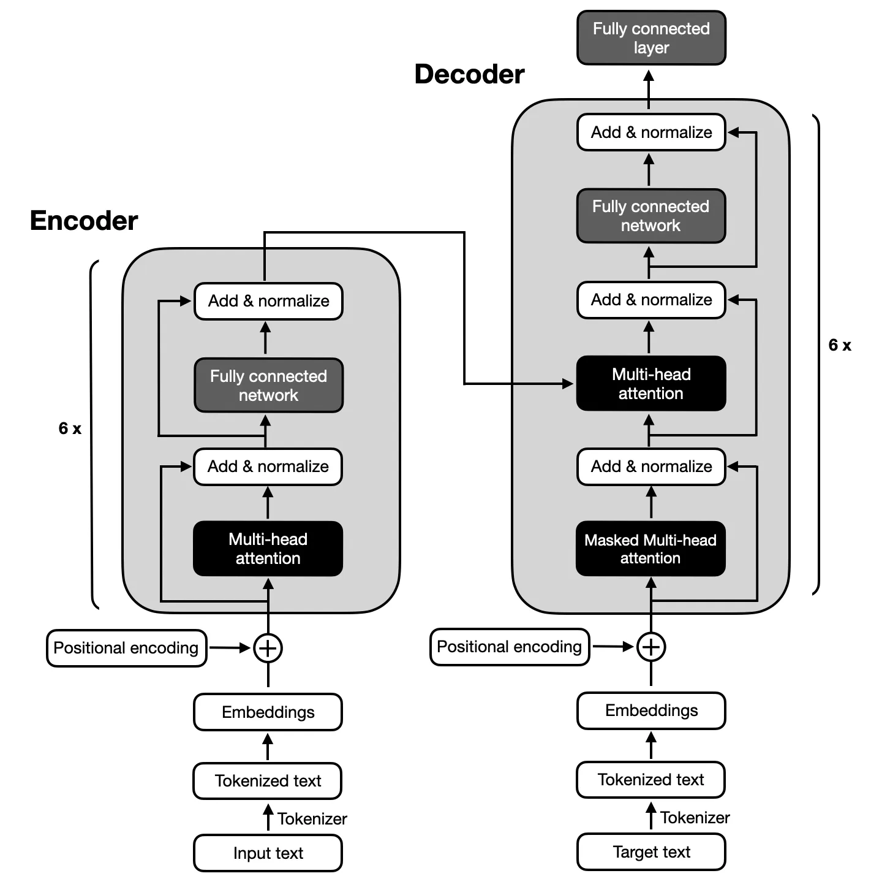
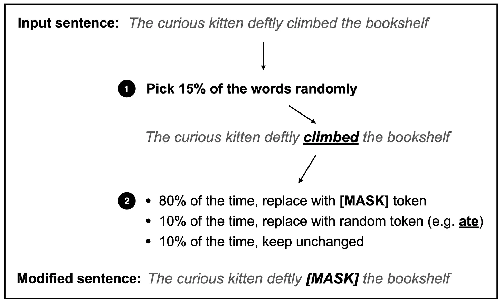
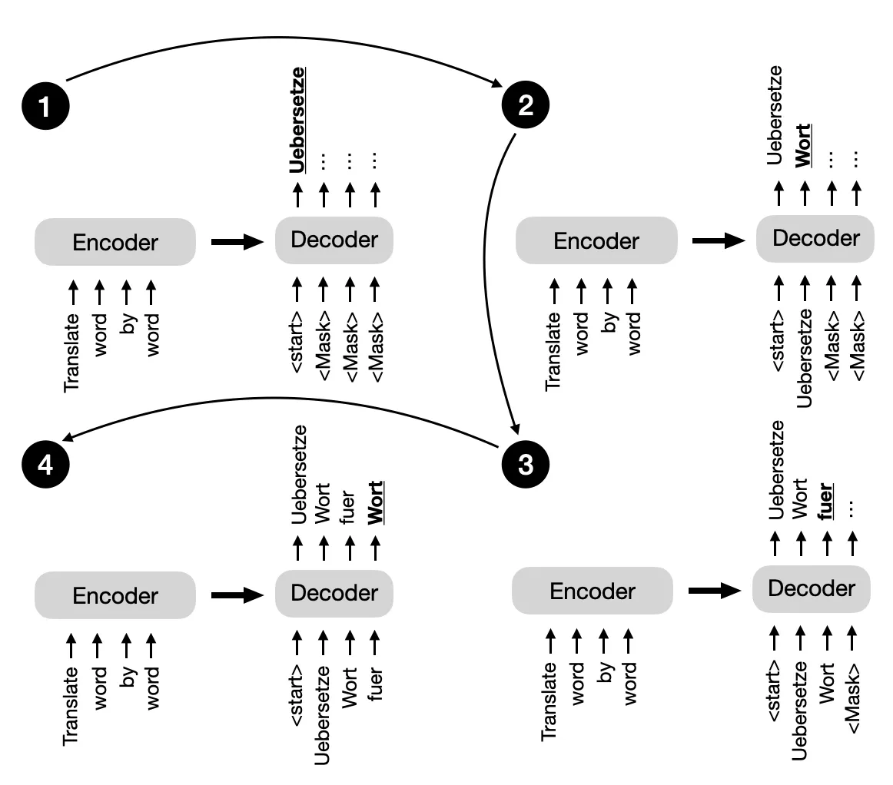

# Encoder- And Decoder-Style Transformers 

从根本上来说，Encoder-base和Decoder-base架构都使用相同的**自注意力层**来编码单词标记。然而，主要区别在于：
- Encoder-base旨在学习可以用于各种预测建模任务（如分类）的嵌入。
- Decoder-base则旨在生成新文本，例如，回答用户查询。

## The original transformer

原始的Transformer架构，该架构最初是针对英-法和英-德语言翻译任务设计，利用了Encoder和Decoder，如下图所示。

在上面的图中，输入文本（即要翻译的文本句子）首先被分解为单个词元，然后通过`嵌入层embedding layer`进行编码，然后进入`Encoder编码器`部分。接着，在每个嵌入单词上添加`positional encoding位置编码`向量后，`embedding向量`通过多头自注意力层。多头注意力层之后是一个“`Add & normalize`”步骤，进行`层归一化并`通过`残差连接`与输入相加。最后，在进入“`fully connected layer全连接层`”之后，该层是由`两个全连接层`和一个`非线性激活函数`组成的小型多层感知器，输出再次经过`Add & normalize`，然后传递到`Decoder解码器`部分的多头自注意力层。

上面的图中解码器部分具有与编码器部分相似的整体结构。关键区别在于输入和输出不同。编码器接收需要翻译的输入文本，而解码器生成翻译后的文本。

## Encoders 编码器
****

原始`transformer`中的`Encoder`部分，如前面的图所示，**负责理解和提取输入文本中的相关信息**。然后，它输出输入文本的**连续表示（embedding）**，传递给`Decoder`。最后，`Decoder`基于从`Encoder`接收到的连续表示生成翻译文本（目标语言）。

多年来，基于`Transformer`模型的`Encoder`模块，开发了各种`Encoder-only`架构。例如：`BERT`和 `RoBERTa` .

BERT (**B**双向 **E**编码器 **R**表示来自 **T**变换器) 是一种`Encoder-only`的架构，基于`Transformer`的`Encoder`块。`BERT` 模型在大型文本语料库上预训练，使用**掩码语言模型**（如下图所示）和**下一个句子预测**任务。

**掩码语言建模**的主要思想是掩盖（或替换）输入序列中的随机词令牌，然后训练模型根据周围的上下文预测原始的掩盖词令牌。

在上图所示的掩蔽语言建模预训练任务旁边，`next-sentence prediction`任务要求**模型预测原始文档中两句随机打乱的句子的顺序是否正确**。例如，两个句子以随机顺序被[SEP]标记分隔：

*   [CLS] Toast is a simple yet delicious food [SEP] It’s often served with butter, jam, or honey.  
*   [CLS] It’s often served with butter, jam, or honey. [SEP] Toast is a simple yet delicious food.  
    
[CLS] 令牌是模型的占位符令牌，提示模型返回一个 `True` 或`False` 标签，表示句子是否按正确顺序排列。

掩码语言和下句预训练目标（这是一种自监督学习的形式，如第二章所述）使 `BERT` 能够学习输入文本的丰富上下文表示，然后可以对其进行微调，以用于情感分析、问答和命名实体识别等各种下游任务。

`RoBERTa `（**R**obustly **o**ptimized **BERT****a**pproach）是 `BERT` 的优化版本。它维持与 `BERT` 相同的整体架构，但采用了若干训练和优化改进，例如**更大的批处理大小**、**更多的训练数据**，以及**去除下一个句子预测任务**。这些变化使得 `RoBERTa` 在各种自然语言理解任务上表现优于` BERT`。

## Decoders 解码器

回到本节开始时概述的原始转换器架构，解码器中的多头自注意机制与编码器中的类似，但它是被`Mask`的，也就是掩盖掉当前`token`之后的`token`，以防止模型关注未来的token信息，从而确保对位置$i$的`token`的预测只能依赖于小于$i$的`token`的已知输出。正如下图所示，解码器逐字生成输出。

如上图中的掩码机制对于保持`transformer`模型在训练和推理过程中的自回归特性至关重要。自回归特性确保模型一次生成一个输出标记，并将先前生成的标记作为生成下一个词标记的上下文。

多年来，研究人员在原始的`Encoder-Decoder Transformer`架构基础上进行了改进，开发了几种`Decoder-only`模型，这些模型在各种自然语言处理任务中被证明非常有效。最著名的模型包括 `GPT` 系列。

GPT(**G**enerative **P**re-trained **T**ransformer)系列是`Decoder-only`模型，预训练于大规模无监督文本数据，并针对特定任务如文本分类、情感分析、问答和摘要进行了微调。`GPT` 模型，包括 `GPT-2`、`GPT-3`以及 `GPT-4`，在各种基准测试中表现出色，目前是自然语言处理领域最受欢迎的架构。

GPT 模型最显著的特性之一是它们的**涌现特性**。涌现特性指的是模型由于其下一个单词预测的预训练而发展出的能力和技能。尽管这些模型仅被教授预测下一个单词，但预训练模型能够进行文本摘要、翻译、问答、分类等。此外，这些模型可以通过上下文学习执行新任务，而无需更新模型参数，这在第 18 章中进行了更详细的讨论。

## Encoder-decoder base

Next to the traditional encoder and decoder architectures, there have been advancements in the development of new encoder-decoder models that leverage the strengths of both components. These models often incorporate novel techniques, pre-training objectives, or architectural modifications to enhance their performance in various natural language processing tasks. Some notable examples of these new encoder-decoder models include  
除了传统的`Encoder-decoder`架构外，新的`Encoder-decoder`模型的开发也有所进展，这些模型利用了两个组件的优点。这些模型通常结合了新颖的技术、预训练目标或架构修改，以增强它们在各种自然语言处理任务中的性能。以下是这些新`Encoder-decoder`模型的一些显著例子：

*   BART (_[Denoising Sequence-to-Sequence Pre-training for Natural Language Generation, Translation, and Comprehension, 2019](https://arxiv.org/abs/1910.13461)_)  
    BART (_[自然语言生成、翻译和理解的降噪序列到序列预训练，2019](https://arxiv.org/abs/1910.13461)_)
    
*   and T5 (_[Exploring the Limits of Transfer Learning with a Unified Text-to-Text Transformer, 2019](https://arxiv.org/abs/1910.10683)_).  
    和 T5 (_[探索统一文本到文本变换器的迁移学习极限，2019](https://arxiv.org/abs/1910.10683)_).
    

`Encoder-decoder`模型通常用于涉及**理解输入序列和生成输出序列**的自然语言处理任务，这些序列的长度和结构往往不同。它们特别擅长处理**输入和输出序列之间存在复杂映射的任务**，**能够有效捕捉两个序列中元素之间的关系**。`Encoder-decoder`模型的一些常见使用案例包括**文本翻译和摘要**。

## 注意

`Encoder-only`、`Decoder-only`和`Encoder-Decoder`模型，都是序列到序列(`seq2seq`)模型。但是需要注意，尽管将 `BERT` 风格的方法称为仅`Encoder-only`，但这些方法在预训练期间也解码embedding输入为输出`token`或文本。

换句话说，`Encoder-only`和`Decoder-only`架构都是“解码”。然而，与`Decoder-only`架构和``Encoder-Decoder`架构相比，`Encoder-only`架构并不是以自回归的方式进行解码。自回归解码是指一次生成一个标记的输出序列，每个标记都以之前生成的标记为条件。`Encoder-only`模型并不会以这种方式生成连贯的输出序列。相反，它们专注于理解输入文本并生成特定任务的输出，例如标签或标记预测。

**Conclusion 结论**

In brief, encoder-style models are popular for learning embeddings used in classification tasks, encoder-decoder-style models are used in generative tasks where the output heavily relies on the input (for example, translation and summarization), and decoder-only models are used for other types of generative tasks including Q&A. Since the first transformer architecture emerged, hundreds of encoder-only, decoder-only, and encoder-decoder hybrids have been developed, as summarized in the figure below.  
简而言之：
- `Encoder-only`模型在学习用于分类任务的嵌入方面很受欢迎
- `Encoder-Decoder`模型用于生成任务，其中输出严重依赖于输入（例如，翻译和摘要）
- `Decoder-only`则用于包括问答在内的其他类型的生成任务。

自从第一个变换器架构出现以来，已经开发了数百种`Encoder-only`、`Decoder-only`和`Encoder-Decoder`模型，如下图所总结。

