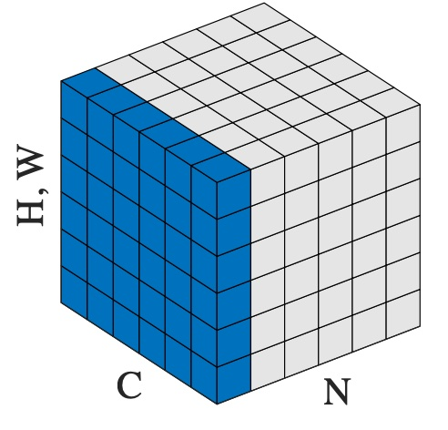

# LayerNorm
Pytorch实现LayerNorm的类为：
`torch.nn.LayerNorm(normalized_shape,eps=1e-05, elementwise_affine=True, bias=True, device=None, dtype=None)`


Applies Layer Normalization over a mini-batch of inputs.  
对输入的小批量应用层归一化。

## LayerNorm公式

$$y = \frac{x - \mathit{E}[x]}{\sqrt{Var[x] + \epsilon}} * γ + \beta$$
 
均值和标准差是在最后 D 个维度上计算的，其中 D 是 `normalized_shape` 的维度。例如，如果 `normalized_shape` 是 `(3, 5)`（一个二维形状），则均值和标准差是在输入的最后两个维度上计算的（即 `input.mean((-2, -1))`）。 $γ$ 和 $β$ 是 `normalized_shape` 的可学习仿射变换参数，如果 `elementwise_affine` 是 `True`。标准差是通过有偏估计量计算的，相当于 torch.var(input, unbiased=False)。

### 注意

与批量归一化和实例归一化不同，它们对每个完整的通道 / 平面应用标量缩放和偏置以及`affine`选项，层归一化则对每个元素应用缩放和偏置，使用`elementwise_affine`。


Parameters 参数

- **normalized_shape**    
    input shape from an expected input of size  
    从预期输入的大小获取输入形状
    
    ` [∗× normalized_shape[0] × normalized_shape[1] × … × normalized_shape[−1]]`
    
    如果使用单个整数，则将其视为单例列表，该模块将对最后一个维度进行归一化，预计该维度的大小为特定值。
    
- **eps** ([_浮动_](https://docs.python.org/3/library/functions.html#float "(in Python v3.13)")) - 为了数值稳定性而添加到分母的值。默认值：1e-5
    
- **逐元素仿射** ([_布尔值_](https://docs.python.org/3/library/functions.html#bool "(in Python v3.13)")) – 一个布尔值，当设置为 `True` 时，这个模块具有初始化为一（用于权重）和零（用于偏置）的可学习逐元素仿射参数。默认值：`True`。
    
- **偏置** ([_布尔_](https://docs.python.org/3/library/functions.html#bool "(in Python v3.13)")) – 如果设为 `False`，该层将不会学习加性偏置（仅在 `elementwise_affine` 为 `True` 时相关）。默认为 `True`。
    

Variables 变量

- **权重** – 当 `elementwise_affine` 设置为 `True` 时，模块的可学习权重形状为 normalized_shape 。这些值初始化为 1。
    
- **偏置** – 当 `elementwise_affine` 设置为 `True` 时，形状为 normalized_shape 的模块的可学习偏置。值的初始值为 0。
    

Shape: 形状：
- Input: (N,∗)  
    (N,∗)
- Output: (N,∗) (same shape as input)  
    (N,∗)
    

Examples: 示例：

```python
# NLP Example
batch, sentence_length, embedding_dim = 20, 5, 10
embedding = torch.randn(batch, sentence_length, embedding_dim)
layer_norm = nn.LayerNorm(embedding_dim)
# Activate module
layer_norm(embedding)
>>>
# Image Example
N, C, H, W = 20, 5, 10, 10
input = torch.randn(N, C, H, W)
# Normalize over the last three dimensions (i.e. the channel and spatial dimensions)
# as shown in the image below
layer_norm = nn.LayerNorm([C, H, W])
output = layer_norm(input)
```
