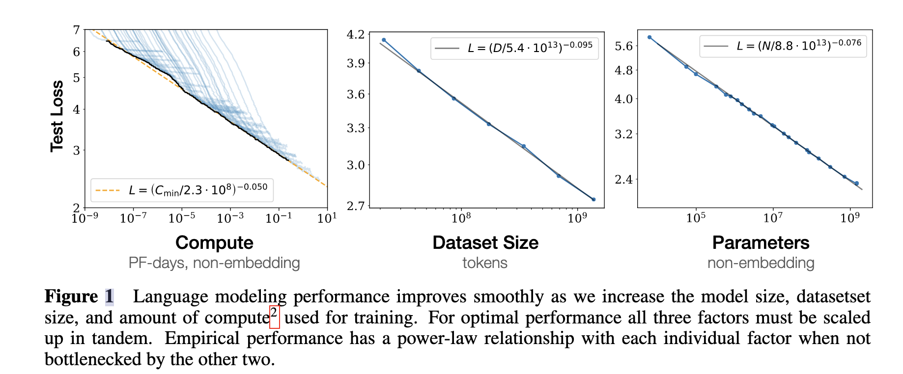
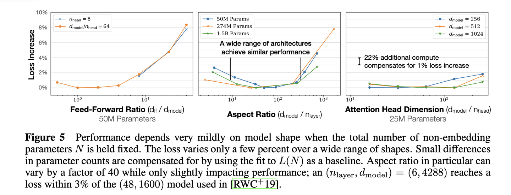
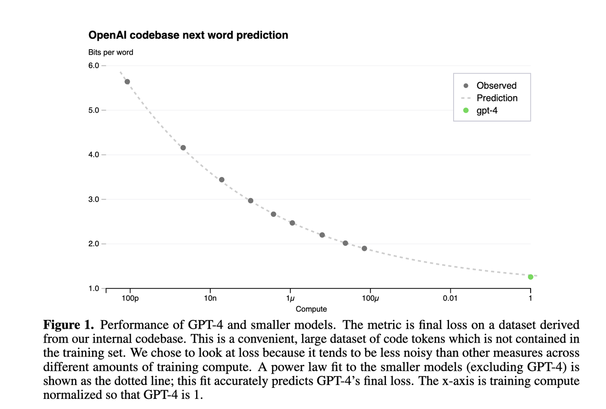
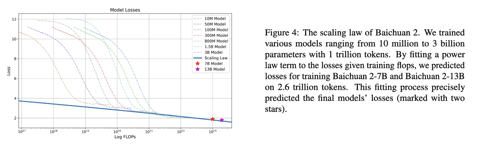
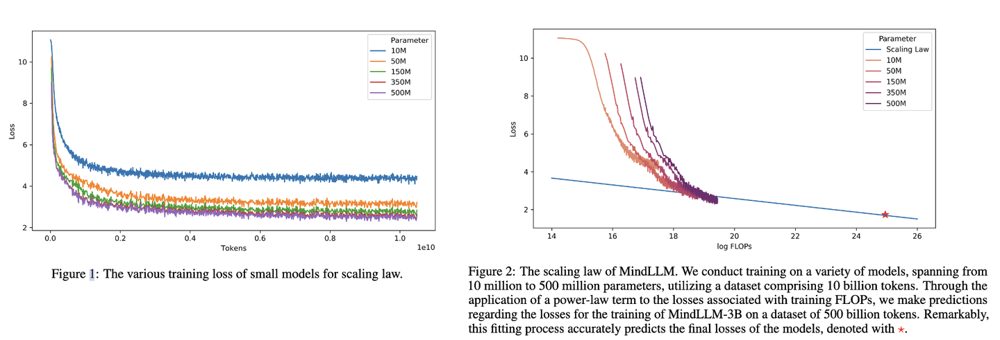
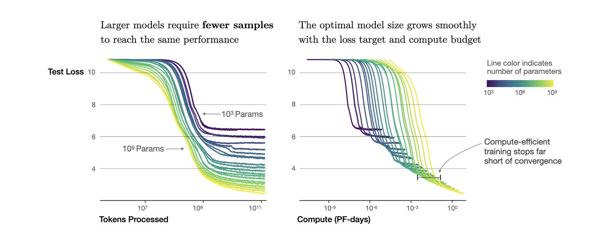

[以下内容取自“大语言模型”一书](https://arxiv.org/abs/2303.18223)

# 扩展法则Scaling Law
在实现上，大语言模型采用了与小型预训练语言模型相似的神经网络结构（基于注意力机制的 Transformer 架构）和预训练方法（如语言建模）。但是通过扩展参数规模、数据规模和计算算力，大语言模型的能力显著超越了小型语言模型的能力。
有趣的是，这种通过扩展所带来的性能提升通常显著高于通过改进架构、算法等方面所带来的改进。因此，建立定量的建模方法，即扩展法则（Scaling Law），来研究规模扩展所带来的模型性能提升具有重要的实践指导意义。在本部分，将首先介绍两种常见的语言模型扩展法则的定义，并且进一步对于扩展法则进行深入讨论。

扩展法则所探讨的主要是：**模型性能与参数规模、数据规模和计算算力之间的关系**

下面分别对**KM扩展法则**和**Chinchilla 扩展法则**进行探讨，从公式层面去理解扩展法则，会比较学术。后面会再根据其他资料，整理出更加通俗易懂的解释，然后在通过实践来研究如何使用扩展法则。

## KM扩展法则
扩展法则是由OPENAI团队最先提出，建立了神经语言模型与**模型规模**`N`、**数据规模**`D`和**计算算力**`C`之间的幂律关系。

在给定算力预算 $𝑐$ 的条件下，可以近似得到以下三个基本指数公式来描述扩展法则：

$$ 𝐿(𝑁)=(\frac{𝑁_𝑐}{𝑁})^{\alpha\mathit{N}}, \alpha𝑁 ∼ 0.076, 𝑁_𝑐 ∼ 8.8 × 10^{13} $$

$$ 𝐿(D) = ( \frac{𝐷_𝑐}{𝐷} )^{\alpha𝐷}, \alpha𝐷 ∼ 0.095, 𝐷_𝑐 ∼ 5.4 × 10^{13} $$ 

$$ 𝐿(C) = ( \frac{𝐶_𝑐}{𝐶} )^{\alpha𝐶}, \alpha𝐶 ∼ 0.050, 𝐶_𝑐 ∼ 3.1 × 10^8 $$

公式中，$\mathit{L}(\cdot)$表示以`nat`为单位的交叉熵损失，其中，$𝑁_𝑐$、$𝐷_𝑐$ 和 $𝐶_𝑐$ 是实验性的
常数数值，分别对应于**非嵌入参数数量**、**训练数据数量**和**实际的算力开销**。这三个公式是通过模型在不同数据规模（22M 到 23B 词元）、模型规模（768M到 1.5B 非嵌入参数）和算力规模下的性能表现拟合推导得到的。为了更好的理解这些公式，需要约定一些基本假设：**一个因素的分析不会受到其他两个因素的限制，如当变动模型参数规模的时候，需要保证数据资源是充足的**。

从上面三个公式中可以看出，模型性能与**模型规模**`N`、**数据规模**`D`和**计算算力**`C`之间存在有强依赖关系，随着`N`、`D`、`C`的提升，模型的损失逐渐降低，可以理解为性能变好，并且还可以看出，模型性能受模型规模的影响最大。

OpenAI团队又将上面3个公式进一步分解为两部分，包括不可约损失（真实数据分布的熵）和可约损失（真实分布和模型分布之间的KL散度估计），公式为：
$$𝐿(x) = \mathit{L}_{\infty} + ( \frac{x_0}{x} )^{\alpha x}$$

其中，$\mathit{L}_{\infty}$是不可约损失，由数据自身特征决定，无法通过扩展法则或者优化算法来进行约减；$( \frac{x_0}{x} )^{\alpha x}$是可约损失，可以通过模型性能的优化来减少。公式里的$x$是一个占位符，指代上面3个公式中的$N$,$D$,$C$

## Chinchilla 扩展法则
DeepMind团队在2022年提出了一种可选的扩展法则，旨在指导大语言模型充分利用给定的算力资源进行优化训练。通过针对更大范围的模型规模（70M 到 16B 参数）和数据规模（5B 到 500B 词元）进行实验，研究人员拟合得到了另一种关于模型性能的幂律关系：

$$\mathit{L}(\mathit{N},\mathit{D}) = \mathit{E} + \frac{\mathit{A}}{\mathit{N}^{\alpha}} + \frac{\mathit{B}}{\mathit{D}^{\beta}}$$

公式中其中 $𝐸 = 1.69$, $𝐴 = 406.4$, $𝐵 = 410.7$，$\alpha = 0.34$ 和 𝛽 = 0.28。进一步，利用约束条件 $\mathit{C} \approx 6\mathit{N}\mathit{D}$对于损失函数 $𝐿(𝑁, 𝐷)$ 进行推导，能够获得算力资源固定情况下模型规模与数据规模的最优分配方案（如下所示）：
$$N_{opt}(\mathit{C}) = \mathit{G}(\frac{C}{6})^{a}, D_{opt}(\mathit{C}) = \mathit{G}^{-1}(\frac{C}{6})^{b}$$

这里，$a=\frac{\alpha}{\alpha+\beta}$，$b=\frac{\beta}{\beta+\alpha}$，$\mathit{G}$ 是由 $\mathit{A}$、$\mathit{B}$、$\alpha$、 $\beta$计算得出的扩展系数。

进一步，研究人员发现 KM 扩展法则和 Chinchilla 扩展法则都可以近似表示成上述算力为核心的公式：
$$\mathit{N}_{opt} \approx \mathit{C}^a,\mathit{D}_{opt} \approx \mathit{C}^b$$
也就是当算力固定的情况下，最优的模型参数规模和数据规模由指数系数 $𝑎$ 和 $b$ 分别确定。可以看到，$𝑎$ 和 $b$ 决定了参数规模和数据规模的资源分配优先级：当$𝑎$ > $b$时，应该用更多的算力去提高参数规模；当 $b$ > $𝑎$ 时，应该用更多的算力去提高数据规模。

总结一点：在给定算力的情况下，我们能够训练多大规模的模型，以及需要多大规模的训练数据，是可以通过扩展发展去计算得到的。虽说计算的不是100%准确，但是扩展法则是在训练模型时的一个非常重要的参考。

> 并且，越来越多的工表明，现有的预训练语言模型对于数据的需求量远高于这些扩展法则中所给出的估计规模。例如，LLaMA-2 (7B) 的模型就使用了 2T 的词元进行训练，很多更小的模型也能够通过使用超大规模的预训练数据获得较大的模型性能提升。这种现象的一个重要原因是由于Transformer 架构具较好的数据扩展性，到目前为止，还没有实验能够有效验证特定参数规模语言模型的饱和数据规模。

## 关于扩展法则的讨论
### 可预测的扩展（Predictable Scaling）
在实践中，扩展法则可以用于指导大语言模型的训练，**通过较小算力资源可靠地估计较大算力资源投入后的模型性能**，这被称为可预测的扩展。这种可预测性主要体现在两个方面：
1. 使用小模型的性能去预估大模型的性能，
2. 或者使用大模型的早期训练性能去估计训练完成后的性能。

可预测扩展对于大模型训练具有两个主要的指导作用。
- 首先，对于大语言模型来说，详细进行各种训练技巧或变体的测试需要耗费巨大的算力资源。因此，一个较为理想的经验性方法是，基于小模型获得训练经验然后应用于大模型的训练，从而减少实验成本。例如，可以训练小型代理模型来确定适合大型模型的预训练数据混合的最佳比例。
- 其次，大语言模型的训练过程较长，经常面临着训练损失波动情况，扩展法则可以用于监控大语言模型的训练状态，如在早期识
别异常性能。

### 任务层面的可预测性
现有关于扩展法则的研究大多数是基于语言建模损失开展的，例如预测下一个词元的平均交叉熵损失 [15]，这一度量本身是平滑的，是对于模型整体能力的宏观度量。在实践中，我们则更关注大语言模型在真实任务中的性能提升。为了建立扩展法则与模型任务性能的关联，一个基础问题就是语言建模损失的减少是否真正意味着（或对应着）真实任务上模型性能的提高。
整体上来说，语言建模损失较小的模型往往在下游任务中表现更好，因为语言建模的能力可以被认为是一种模型整体能力的综合度量。然而，语言建模损失的减少并不总是意味着模型在下游任务上的性能改善。对于某些特殊任务，甚至会出现“逆向扩展”（Inverse Scaling）现象，即随着语言建模损失的降低，任务性能却出人意料地变差 [37]。总体而言，探索和描述任务层面的扩展法则更加困难，因为它可能还依赖于任务相关的信息（如任务指标、任务难度等）。根据 GPT-4 的报告 [35]，通过扩展法则可以准确预测某些任务能力（例如编码能力），但是对于有些任务的性能预测是非常困难的。此外，有些重要能力（例如上下文学习能力）根据扩展法则是不可预测的，只有当模型大小超过一定规模时才会出现,如下文所讨论的涌现能力。

## 公式总结
1. 对于由Transformer衍生而来的大语言模型，模型的性能主要**模型规模**`N`、**数据规模**`D`和**计算算力**`C`三者有关，它们之间的关系满足：$\mathit{C} \approx 6\mathit{N}\mathit{D}$
2. 对于主要**模型规模**`N`、**数据规模**`D`和**计算算力**`C`，当不受其他两个因素制约时，模型性能与每个因素都呈现幂律关系。
3. OpenAI提出的公式为：
    $$ 𝐿(𝑁)=(\frac{𝑁_𝑐}{𝑁})^{\alpha\mathit{N}}, \alpha𝑁 ∼ 0.076, 𝑁_𝑐 ∼ 8.8 × 10^{13} $$
    $$ 𝐿(D) = ( \frac{𝐷_𝑐}{𝐷} )^{\alpha𝐷}, \alpha𝐷 ∼ 0.095, 𝐷_𝑐 ∼ 5.4 × 10^{13} $$ 
    $$ 𝐿(C) = ( \frac{𝐶_𝑐}{𝐶} )^{\alpha𝐶}, \alpha𝐶 ∼ 0.050, 𝐶_𝑐 ∼ 3.1 × 10^8 $$
    并且可以统一表示为：
    $$𝐿(x) = \mathit{L}_{\infty} + ( \frac{x_0}{x} )^{\alpha x}$$
    根据公式，增大$x$(例如数据规模)，模型整体loss下降，模型性能提升；伴随趋向于无穷大，模型能拟合数据的真实分布，让第二项逼近0，整体趋向于$\mathit{L}_{\infty}$.

4. 针对模型性能，当**模型规模**`N`、**数据规模**`D`和**计算算力**`C`任意一个因素不受其他两个因素制约时，模型性能与三者都呈现幂律关系。
   
5. 模型的性能与模型本身的结构，例如层数、深度、宽度的关系不大。如下图所示，在固定模型总参数量的情况下，改变模型的层数\深度\宽度，不同模型之间的性能差距很小。
   
6. 
## 如何使用Scaling Law
思考几个问题：
1. 计划训练一个10B的模型，想知道至少需要多大的数据？
2. 收集到了1T的数据，想知道能训练一个多大的模型？
3. 老板准备1个月后开发布会，给的资源是100张A100，应该用多少数据训多大的模型效果最好？
4. 老板对现在10B的模型不满意，想知道扩大到100B模型的效果能提升到多少？

## 常见大语言模型中的Scaling Law
### GPT-4
在GPT-4的技术报告中，同样体现了Scaling Law。如下图所示，
- 横轴是归一化之后的计算量，假设GPT4的计算量为1。基于10,000倍小的计算规模，就能预测最终GPT4的性能。
- 纵轴是"Bits for words", 这也是交叉熵的一个单位。在计算交叉熵时，如果使用以 2 为底的对数，交叉熵的单位就是 "bits per word"，与信息论中的比特（bit）概念相符。所以这个值越低，说明模型的性能越好。

### Baichuan2
下图是Baichuan2技术报告中的Scaling Law曲线。使用参数量为10M到3B的模型规模在1T的数据规模上进行训练，通过观察模型性能，可以预测出训练7B模型和13B模型在2.6T数据上的性能。

### MindLLM
下图是MindLLM技术报告中的Scaling Law曲线。基于10M到500M的模型在10B数据上训练的性能，预测出最后3B模型在500B数据上的性能。

## Scaling Law计算实操
根据前面给出的KM扩展法则公式，模型性能与`DNC`之间存在幂律关系。如下图所示，在模型参数固定的情况下，不断增加数据规模并不能使模型的性能不断提升，而是会趋向于一个稳定值。

如图中的紫色曲线，模型的参数规模为$10^3$，当数据规模达到$10^9$token规模时，模型的`Loss`基本收敛。因此，再继续增加数据规模对模型性能带来是提升，是不如在同等算力`C`和数据规模的情况下，增加模型规模带来的提升大。

进一步，根据$\mathit{C} \approx 6\mathit{N}\mathit{D}$，当参数规模为$10^3$，数据规模为$10^9$时，可以计算出需要的计算算力为$6 * 10^12$ Flopes，换算成`PF-days`就是$7*10^{-8}$ PF-days，也就是上图中右边图表中的紫色曲线，在训练$7*10^{-8}$ PF-days后基本收敛。

再来计算一个例子，看下面这个**BaiChuan2**的Scaling Law实验图，通过使用参数规模为`10M`到`3B`的模型进行实验，推测出训练一个`7B`和`13B`的模型需要的计算算例规模为`10^{23}`，代入$\mathit{C} \approx 6\mathit{N}\mathit{D}$的公式可以得到，`7B`模型，所需要的数据规模是$D=\frac{10^{23}}{6*7*10^9}=2.3T$

## Scaling Law实验步骤

参考资料：
1. [解析大模型中的Scaling Law](https://zhuanlan.zhihu.com/p/667489780)
2. [“大语言模型”综述](https://arxiv.org/abs/2303.18223)