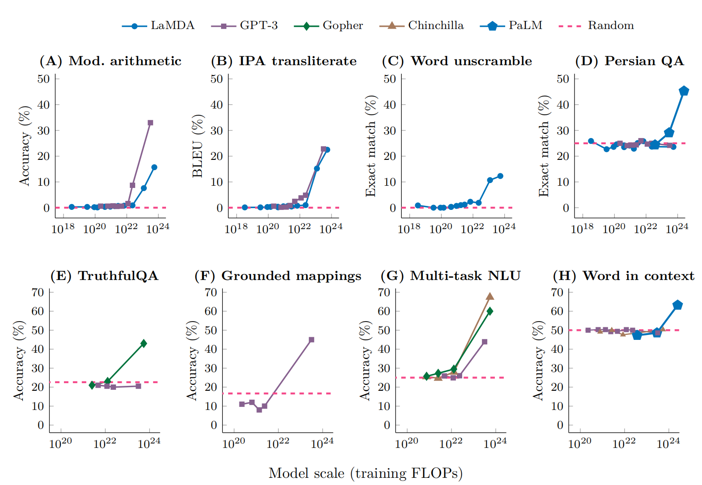
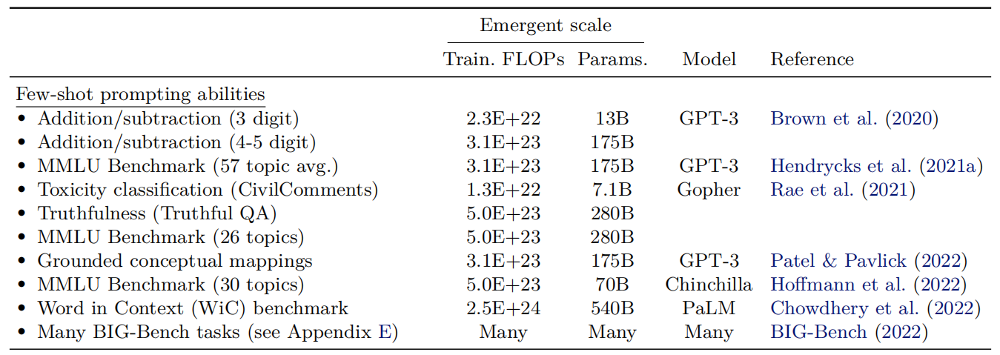
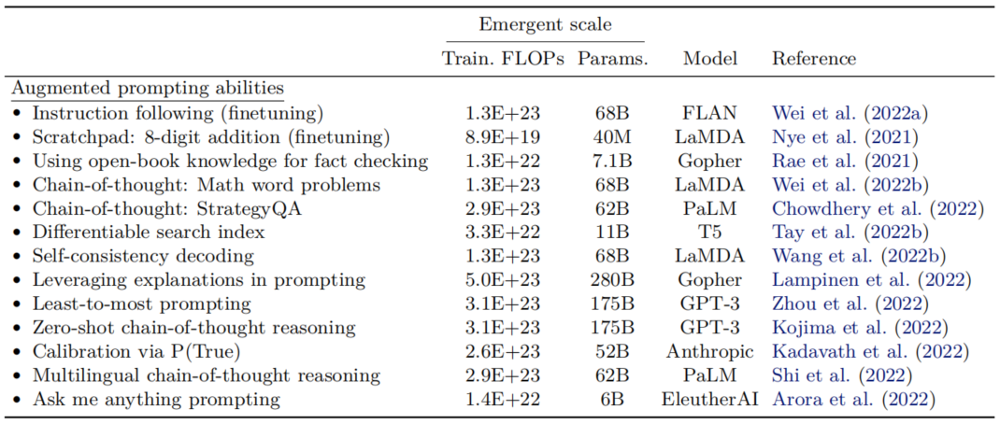

# 涌现能力 Emergent abilities 
在《大语言模型综述》一书中，明确给出了涌现能力的定义：
> 在小型模型中不存在但在大模型中出现的能力
具体来讲，就是当模型的规模扩展到一定程度时，模型在特定任务上的能力出现了显著提升的情况，并且出现了一些原本模型所不具备的能力。

下面介绍几种涌现能力的典型表现。

## 上下文学习能力In-context Learning, ICL
In-context Learning的概念在OpenAI团队的`GPT-3`论文中首次提出，具体定义为：
> 在Prompt中为语言模型提供自然语言指令和多个任务示例，无需显式的训练或梯度更新，仅依靠提示指令和任务示例，模型就能为测试样本生成预期的输出。
但是需要注意的是，上下文学习能力还与具体的下游任务有关，训练的模型并一定在所有任务上都能展现出良好的上下文学习能力。

如下图所示，展示了Few-shot prompt的8个示例，图中一共有5种模型。红色虚线代表的是随机结果，从图中可以看出，当模型的规模较小时，各个模型通过Few-shot prompt执行的8种不同的任务，都表现为随机性。只有当模型规模超过一定阈值，才看到了准确率的显著提升。这就是In-context Learning中的涌现能力。

## 指令遵循
根据《大语言模型综述》一书中的定义：
> 指令遵循能力是指大语言模型能够按照自然语言指令来执行对应的任务
预训练之后的模型并不具备这一能力，需要使用自然语言描述的多任务数据集来微调预训练模型，这一过程也被称为能力激活，就是激活预训练的泛化能力，遵循指令完成下游任务的能力。通过指令微调，大语言模型可以在没有显示示例的情况下按照Prompt指令来完成特定任务。

根据`FLAN-PaLM`模型的实验表明，在8B、62B以及540B三个参数规模的模型之中，经过指令微调之后，只有当参数规模达到 62B及以上的时候，才能够在包含 23 个复杂推理任务的 `BBH` 评估基准上，展现出较好的零样本（Zero-Shot）推理能力。而对于规模相对较小的语言模型（如 2B），也可以通过使用高质量指令数据微调的方式习得一定的通用指令遵循能力，但是主要
是在简单任务上的指令遵循能力。

## 逐步推理（Step-by-step Reasoning）
大语言模型具备有逐步推理，采用思维链的方式来输出推理步骤，并通过推理来提高最终结果的准确率。而这个能力在小型语言模型中是不具备的。例如在处理复杂的数学题目时，大语言模型可以逐步推理中间解题过程，从而输出更加准确的答案。

这一能力在规模巨大的模型中体现得非常明显，例如GPT-4,540B的PaLM模型等，最新的`GPT4-o1`更是展现出了惊人的复杂推理能力。

## 涌现能力与模型规模的关系

上图中展示了In-context Learning与涌现能力的关系。图中一行表示的意思，对于某个任务，特定模型在多少参数规模盒算力规模的情况下，出现了涌现能力。例如：对于"Addition subtraction 3 digit"任务，GPT-3模型只有达到13B的参数规模时，才出现了涌现能力。

从这个图中，也可以看出。多大的模型会出现涌现能力，这不是固定的，这与具体的任务有关。从下面这个表中，还可以看出对于模型的CoT能力，PaLM模型在参数规模达到了62B之后才出现。

参考资料：
1. [“大语言模型”综述](https://arxiv.org/abs/2303.18223)
2. [Emergent Abilities of Large Language Models](https://arxiv.org/abs/2206.07682)
