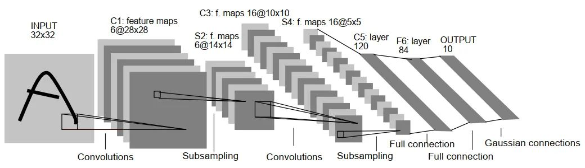
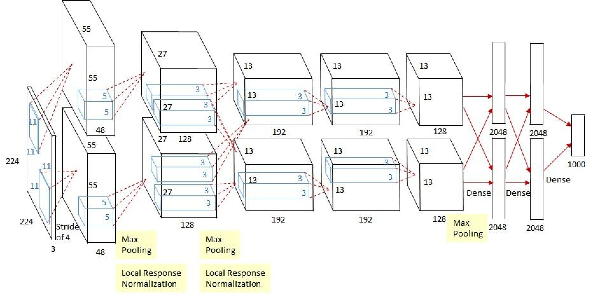
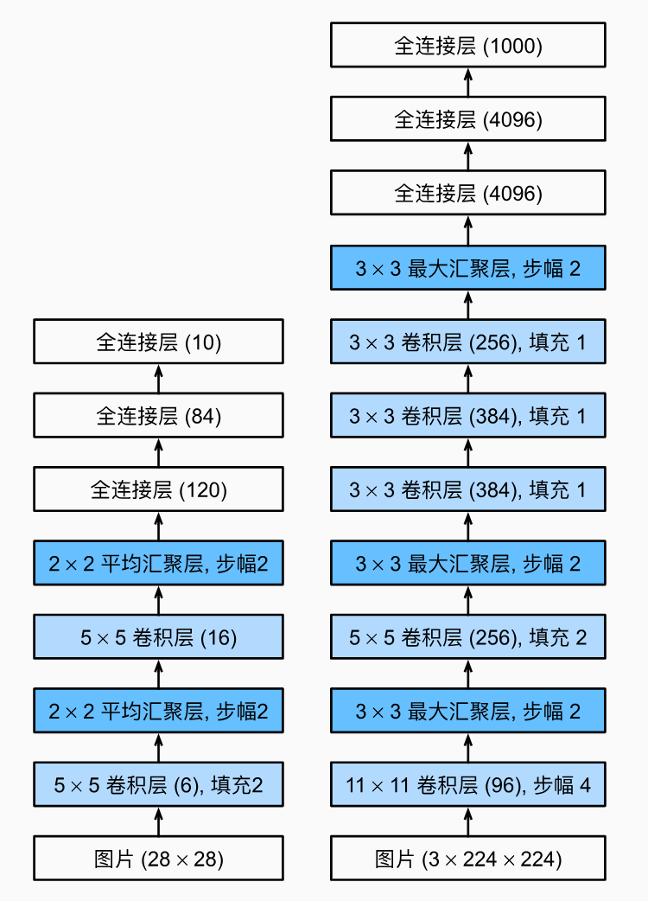
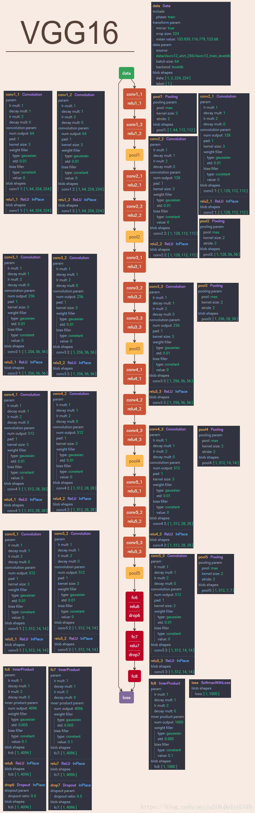

1. LeNet-5

LeNet-5早期在数字识别中取得了成功的应用，网络结构是:\
`Input`->`Conv`->`Pooling`->`Activation`->`Conv`->`Pooling`->`Activation`->`Conv`->`FFN`->`FFN`->`Output` 
   - 卷积层使用 `5x5`卷积核，`padding=0,stride=1`；
   - 池化层使用 `2x2` 的区域，`padding=0,stride=2`；
   - 后面是两个全连接层；
2. AlexNet

AlexNet相比LeNet-5做了更多层数的堆叠，网络参数进行了相应的调整，并在ImageNet大赛2012夺得冠军；相应VGG网络使用更小的卷积核，同时相比AlexNet进一步提升了网络层数。\
1、卷积+池化层（前五层）\
AlexNet共有五个卷积层，每个卷积层都包含卷积核、偏置项、ReLU激活函数和局部响应归一化（LRN）模块。\
卷积层C1：使用96个核对224 × 224 × 3的输入图像进行滤波，卷积核大小为11 × 11 × 3，步长为4。将一对55×55×48的特征图分别放入ReLU激活函数，生成激活图。激活后的图像进行最大池化，size为3×3，stride为2，池化后的特征图size为27×27×48（一对）。池化后进行LRN处理。\
卷积层C2：使用卷积层C1的输出（响应归一化和池化）作为输入，并使用256个卷积核进行滤波，核大小为5 × 5 × 48\
卷积层C3：有384个核，核大小为3 × 3 × 256，与卷积层C2的输出（归一化的，池化的）相连。\
卷积层C4：有384个核，核大小为3 × 3 × 192。\
卷积层C5：有256个核，核大小为3 × 3 × 192。卷积层C5与C3、C4层相比多了个池化，池化核size同样为3×3，stride为2。\
其中，卷积层C3、C4、C5互相连接，中间没有接入池化层或归一化层。\
2、全连接层（后三层）\
全连接层F6：因为是全连接层，卷积核size为6×6×256，4096个卷积核生成4096个特征图，尺寸为1×1。然后放入ReLU函数、Dropout处理。值得注意的是AlexNet使用了Dropout层，以减少过拟合现象的发生。\
全连接层F7：同F6层。\
全连接层F8：最后一层全连接层的输出是1000维softmax的输入，softmax会产生1000个类别预测的值。

从LeNet（左）到AlexNet（右）的变化图：\

推荐阅读：[深度卷积神经网络（AlexNet）](https://zh-v2.d2l.ai/chapter_convolutional-modern/alexnet.html)

3. VGG

    

在VGG网络中 
- 图片输入的尺寸固定，均为224 x 224；
- 图片的预处理方式和AlexNet一样：每个像素值减去整个训练集对应位置的RGB均值，除此之外没有其它预处理方式；
- 仅使用小卷积核3 x 3和1 x 1，步长均为1，3 x 3的padding = 1；
- Max pooling窗口均为2 x 2，步长2（不使用AlexNet的重叠池化了）；
- 所有卷积层和FC层之后都有ReLU；
- 除上图中的A-LRN网络之外其它模型（A\B\C\D\E）没有使用LRN（因为经过实验发现加入了LRN没有效果，同时又费时费空间）。