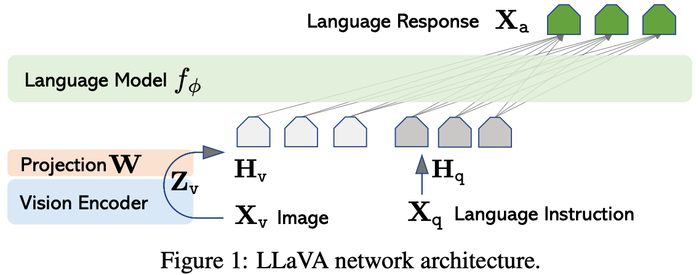
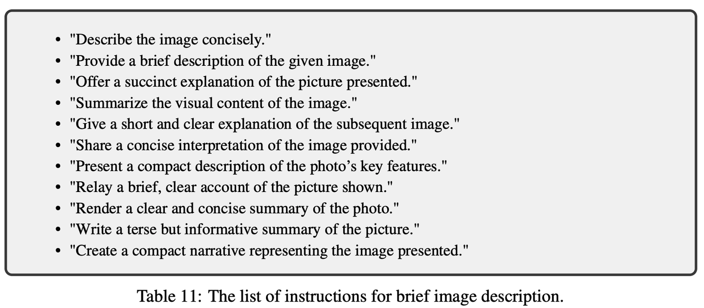
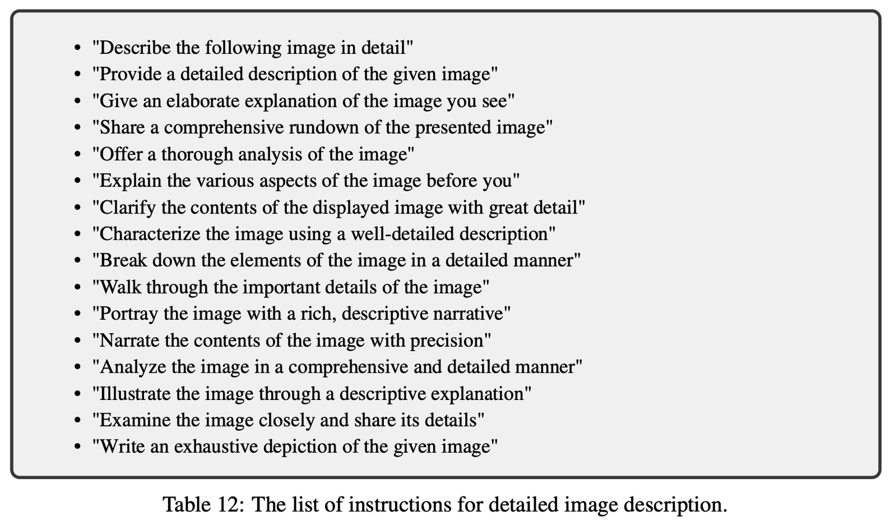
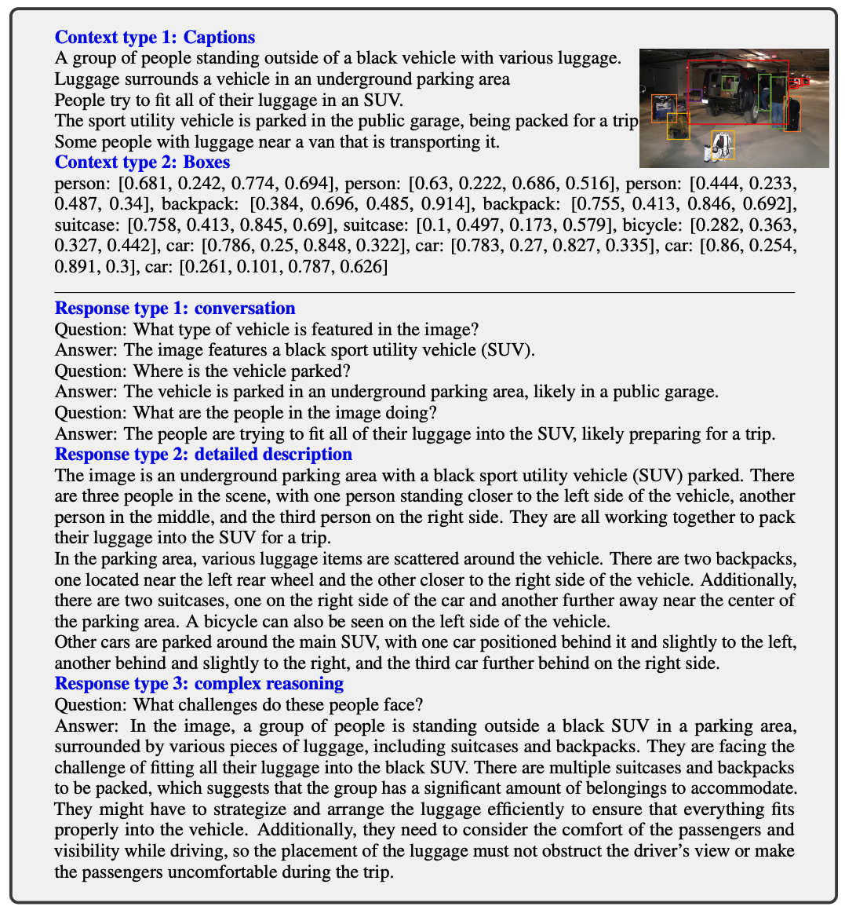
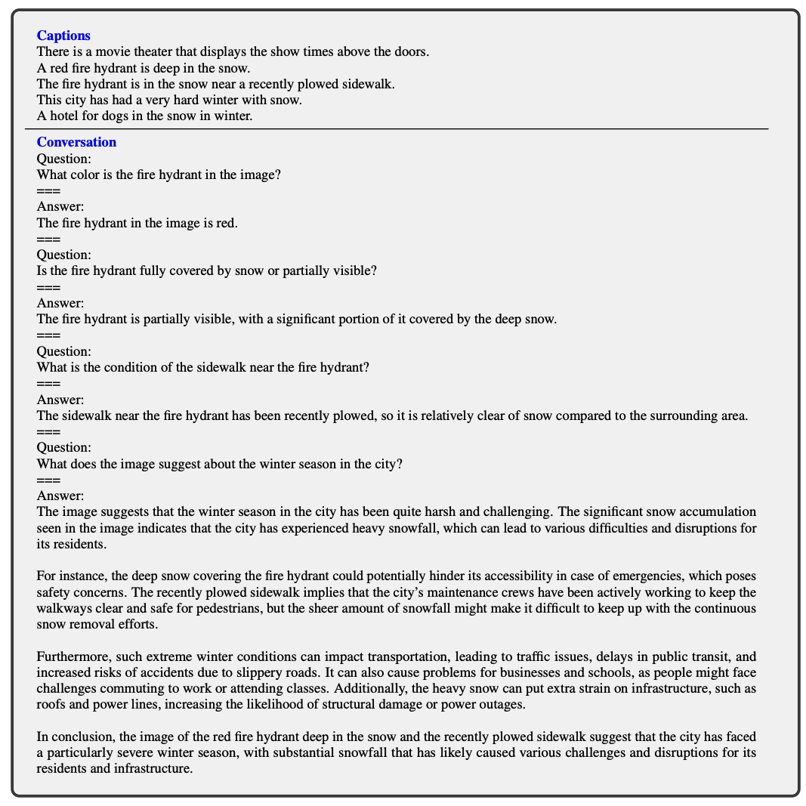

# **L**arge **L**anguage **a**nd **V**ision **A**ssistant

### **[模型结构](https://zhida.zhihu.com/search?content_id=241996811&content_type=Article&match_order=1&q=%E6%A8%A1%E5%9E%8B%E7%BB%93%E6%9E%84&zhida_source=entity)：**

-   **Vision Encoder**: pre-trained CLIP visual encoder ViT-L/14
-   **LLM**：Vicuna
-   **Projection**：A simple linear layer to connect image features into the word embedding space。不同于Flamingo的[gated cross-attention](https://zhida.zhihu.com/search?content_id=241996811&content_type=Article&match_order=1&q=gated+cross-attention&zhida_source=entity)，和BLIP-2的Q-former，LLaVA的映射层比较简单，好处是可以方便迭代以数据为中心的实验。

### **训练方法：**

#### 阶段一：特征对齐的预训练 Pre-training for Feature Alignment

-  冻结视觉编码器和LLM，只训练Projection层。
-  从CC3M中过滤了595K的图文对。这些图文对被改造为指令跟随数据（instruction-following data）
-  每个样本是一个单轮对话。
-  预测结果是图像的原始描述文本。
-  通过这一步，[视觉编码器](https://zhida.zhihu.com/search?content_id=241996811&content_type=Article&match_order=2&q=%E8%A7%86%E8%A7%89%E7%BC%96%E7%A0%81%E5%99%A8&zhida_source=entity)输出的图像特征可以和预训练的LLM的词向量对齐。这个阶段可以理解为**为冻结的LLM训练一个兼容的[visual tokenizer](https://zhida.zhihu.com/search?content_id=241996811&content_type=Article&match_order=1&q=visual+tokenizer&zhida_source=entity)。**
-  在CC-595K过滤后的子数据集上训练，epoch数量为1，学习率2e-3，batch_size为128。
-  **阶段二：端到端微调（Fine-tuning End-to-End）。**
-  冻结视觉编码器，训练Projection层和LLM。
-  两个实验设置
-  多模态对话机器人：利用158K语言-图像指令跟随数据对Chatbot进行了微调开发。在这三种类型的回答中，对话型是多轮交互式的，而其他两种则是单轮交互式。在训练过程中，这些样本被均匀地采样使用。
-  ScienceQA数据集：ScienceQA [34] 包含了21,000个多模态多项选择题，这些问题涵盖了广泛的领域多样性，涉及3个学科、26个主题、127个类别和379项技能。这个[基准数据集](https://zhida.zhihu.com/search?content_id=241996811&content_type=Article&match_order=1&q=%E5%9F%BA%E5%87%86%E6%95%B0%E6%8D%AE%E9%9B%86&zhida_source=entity)被划分为训练、验证和测试三个部分，分别包含12,726个、4,241个和4,241个样本。

-  在提出的LLaVA-Instruct-158K数据集上训练，epoch数量为3，学习率2e-5，batch_size为32。

### 指令数据
对图像描述比较简单的指令

描述详细的指令

### prompt

对于每个查询，下图展示了如何通过ChatGPT/GPT-4构建提示以从query['context']中收集query['response']的过程，采用少量示例的上下文学习方式，其中示例来自fewshot_samples，每个示例包含输入sample['context']和输出sample['response']。请注意，messages是最终的提示。在这个示例中，提供了用于生成对话响应的提示。

一个例子来说明指令遵循数据。下图中，顶部区块显示了诸如标题和框等用于提示GPT的上下文信息，而底部区块则展示了三种类型的响应。请注意，视觉图像并未用于提示GPT，在这里仅将其作为参考展示出来。

下面是一个用于构建视觉对话数据的一个上下文学习示例。

用于构建视觉对话数据的一个上下文学习示例

# LLaVA-1.5（通过视觉指令微调改进基线性能）

论文名称：Improved Baselines with Visual Instruction Tuning

论文链接：[https://arxiv.org/pdf/2310.03744.pdf](https://link.zhihu.com/?target=https%3A//arxiv.org/pdf/2310.03744.pdf)

论文发布时间：2023年10月

### 基于LLaVA的改动点

-  **明确指定输出格式的提示**：为了解决短文本 VQA 和长文本 VQA 之间的兼容问题，在短文本回答中明确指定了输出格式的提示。例如，通过在问题文本的末尾添加特定的短语，如**想要短回答时加上“Answer the question using a single word or phrase”**，模型能够基于用户的指示适当地调整输出格式。
-  **使用 MLP 作为视觉-语言连接器**：使用了**两层 MLP**作为[视觉-语言连接器](https://zhida.zhihu.com/search?content_id=241996811&content_type=Article&match_order=2&q=%E8%A7%86%E8%A7%89-%E8%AF%AD%E8%A8%80%E8%BF%9E%E6%8E%A5%E5%99%A8&zhida_source=entity)，以增强连接器的表达能力。相比LLaVA的单个线性投影层，显著提升了多模态能力。
-  **添加特定任务的数据集**：为了强化模型在不同能力上的表现，研究者不仅添加了 VQA 数据集，还专注于 OCR 和区域级别识别的四个数据集。这些数据集包括需要广泛知识的 VQA（如 OKVQA 和 A-OKVQA）、需要 OCR 的 VQA（如 OCRVQA 和 TextCaps）等。
-  **规模扩大。**

-  图片分辨率提升到336。
-  新增GQA数据集作为额外的图片知识。
-  加入ShareGPT数据。
-  LLM增大到13B。MM-Vet上的结果显示，当LLM模型扩展至130亿参数规模时，改进最为显著，这表明基础LLM的能力对于视觉对话至关重要。

  

### 和其他模型的对比结果

-  12个任务中有11个都是第一，另一个是第二。
-  该方法**在单一8块[A100节点](https://zhida.zhihu.com/search?content_id=241996811&content_type=Article&match_order=1&q=A100%E8%8A%82%E7%82%B9&zhida_source=entity)上大约1天内完成训练**，并超越了那些使用十亿级别数据的方法（指的Qwen-VL）。

### 计算成本

对于LLaVA-1.5，我们使用与LCS-558K1相同的预训练数据集，并在进行指令微调时保持与LLaVA [28]大致相同的训练迭代次数和批次大小。由于将图像输入分辨率提高到了336像素，因此LLaVA-1.5的训练时间约为LLaVA的两倍：预训练阶段大约需要6小时，视觉指令微调阶段大约需要20小时，使用的是8块A100显卡。

  

### 几点不足

-  首先,LLaVA利用完整的图像patch，可能会延长每个训练迭代。而视觉重采样器减少了LLM中的视觉patch数量，但目前它们不能像LLaVA那样有相当数量的训练数据时有效收敛，可能是因为重采样器中的更多可训练参数。**开发一个样本效率高的视觉重采样器可以为未来扩展指令遵循多模态模型铺平道路**。
-  其次,由于缺乏这样的指令遵循数据和上下文长度的限制，**LLaVA-1.5还无法处理多个图像**。
-  第三,尽管LLaVA-1.5展示了遵循复杂指令的熟练程度，但其问题解决能力在某些领域仍可能受到限制，这可以通过更强大的语言模型和高质量的针对性视觉指令调谐数据来改进。
-  最后，尽管其**幻觉**的倾向显著减少，但LLaVA不免偶尔产生幻觉和传播错误信息，在关键应用中(例如医疗)仍应谨慎使用。

  

LLaVA-NEXT-240130 (LLaVA-1.6) （改进的推理、OCR及[世界知识](https://zhida.zhihu.com/search?content_id=241996811&content_type=Article&match_order=1&q=%E4%B8%96%E7%95%8C%E7%9F%A5%E8%AF%86&zhida_source=entity)能力）
-----------------------------------------------------------------------------------------------------------------------------------------------------------------------------------------------------

文章链接：[LLaVA-NeXT: Improved reasoning, OCR, and world knowledge](https://link.zhihu.com/?target=https%3A//llava-vl.github.io/blog/2024-01-30-llava-next/)

### 概述

LLaVA-NeXT，它在推理、OCR和世界知识方面实现了显著提升，甚至在多个基准测试上超过了[Gemini Pro](https://zhida.zhihu.com/search?content_id=241996811&content_type=Article&match_order=1&q=Gemini+Pro&zhida_source=entity)的表现。

相较于LLaVA-1.5，LLaVA-NeXT有如下改进：

1.  将输入**图像分辨率**提高了4倍，使得它可以捕捉到更多视觉细节。它支持三种不同的宽高比，最高可达672x672、336x1344、1344x336的分辨率。
2.  通过**改进视觉指令微调数据混合**，提升了视觉推理和OCR能力。
3.  对**更多场景**下的视觉对话功能进行了优化，**覆盖了不同应用领域**，并增强了世界知识和逻辑推理能力。
4.  采用SGLang实现**高效的部署和推理**。

伴随着性能的提升，LLaVA-NeXT继续保持了LLaVA-1.5的极简主义设计和数据效率。它重用了LLaVA-1.5预先训练的连接器，并且仍然使用少于100万的视觉指令微调样本。最大的340亿参数版本在配备32块A100显卡的情况下，约1天即可完成训练。代码、数据和模型将会公开提供。

动态高分辨率方案示例：2×2网格配置

  

亮点：

1.  表现卓越！**LLaVA-NeXT相比开源的大型[多模态模型](https://zhida.zhihu.com/search?content_id=241996811&content_type=Article&match_order=2&q=%E5%A4%9A%E6%A8%A1%E6%80%81%E6%A8%A1%E5%9E%8B&zhida_source=entity)（如CogVLM或Yi-VL）取得了最佳性能表现**。相较于商业模型，它在部分基准测试中已达到与Gemini Pro相当的水平，并超越了Qwen-VL-Plus。
2.  **零样本中文能力**。LLaVA-NeXT具备新兴的零样本中文能力（即仅考虑英文多模态数据训练）。其在中文多模态场景中的表现令人惊讶，例如在MMBench-CN上取得最优结果。
3.  **训练成本低**。LLaVA-NeXT使用32块GPU进行约1天的训练，总共使用了130万个数据样本。其计算量和训练数据成本仅为其他模型的1/100至1/1000，展现出极低的训练成本优势。

### 评估

下面是和其他多模态大模型的对比结果。

和其他多模态大模型的对比

  

  

  

LLaVA-NEXT-Video-240430（一个强大的[零样本](https://zhida.zhihu.com/search?content_id=241996811&content_type=Article&match_order=3&q=%E9%9B%B6%E6%A0%B7%E6%9C%AC&zhida_source=entity)视频理解模型）
-----------------------------------------------------------------------------------------------------------------------------------------------------------------------------------

文章链接：[https://llava-vl.github.io/blog/2024-04-30-llava-next-video/](https://link.zhihu.com/?target=https%3A//llava-vl.github.io/blog/2024-04-30-llava-next-video/)

### 概述

在 2024 年 1 月 30 日，LLaVA-NeXT发布，这是一个开源的大型多模态模型（LMM），它专门在文本-图像数据上进行训练。通过提出的 **AnyRes**技术，它提高了推理、OCR 和世界知识方面的能力，在一系列基于图像的多模态理解任务中表现出色，甚至在一些图像基准上超过了 [Gemini-Pro](https://zhida.zhihu.com/search?content_id=241996811&content_type=Article&match_order=1&q=Gemini-Pro&zhida_source=entity)，例如 MMMU 和 MathVista。

此次推出的 LLaVA-NeXT 在理解视频内容方面出乎意料地具有强大的性能。视频版 LLaVA-NeXT 的当前版本有几个改进之处：

-  **具有 AnyRes 的零样本视频表示能力**：AnyRes 技术自然地**将高分辨率图像表示为多个预训练的 VIT 能够消化的图像，并将它们形成一个连接的序列**。这种技术自然可推广用于表示视频（由多个帧组成），使仅经过图像训练的 LLaVA-Next 模型在视频任务上表现得非常好。值得注意的是，这是 LMM 首次显示出强大的零样本模态转换能力。
-  **具有长度泛化的推理在更长的视频上得到改进**。线性缩放技术实现了长度泛化，使 LLaVA-NeXT 能够有效处理超出 LLM“max_token_length”限制的长视频。
-  **强大的视频理解能力**。

-  (1) 结合上述两种技术的 **LLaVA-Next-Image**，产生了比在视频上调整的开源 LMM 更好的零样本性能。
-  (2) 在视频数据上进一步对 LLaVA-Next-Image 进行监督微调（SFT）的 **LLaVA-Next-Video**，与 LLaVA-Next-Image 相比，实现了更好的视频理解能力。
-  (3) 使用直接偏好优化（DPO）使模型响应与人工智能反馈对齐的 **LLaVA-Next-Video-DPO**，显示出显著的性能提升。

-  **使用 SGLang 进行高效的部署和推理**。它使视频任务上的推理速度提高了 5 倍，允许更可扩展的服务，例如百万级别的视频重新标注。

  

### 评估

*视频输入仅表示为一帧。

✨ 亮点概览：

-  突破性表现！在未接触任何视频数据的情况下，LLaVA-Next展示了强大的零样本模态迁移能力，超越了所有现有的专为视频设计的开源大规模语言模型（例如，[LLaMA-VID](https://zhida.zhihu.com/search?content_id=241996811&content_type=Article&match_order=1&q=LLaMA-VID&zhida_source=entity)）。与专有模型相比，在NextQA和[ActivityNet-QA](https://zhida.zhihu.com/search?content_id=241996811&content_type=Article&match_order=1&q=ActivityNet-QA&zhida_source=entity)上，它达到了与Gemini Pro相当的性能水平。
-  出色的长度泛化能力。尽管在4096个token长度限制的序列条件下进行训练，LLaVA-Next仍表现出卓越的向更长序列泛化的能力。这种能力确保了即便处理超出原始token长度限制的长帧内容时，也能保持稳健的性能。
-  DPO推动性能提升。利用AI反馈在视频上的分布式实践优化（DPO）带来了显著的性能增长。

  

### AnyRes：从多块到多帧

在 LLaVA-NeXT 中引入的 AnyRes 算法，实现了性能效率和操作成本之间的最佳平衡，以处理任何高分辨率的图像。它将图像分割成具有各种配置的子图像网格，例如{2x2、1x{2、3、4}、{2、3、4}x1}。

说明 AnyRes 将一组图像消化为一连串拼接的视觉 token，允许统一的图像和视频输入，这自然支持从多图像到多帧的演进。

通过少量代码调整，LLaVA-NeXT 可以处理排列在{1xN}网格中的 N 个视频帧。**假设每个帧包含 24x24 个 token，一个视频的总 token 数将是 24x24xN**。然而，考虑到 LLM 的“max_token_length”限制为 4096，必须确保 24x24xN + 文本 token 的数量 < 4096，以避免产生无意义的输出。这需要在每个帧的 token 和总帧数之间仔细平衡。例如，应用步长为 2 的[空间池化](https://zhida.zhihu.com/search?content_id=241996811&content_type=Article&match_order=1&q=%E7%A9%BA%E9%97%B4%E6%B1%A0%E5%8C%96&zhida_source=entity)将每个帧的 token 从 24x24 减少到 12x12，可以容纳多达 16 帧。我们的研究结果表明，16 帧中 12x12 个 token 的配置产生了最佳性能。然而，16 帧可能不足以捕捉大多数视频的本质。接下来，我们专注于使 LLaVA-NeXT 能够处理更多帧。

  

### 长度泛化：从多帧到长视频

**受到最近在处理 LLM 中长序列方面的进展的启发**，例如在旋转位置嵌入（RoPE）中实现线性缩放，**我们在 LLaVA-NeXT 中应用了类似的缩放方法。例如，通过引入 2 的[缩放因子](https://zhida.zhihu.com/search?content_id=241996811&content_type=Article&match_order=1&q=%E7%BC%A9%E6%94%BE%E5%9B%A0%E5%AD%90&zhida_source=entity)，我们有效地将模型的“max_token_length”容量翻倍，使其能够处理多达 8192 个 token 的序列**。通过这种技术，**LLaVA-NeXT 可以处理多达 56 帧，每帧的 token 数为 12x12**，显著扩大了模型在分析更长视频序列中的适用性。

  

处理具有更多帧的长序列的长度泛化的示例，其中推理中的序列长度可以长于训练中的序列长度。

这种线性缩放的适应不仅便于处理更多数量的帧，而且为 LLaVA-NeXT 在全面视频分析中的应用开辟了新的途径，为该领域的未来研究树立了先例。

  

### 基于AI反馈的DPO（Direct Preference Optimization）

最近从人类反馈中进行强化学习（RLHF）的进展在引导 LLM 生成更诚实（honest）、有帮助（helpful）和无害（harmless）的内容方面是有效的。它们在多模态环境中的有效性仍然有限。**关键障碍在于**

（1）开发一个能够区分首选响应和不太首选响应的强大[奖励系统](https://zhida.zhihu.com/search?content_id=241996811&content_type=Article&match_order=1&q=%E5%A5%96%E5%8A%B1%E7%B3%BB%E7%BB%9F&zhida_source=entity)

（2）从人类获取高质量的偏好数据既昂贵又劳动密集，特别是对于具有多个帧的视频输入。

作为一种具有成本效益的替代方案，在我们最近的研究 **LLaVA-Hound**中考虑了使用 LLM 奖励的 AI 反馈。DPO 用于**基于 LLM 生成的偏好数据**训练 LMM，其中**视频以其详细的标题作为支持证据表示**。按照相同的配方，我们探索基于更强大的 SFT LMM LLaVA-NeXT-Video 的 DPO，从而导致最终模型 LLaVA-NeXT-Video-DPO。

  

实验结果展示了 DPO 显著提高的性能增益，有时甚至超过了使用视频数据进行有监督微调的增益。这突出了探索利用 AI 或人类反馈的训练方法的有前途的未来。

  

### 如何表示视频？配置：(# Tokens/Frame, # Frames)

如“从多块到多帧”部分所述，应对[大型语言模型](https://zhida.zhihu.com/search?content_id=241996811&content_type=Article&match_order=1&q=%E5%A4%A7%E5%9E%8B%E8%AF%AD%E8%A8%80%E6%A8%A1%E5%9E%8B&zhida_source=entity)（LLM）的“max_token_length”限制（为4096）**需要在每帧分配的token数量与分析中包含的总帧数之间找到一个策略性平衡**。我们的探索得出了**一个最优设置：配置每帧包含12x12个token，并为每个视频采样16帧**。

  

为了进一步提升模型的能力，“线性缩放”成为探索能够容纳更多图像token配置的关键工具，从而允许更长的推理token序列。下表总结了我们的发现，说明了“线性缩放”启用的配置通过允许可更长的推理token序列，显著提高了性能。

  

  

### 如何针对视频进行微调以提升性能？

很自然地，为了提升性能，我们会在视频数据上对模型进行进一步微调。**我们的分析揭示，针对“LLaVA-NeXT-Video”优化性能，采用视频和图像数据的混合训练方案是至关重要的**。

具体来说，我们考虑了以下不同策略：

(1) 仅在视频数据上对LLaVA-NeXT阶段-2检查点进行持续微调；

(2) 从LLaVA-NeXT阶段-1检查点开始，在阶段-2中，模型针对图像和视频的联合数据进行微调，此时每个批次中的数据类型可以是分离的（每个批次只含有一种类型）或是混合的（每个批次同时包含两种类型）。

结果清晰显示，**使用混合图像和视频数据的批次进行训练表现最佳，而其他策略的表现甚至不如LLaVA-NeXT-Image模型**。这一结果强调了在训练过程中混合视频和图像数据的重要性，以此增强模型在视频相关任务上的专业能力。

  

LLaVA-Next-240510（更强的LLMs在野外环境下极大增强了多模态能力）
------------------------------------------

文章链接：[https://llava-vl.github.io/blog/2024-05-10-llava-next-stronger-llms/](https://link.zhihu.com/?target=https%3A//llava-vl.github.io/blog/2024-05-10-llava-next-stronger-llms/)

### 概述

2024年1月30日发布的LLaVA-NeXT，是一款基于开放资源的经济高效训练方法开发的先进大型多模态模型（LMM）。**它利用当时领先的LLM——Yi-34B，在多模态能力上增强了推理、OCR及世界知识**。LLaVA-NeXT在多种多模态理解任务上展现了卓越性能，甚至在MMMU和MathVista等基准测试上超越了Gemini-Pro。

近期，社区见证了诸如LLaMA3和Qwen-1.5家族等更强大语言能力的开源LLM的出现。同时，有猜测称专有的LMM，如OpenAI的GPT-V，正得到如GPT-4这样更强LLM的支持。这自然而然地引出一个问题：随着新推出的强[大语言模型](https://zhida.zhihu.com/search?content_id=241996811&content_type=Article&match_order=1&q=%E5%A4%A7%E8%AF%AD%E8%A8%80%E6%A8%A1%E5%9E%8B&zhida_source=entity)缩小了开源与专有LLM之间的差距，当这些更强的LLM赋能时，开源与专有多模态模型之间的鸿沟是否也在缩小？

借助近期更强的开源LLM扩展了LLaVA-NeXT，就是LLaVA-Next-240510。下面是有关更强大语言模型的发现：

- **使用更强更大的语言模型增加多模态能力，模型规模最大可至3倍**。这使得LMM能够展现更好的视觉世界知识和源自LLM的逻辑推理能力。它支持LLaMA3（80亿参数）和Qwen-1.5（720亿和1100亿参数）。

- **针对更多现实生活场景提供更好的视觉聊天体验，涵盖不同的应用领域**。为评估在野环境下的改进多模态能力，我们**收集并开发了新的评估数据集LLaVA-Bench（Wilder）**，该数据集继承了LLaVA-Bench (in-the-wild)的精神，用于研究日常生活中的视觉对话，并扩大了数据量以进行全面评估。

- 为了清晰突出LLM在提升多模态性能改进方面的影响，我们**沿用了LLaVA-NeXT相同的训练方案**，从而保持了LLaVA系列简洁的设计和数据效率。**最大的1100亿参数变体仅用18小时和128台H800服务器即完成训练**。代码、数据和模型将向公众开放。

  

### 模型关键信息

  

### 评估

  

Benchmark Results

  

亮点概要：

-  顶尖水平的性能！仅通过增强LLM能力，LLaVA-NeXT就实现了与先前开源LMM相比持续更优的性能表现。在选定的基准测试上，它已赶超GPT4-V。
-  低成本训练！延续了之前LLaVA模型的高效训练策略。使用与先前LLaVA-NeXT 7B/13B/34B模型相同的数据集进行了监督微调。当前最大的模型LLaVA-NeXT-110B仅需在128台H800-80G机器上训练18小时。（评价：成本也不低呀(⁎⁍̴̛ᴗ⁍̴̛⁎) ）

与LLaVA家族及当前最优LMMs的对比

### 探究大型语言模型（LLM）的能力极限

在使用LLaVA-NeXT进行的探索中，我们观察到将LLM从130亿规模扩大到340亿时，性能有了显著飞跃。随着更强大的开源LLM的出现，人们自然而然地对推动多模态性能边界产生了好奇，进而提出了问题：LLM的语言能力能多有效地转移到多模态环境中？

为了衡量LLM的语言能力，我们采用了大规模多任务语言理解（MMLU）基准的评估分数。

为了在应用相同的LLaVA-NeXT训练方法后衡量多模态能力，我们考察了四个关键基准：**MMMU用于多学科理解、MathVista用于视觉数学推理、AI2D用于科学图表理解，以及LLaVA-W用于日常视觉聊天场景**。这些基准涵盖了野外环境下LMM的多样化实际应用案例。

多模态与语言能力之间的关联通过下图直观展示，利用回归线描绘了各基准上的趋势。

在四个基准上的多模态和语言能力之间的性能相关性。圆的大小代表模型大小。

  

  

语言能力的提升：在规模相当的LLM中（例如，70亿规模的Mistral/Vicuna、Qwen，以及80亿规模的LLaMa3），存在一种一致的模式，即根据MMMU分数衡量的语言熟练度越高，多模态能力也越强。

模型规模的影响：在同一LLM系列内（例如，Qwen LLM：70亿、720亿、1100亿规模），更大规模的模型在多模态基准测试上持续展现出更优越的性能。这强化了这样一个观念，即更大规模的模型往往具有更强的语言能力，从而在多模态任务中实现更好的性能。

在上述两项分析中，更强的LLM很可能带来更优秀的多模态能力。这一现象可以归因于更强LLM通常关联的更广泛的世界知识、强大的逻辑推理能力以及对话技巧。这些语言能力通过LLaVA-NeXT的轻量级训练得以良好保持并在视觉-语言领域转移，这是由于跨模态概念的对齐，以及在视觉指令微调中与人类意图的对齐。

  

### LLaVA-Bench (Wilder): 日常视觉聊天基准测试

开发LLMs（多模态大语言模型）的**最终目标之一是构建一个通用助手，以帮助人类在日常生活的各种多模态任务中**。因此，**拥有强大的基准来精确衡量相关进展显得尤为重要**。

LLaVA-Bench（In-the-Wild），也称为LLaVA-W，就是这样一个用于衡量LLMs日常视觉聊天能力的基准。然而，由于只有60个示例可用，我们意识到需要一个更庞大的数据集。秉承这一理念，我们引入了**LLaVA-Bench（Wilder），它包含两个版本：一个较小的迭代版本，包含120个示例，以便快速评估；以及一个中等规模的版本，包含1020个示例，以进行全面测量**。这些数据集涵盖了多种场景，如数学问题解决、图像理解、代码生成、视觉AI辅助和基于图像的推理。为了构建这些数据集，**我们从在线服务中收集了反映现实用户需求的指令和图像。随后，我们仔细筛选样本以解决隐私问题并减轻潜在危害。对这些提示的响应使用GPT4-V生成**。

  

与其他基准的比较。下图提供了LLaVA-Bench（Wilder）与现有LLM评估基准的视觉对比。**许多当前基准采用固定形式的问答（QA）格式，因其易于评估指标和展示模型比较而被选中。顺应这一趋势，像MMMU、Mathvista和AI2D这样的基准专门用于评估LMM在特定知识密集型领域的性能**。相比之下，**RealWorldQA侧重于日常生活场景，但局限于简短回答格式**。然而，作为助手模型，具备在自由形式对话中吸引用户的能力对于激发兴趣、超越简单简短回答互动的限制至关重要。因此，**在日常视觉聊天场景中纳入自由形式对话变得至关重要。LLaVA-W率先引入了这样的基准原型，而LLaVA-Bench-Wilder致力于通过包含更多日常生活场景和覆盖不同应用来建立在这个基准之上**。

不同基准测试的比较。圆圈的大小代表数据集的大小。

  

**构建与评估指标**。对于来自在线服务的一大批查询，我们使用**ONE-PEACE嵌入模型**生成嵌入。接下来，我们应用了加权K-Means聚类，利用图像总像素值的最小-最大规范化作为权重，确保像素值较高的图像更可能被包含在我们的测试集中。**去除重复项后，我们得到了一个小版本，包含120个问题，和一个中等版本，包含1020个问题。我们还进行了去污检查，以确保数据集干净无污染**。两个版本的图像重叠率均低于2%。相比之下，原始的LLaVA-W有5%的图像重叠。评估数据被排除在LLaVA-NeXT训练数据之外，以避免污染。

  

**参考答案构建**。对于每个筛选出的问题，我们首先使用**GPT4V生成参考响应，并邀请人工标注员手动验证问题和参考答案的准确性**。相当数量的用户询问较为模糊，涉及图像分辨率查询、语法错误或与上传图片无关。在这种情况下，GPT4V可能会拒绝回应，或者提供的参考答案可能是错误的。为了保证评估数据的质量，我们对手头有问题的答案进行了人工复审和修订，确保准确性和可靠性。

  

**评分方法**。我们采用了与LLaVA-W相同的评估流程，但**将GPT-4替换为GPT4-V**。与LLaVA-W中使用多个类别不同，我们简单地计算了GPT4-V参考答案与模型响应之间的总体得分比率。在评估过程中，我们注意到得分并不能很好地揭示不同模型间的问题，可能会不公平地降低参考答案的分数，导致模型的不良案例无法在总体分数中正确反映。为了解决这个问题，我们让GPT4-V始终认为正确的答案是完美的，并给予满分10分。这意味着其他模型会得到更低的分数，并且因错误而受到更多惩罚。这有助于我们更好地[评估模型](https://zhida.zhihu.com/search?content_id=241996811&content_type=Article&match_order=1&q=%E8%AF%84%E4%BC%B0%E6%A8%A1%E5%9E%8B&zhida_source=entity)在实际生活场景中的能力。

  

### 基准与模型比较

定量结果。LLaVA-Bench (Wilder) 相较于其他基准所展现的独特评估价值，明显体现在最先进（State-of-the-Art, SoTA）多模态大语言模型（LMMs）之间显著的性能差异上。某些在知识密集型任务中高度熟练的LMMs，在LLaVA-Bench (Wilder) 测评的日常视觉聊天场景中可能并不出众。本次发布的LLaVA-NeXT模型持续在多个领域推进性能的进步。

