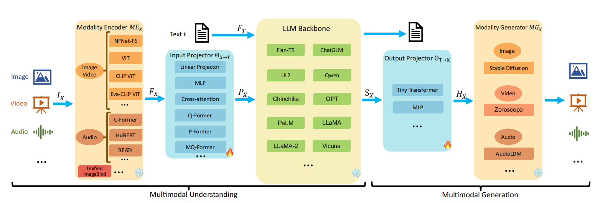

本文是是对综述：[MM-LLMs: Recent Advances in MultiModal Large Language Models](https://arxiv.org/abs/2401.13601)的解读，建议结合原文一起看

# 多模态大模型
MM-LLMs面临的核心挑战是如何有效地将LLMs与其他模态的模型连接起来，以实现协同推理，并且最终使得 MM LLMs 的输出与人类价值观保持一致。

## 多模态任务分类
**内容理解和文本生成方向**：
1. 图像-文本理解任务，如`BLIP-2`、`LLaVA`、`MiniGPT-4`和`OpenFlamingo`；
2. 视频-文本理解任务，如`VideoChat`、`Video-ChatGPT`和`LLaMA-VID`；
3. 音频-文本理解任务，如`Qwen-Audio`。随后，
**特定模态输出方向**：
1. 图像-文本输出任务，如`GILL`、`Kosmos-2`、`Emu`和`MiniGPT-5`
2. 语音/音频-文本输出任务，如`SpeechGPT`和`AudioPaLM`。

## 多模态组成

通用的多模态模型架构一般由五个部分组成，如下图所示。首先可以分为**Mul.modal Understanding多模态理解**与**Mul.modal Genera.on多模态生成**两个步骤。
### **多模态理解**部分
1. 首先将`Image`,`Video`,`Audio`等不同模态的数据(标记为$I_X$)作为输入，使用`Modality Encoder`进行编码，映射到特征空间$F_X$.
2. 然后$F_X$输入到`Input Projector`模块，该模型主要实现模态特征$F_X$与文本特征空间$T$的对齐，
3. `LLM backbone`部分则是接受文本特征$F_T$和映射之后的模态向量$P_X$，输出文本$t$和模态的`signal token` $S_X$。

### **多模态生成**部分
这部分则主要是用于根据`LLM backbone`输出的$S_X$，生成图片、音频等内容。
1. **输出投影**：将`signal token` $S_X$映射到特征空间$H_X$
2. **多模态生成器**: 接受$H_X$输出模态信息，图片，音频等。

通常而言，在训练过程中，多模态的编码器、生成器与大模型的参数一般都固定不变，不用于训练，主要优化的重点将落在输入投影与输出投影之中，而这两部分一般参数量仅占总体参数的 2%。

### Modality Encoder 多模态编码器
多模态编码器完成的任务是编码输入的多模态信息 ，将其映射到特征空间，可以是图像、视频、音频等不同模态的信息。

#### Visual Modality
对于视觉模态，可选的编码器有：
- **NFNet-F6**：一种无需归一化的ResNet，展示了自适应梯度裁剪技术，使得在广泛增强的数据集上进行训练的同时，能够达到图像识别的SOTA水平。
- **ViT**：通过首先将图像分割成小块，将Transformer应用于图像。然后，它通过线性投影来平整这些小块，接着通过Transformer块进行编码。
- **CLIP ViT**：建立了文本和图像之间的联系，包括一个视觉变换器（ViT）和一个文本编码器。通过大量的文本-图像配对，它通过对比学习优化视觉变换器，将配对的文本和图像视为正样本，而将其他样本视为负样本。
- **Eva-CLIP ViT**：稳定了大规模CLIP的训练和优化过程，为扩展和加速昂贵的多模态基础模型训练提供了新的方向
- BEiT-3
- OpenCLIP
- 带有Swin-T backbone骨干的Grounding-DINO-T
- DINOv2
- 带有MAE（He等人，2022年）的SAM-HQ
- 带有Swin-B骨干的RAM++
- InternViT
- VCoder
  
对于视频，**它们可以统一采样为5帧，经过与图像相同的预处理**。

#### Audio Modality
对于音频模态，编码器有：
- CFormer：使用了CIF进行序列转换，并使用Transformer提取音频特征。
- HuBERT：一种基于BERT的自监督语音表示学习框架，通过离散隐藏单元的掩码预测实现。它能够将连续的语音信号转换成一系列离散单元。
- BEATs：一个迭代的音频预训练框架，旨在学习来自音频变换器的双向编码器表示。
- Whisper
- CLAP

#### 3D Point Cloud Modality
3D点云模态通常由ULIP-2（Salesforce，2022）编码，其后端为PointBERT（Yu等人，2022）。

### Input Projector 输入投影
输入投影器的目标是将其他模态的编码特征与文本特征空间对齐。然后将对齐的特征作为提示 PX 输入到 LLM 主干网络中，与文本特征 FT 一起。给定 X-文本数据集 {IX, t}的情况下，最小化 X 条件下的文本生成损失。

输入投影器可以通过`Linear Projector`或`MLP`直接实现，即通过非线性激活函数交错的几个线性投影器。其他更加复杂的实现方式还有：
- 交叉注意力：使用一组可训练的向量作为查询，并将编码的特征FX作为键，以将特征序列压缩到固定长度。然后将压缩的表示直接输入到LLM或进一步用于X-Text交叉注意力融合
- Q-Former：使用可学习的查询从FX中提取相关特征，然后将选定的特征用作提示PX
- P-Former：生成“参考提示”，对Q-Former产生的提示施加对齐约束。
- MQ-Former（卢等人，2023a）。

与此同时，P-FormerMQ-Former对多尺度视觉和文本信号进行精细对齐。然而，Q-Former、P-Former和MQ-Former都需要额外的PT过程进行初始化。

### LLM Backbone 
LLM处理多模态输入，进行语义理解、推理和基于输入的决策推理，他的输出主要为两种：
1. 文本输出
2. 其他多模态输出的`signal token` $S_X$。

在多模态大模型中主要使用的LLM backbone有：
- Flan-T5
- ChatGLM 
- UL2 
- Persimmon
- Qwen
- Chinchilla
- OPT
- PaLM
- LLaMA
- LLaMA-2
- Vicuna

### Output Projector
将LLM backbone中的输出的`signal token` $S_X$映射到特征$H_X$，这样才能够在后面的模态生成器中使用。

通常由一个带有可学习解码器特征序列或MLP的`Tiny Transformer`实现。

### Modality Generator
模态生成器则负责完成不同模态（图像，音频等）的输出，通常采用预训练的潜在扩散模型(LDMs)，将输出投影器映射的特征HX作为条件输入，以生成多模态内容。常用的LDMs包括：
- Stable Diffusion：用于图像合成
- Zeroscope： 用于视频合成
- AudioLDM-2：用于音频合成

