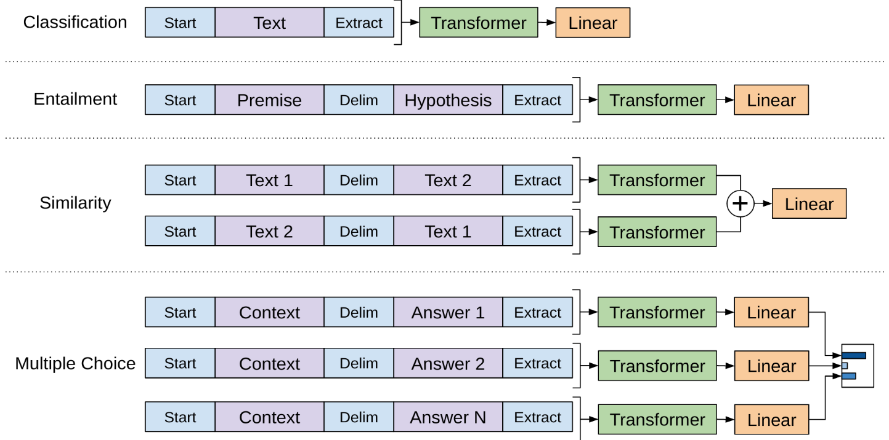
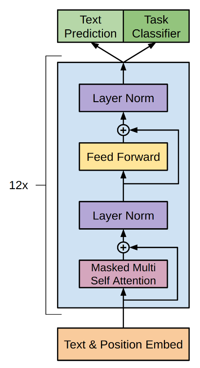
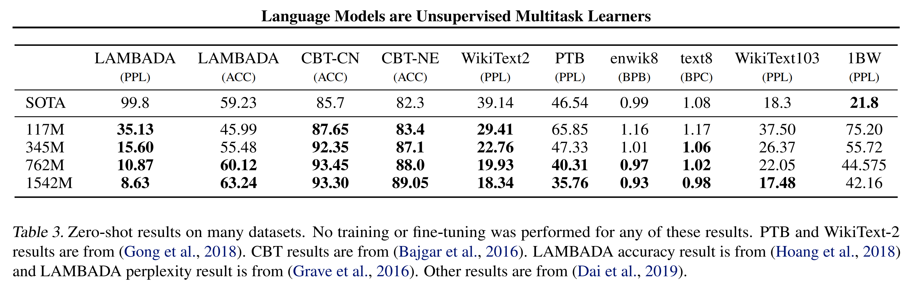
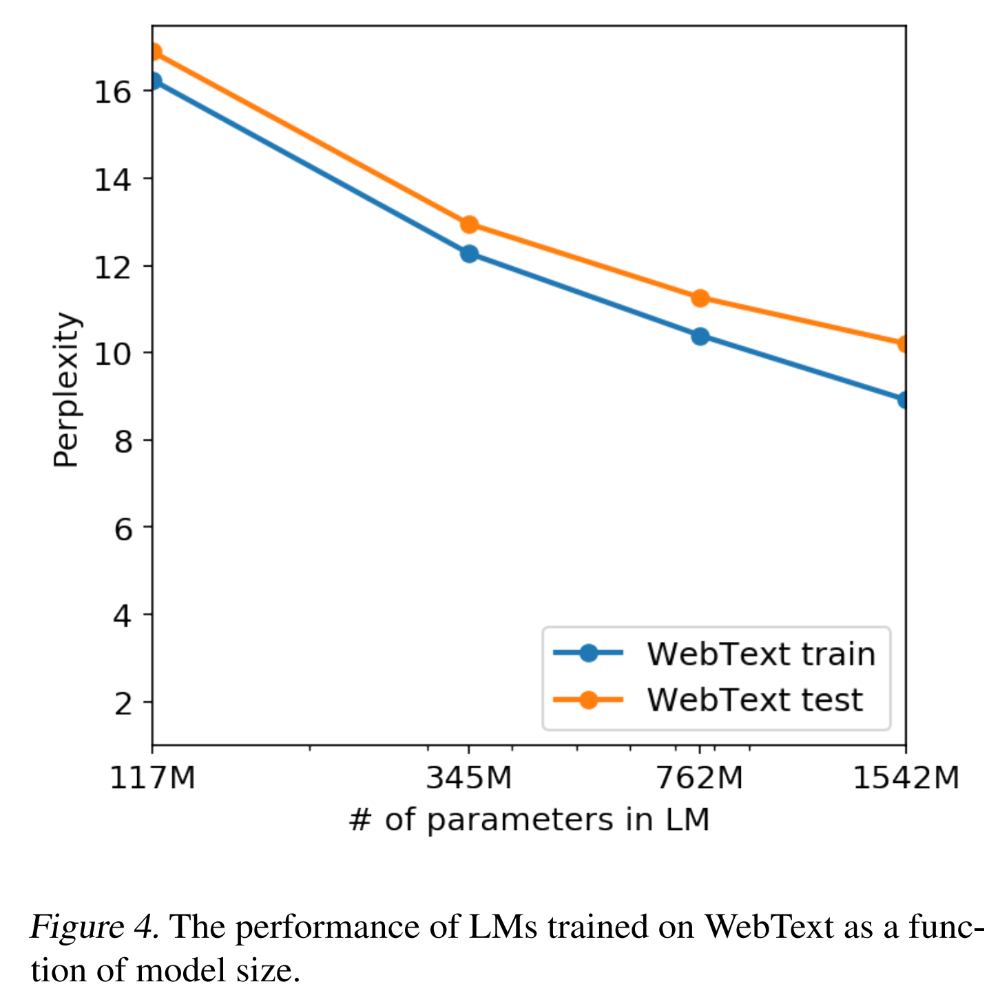
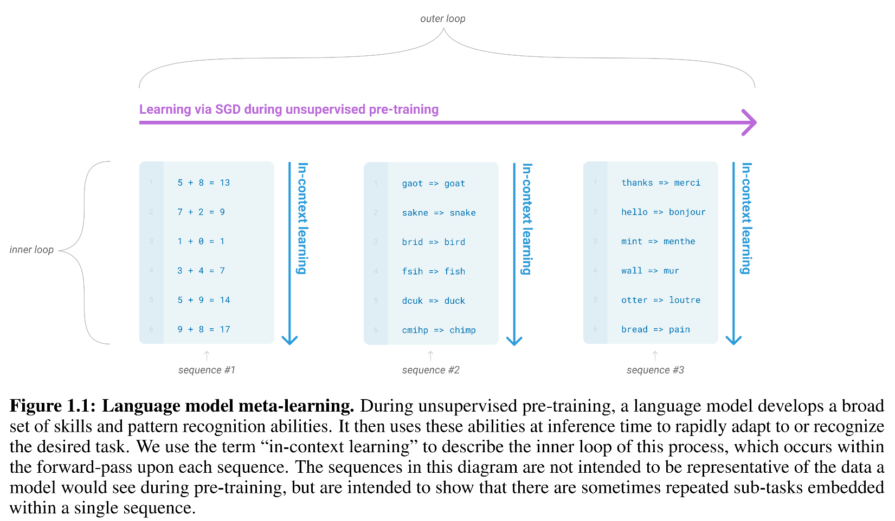
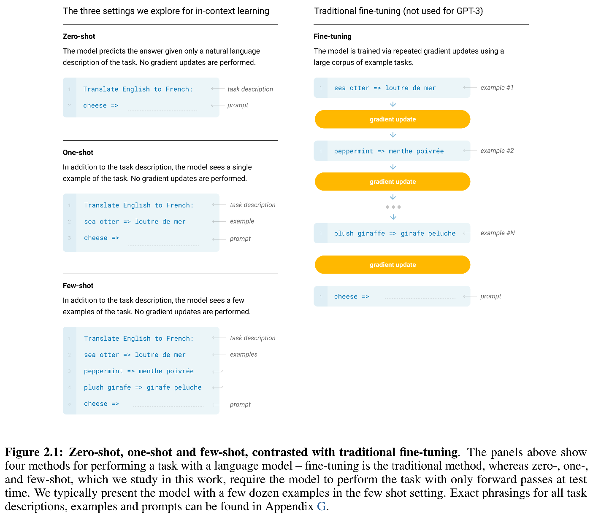
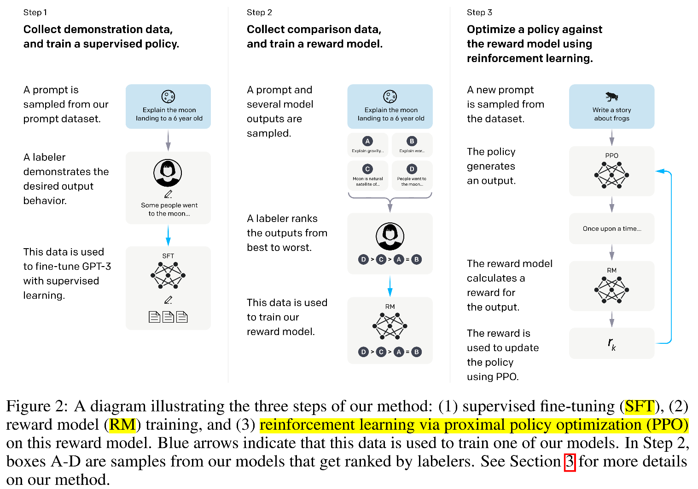
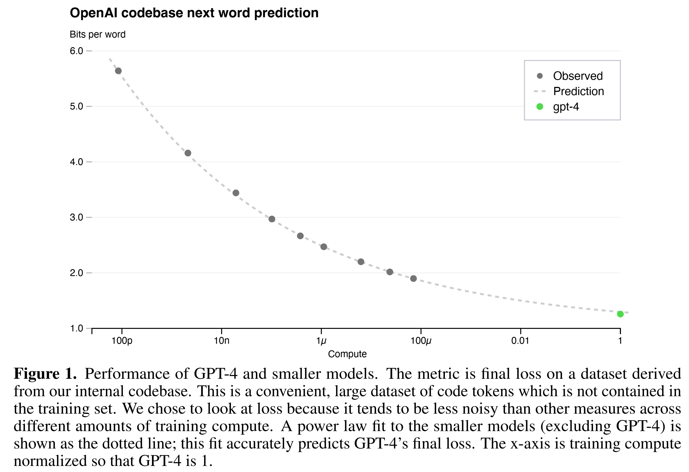

# GPT-1, GPT-2, GPT-3, InstructGPT / ChatGPT and GPT-4 summary  

# 1. GPT-1

[Improving Language Understandingby Generative Pre-Training  
通过生成预训练提高语言理解](https://s3-us-west-2.amazonaws.com/openai-assets/research-covers/language-unsupervised/language_understanding_paper.pdf)

## GPT-1 解决了什么问题？
在 GPT-1 之前，自然语言处理通常是一个监督模型。对于每个任务，都需要一些标记数据，然后根据这些标记数据开发一个监督模型。这个方法有几个问题：
- 首先，需要标记数据。但自然语言处理不像计算机视觉那样有一个良好标记的数据集，例如 ImageNet。
- 其次，通过这些不同任务训练的模型并不通用。例如，直接将翻译训练的模型用于分类是困难的。

GPT-1 提出了一些想法：首先，现实中有很多没有标签的文本，我们能否利用这些大量的无标签数据？其次，是否有可能预训练一个通用模型，以便转移到处理不同的任务？然而，利用无标签数据面临两个主要挑战：
- 首先，应该使用什么目标函数来优化，以便学习可转移的文本表示？
- 其次，关于将这些学习到的表示转移到目标任务的模型没有共识。

GPT-1 使用自监督方法来实现这个目标：它使用自监督（在论文中称为无监督）预训练模型**从大量未标记的数据中学习文本表示**，并使用监督模型针对每个子任务使用带注释的训练数据进行微调。我会称其为自监督，而不是机器学习中的无监督，因为无监督模型通常意味着数据没有标签，任务更像是聚类。在这里，自监督只是意味着不需要手动标记的数据，而只是从当前时刻之前的标记（词）token中预测下一个标记（词）token。更多细节将在下面的模型细节中介绍。

对于模型结构，GPT-1 使用`Transformer 解码器`，因为他们认为这为处理文本中的长期依赖关系提供了更具结构性的记忆，从而在不同任务中产生强大的迁移性能。与同样基于 Transformer 的 BERT 相比，BERT 使用`Transformer 编码器`。这意味着 GPT-1 选择了一条比 BERT 更困难的道路，因为解码器仅使用直到$Token_t$的信息来预测的下一个$Token{t+1}$，而编码器则利用掩码标记之前和之后的信息进行预测，这更容易，性能可能更好，因为之后的标记已经被看到以进行预测。这就是为什么 GPT 被称为单向（从左到右），而 BERT 被称为双向（使用掩码标记之前和之后的单词进行预测）的原因。

## GPT-1 是如何工作的（模型框架）？

如上所述，GPT-1 包含两个阶段。
- 第一阶段是在大规模文本语料库上学习高质量语言模型。
- 接下来是微调阶段，我们针对一个具体的下游任务，在标记数据上对预训练模型进行调整，激发模型处理下游任务的能力。

### （自监督）预训练模型

This task is to predict the token $u_i$ based on the previous $k$ tokens $(u_{i-k}, \cdots, u_{i-1})$. Given the tokens $\mathcal{U} = \{u_1, \cdots, u_n \}$, the objective is to maximize the probability likelihood to predict the next word  
这个任务是根据之前的$k$标记预测标记$u_i$  ，给定标记$\mathcal{U} = \{u_1, \cdots, u_n \}$，目标是最大化预测下一个词的概率。

$$L_1(\mathcal{U}) = \sum_i \log P(u_i | u_{i-k}, \cdots, u_{i-1}; \Theta)$$

where $k$ is the size of the context window and the conditional probability $P$ is a NN model with parameters $\Theta$. The bigger the $k$, the longer of the previous text that the model will see. So a bigger $k$ usually enable the model to learn and remember better.  
其中$k$是上下文窗口的大小，条件概率$P$是一个具有参数$\Theta$的神经网络模型。$k$越大，模型看到的前文就越长。因此，更大的$k$通常使模型能够更好地学习和记忆。

1. 由于$L_1(\mathcal{U}) = \sum_i \log P(u_i | u_{i-k}, \cdots, u_{i-1}; \Theta) = \log \prod_i P(u_i | u_{i-k}, \cdots, u_{i-1}; \Theta)$和$\prod_i P(u_i | u_{i-k}, \cdots, u_{i-1}; \Theta)$是每个单词预测的联合概率。因此，最大化这个联合概率就是找到$\Theta$以使得预测的单词与输入文本相同。
    
2. 正如上面的公式所示，这里 GPT-1 选择根据之前的$k$个单词来预测下一个单词，而 `BERT` 将使用**目标单词前后的单词**。这使得 `GPT` 的任务比 `BERT` 稍微更困难，因此在某些任务中，其表现可能不如 `BERT`（这一点在 GPT-1 发布几个月后发表的 `BERT` 论文中得到了验证）。

在实验中，模型是一个多层 Transformer 解码器。它对输入标记应用多头自注意力操作，然后是逐位置前馈层。通过这种变换，作者巧妙地找到了一个优化目标。

$$\begin{aligned} & h_0 = U W_c + W_p \\ & h_l = \mbox{transformer_block} (h_{l-1}), \forall i \in [1, n] \\ & P(u) = \mbox{softmax} (h_n W_e^{T}) \end{aligned}$$

其中$U = (u_{-k}, \cdots, u_{-1})$是上下文令牌向量，$h_0$是$U$的映射投影，$W_c$是令牌嵌入，而$W_p$是位置嵌入。

### 2. 监督微调

After the generative model is trained from the unlabelled data, GPT-1 fine tuned the pre-trained model on the subtasks by adding a task specific layer after the last layer of the pre-trained model. The parameters from the pre-trained model are adapted to the supervised subtasks by fine-tuning on the labeled data $\mathcal{C}$, in which each instance is a sequence of input tokens $x^1, \cdots, x^m$ along a label $y$. The inputs are passed throught the pre-trained transformer block to get the activation $h_l^m$, which is fed into a linear layer with softmax to predict the probability for $y$:  
在生成模型从未标记数据中训练后，GPT-1 **通过在预训练模型的最后一层后添加特定任务层来微调预训练模型**。预训练模型的参数通过在标注数据$\mathcal{C}$上微调，以让预训练模型适应带有标签的子任务，其中每个实例是一个输入令牌序列$x^1, \cdots, x^m$以及一个标签$y$。输入通过预训练transformer传递，以获得**激活**$h_l^m$，该**激活**被输入到带有`softmax`的线性层中，以预测$y$的概率：

$$P(y|x^1, \cdots, x^m) = \mbox{softmax}(h_l^m W_y)$$
目标是最大化可能性

$$L_2(\mathcal{C}) = \sum_{(x, y)} \log (P(y|x^1, \cdots, x^m))$$
**辅助训练目标Loss函数**：作者发现，与其单独最大化似然函数，不如将语言建模作为微调的辅助目标，这有助于提高监督模型的泛化能力并加快收敛。因此，最终目标是最大化增加的两个目标函数以及参数$\lambda$。

$$L_3(\mathcal{C}) = L_2(\mathcal{C})+ \lambda * L_1(\mathcal{C})$$

### 3. 监督模型任务和输入转换 Supervised model tasks and input transformation
转换器解码器的输入是一系列的标记。对于分类等子任务，它可以直接输入到转换器解码器中。对于其他任务，如蕴含、相似性和多项选择，数据通过添加一些特殊标记来重新构造，以指示`开始、分隔和提取`（`<BOS>, <EOS>, <PAD>` 等），如下面的图 1 所示。在将数据重新构造为统一格式后，它将被拆分为标记，作为输入到转换器解码器中，如图 2 所示。

如前一节所述，在微调步骤中，目标是辅助目标，即预训练模型中的下一个单词预测和微调任务中的分类任务所增加的两个目标。因此，微调任务中`transformer`的输出包括两个部分：**文本预测**和**分类器**的输出（见图 2）。

 
 

## Analysis and discussion 分析和讨论

1. 为什么选择`transformer`而不是其他语言模型，如 `LSTM`? 
- 首先从预训练模型转移到微调任务的层数越多，性能（准确性）就越好。也就是说，提高模型性能的一种方法是增加模型的层数（层大小 = d_model）。这正是 GPT-2/3/4 将要做的。
- 其次，`transformer`的注意力机制可以帮助模型更好的记住和使用数据中有用的信息，以此来提高语言模型的能力。作者通过zero-shot验证了这一点，即，直接使用预训练模型，而不针对子任务进行微调。`transformer`的性能比 `LSTM`更加稳定和更好。这也是 GPT-2 将关注的内容。

# 2. GPT-2
[Language Models are Unsupervised Multitask Learners](https://d4mucfpksywv.cloudfront.net/better-language-models/language_models_are_unsupervised_multitask_learners.pdf)

## GPT-2 解决了什么问题？
正如在`GPT-1` 结束时讨论的（并且也受到BERT的启发？），预训练模型的性能可以通过更复杂的模型来提高（更多的层数，higher layer size）。它也可以直接用于目标任务（`zero-shot learning`），并超越 `LSTM` 的性能。那就是 GPT-2。与 GPT-1 类似，GPT-2 也是具有`transformer`解码器的自监督模型，但参数更多。`GPT-2`主要集中在零样本学习上。

### Why zero-shot? 
BERT which was introduced after GPT-1 outperformed GPT-1 in many tasks. In the last section of GPT-1, it shows the pre-trained model performance could be improved with bigger model. But if just purely increasing the parameters, the value of the GPT-2 paper may not mean too much. So GPT-2 wants to discuss from the other aspect that the model can do zero-shot: without additional training, the model can performs good in some tasks. This also shows that the gpt model has a strong generalization ability, which in fact is lacked in BERT.  

BERT 在许多任务上表现超过了 GPT-1，而 BERT 是在 GPT-1 之后推出的。在 GPT-1 的最后部分，它显示预训练模型的性能可以通过增加模型规模来提高。但是，如果仅仅是纯粹增加参数，GPT-2 论文的价值可能就不大。因此，GPT-2 想从另一个方面讨论，即模型可以进行零样本学习(zero-shot learning)：在没有额外训练的情况下，模型在某些任务中表现良好，注意：模型并没有针对这些任务进行专门的训练，但依旧表现出了不错的性能。这也表明，`GPT`模型具有很强的泛化能力，而这一点在 `BERT` 中实际上是缺乏的。

## GPT-2 是如何工作的（模型框架）？

因为它没有微调任务，GPT-2 不需要像 GPT-1 那样的特殊标记（`<BOS>, <EOS>`）。相反，GPT-2 使用`promot`来控制输入到模型中的内容。`Prompt`是提供给模型的一小段文本，模型将根据此输入生成额外的文本。`Prompt`是任务特定的，取决于特定的输入序列和任务。

GPT-2 使用`Prompt`来控制输入到模型。`Prompt`是提供给模型作为初始输入的一小段文本，模型根据这个输入生成额外的文本。`Prompt`是特定于任务的，取决于具体的输入序列和任务。例如，要翻译成法语，提示类似于 “翻译成法语”，后面跟着英语句子，然后是法语句子。因此，示例数据是一个类似于 `(translate to french, english text, french text)` 的序列。

### 1. 数据
因为 GPT-2 的参数比 GPT-1 多得多，所以它需要更多的训练数据。为了构建一个大型和多样化的数据集以收集任务的自然语言示例，作者使用了 **Common Crawl** 数据。但这个数据集的质量较低，因此他们从中挑选了相对较高质量的子集：来自 reddit 的至少有 3 个 karma 的帖子。另一个数据集是 WenText，它来自 Dragnet 和报纸内容提取。数据经过清理，并通过字节对编码（**BPE**）进行拆分。

### 2. 模型

The model is almost the same as GPT-1 which is transformer decoder, with layer norm was moved to each sub-block and an additional layer norm was added after the final self-attention block.  
该模型几乎与 GPT-1 相同，都是transformer decoder，将层归一化（LayerNorm）移至每个子块，最后一个自注意力块后添加了一个额外的层归一化。

There are different setups of the number of transformer layers and the d_model.  
有不同的变压器层数和 d_model 的设置。

| Parameters 参数 |	Layers 层数 | d_model |
| -- | -- | -- | 
| 117M |	12 |	768|
| 345M |	24 |	1024|
| 762M |	36 |	1280|
| 1542M |	48 |	1600|

### 3. 在自然语言处理任务中的Zero-shot学习表现

 

实验表明：
1. GPT-2 在零样本情况下可以在自然语言处理任务（及其对应的数据集）上超越大多数其他的 SOTA 零样本模型。
2. 随着参数数量的增加，GPT-2 的性能也随之提高。最大的模型几乎在这些任务上击败了所有 SOTA 模型。

## Analysis and discussion 分析与讨论
1. GPT-2 在一些任务如阅读理解上的表现与监督模型相似，其表现与人类表现相差不大，但在其他任务如问答上仍然表现不佳，与随机结果没有区别，尤其是与人类表现差距较大。与其他具有相似参数数量的自监督预训练模型（如 BERT）相比，GPT-2 在子任务上的表现并没有胜过它们。这意味着，尽管zero-shot 学习可以提供一个强大的预训练模型，但在特定任务上仍可能需要一些微调以提升其表现。问题是，在每个子任务中，它是否需要与微调相同数量的标记数据，还是只需要少量标记数据？以下论文 GPT-3 表明，只有少量数据（少样本学习或甚至一样本学习）就能显著改善表现。

 

2. 随着参数数量的增加（更多的层和更大的层大小），模型性能仍然提高。如上图所示，当语言模型中的参数从 117M 增加到 1542M 时，训练数据和测试数据的困惑度都降低了。这也是 GPT-3 将要做的：同时增加模型参数的数量和训练数据的大小。

The last finding is that GPT-2 can write news articles. Although the author did not spend too much space discussing this feature, this feature is one of the main reasons why the GPT series will shine in the future - it can generate contents. We will discuss this below.  
3. 最后的发现是 GPT-2 可以撰写新闻文章。尽管作者没有花太多篇幅讨论这个特性，但这个特性是 GPT 系列未来将会闪耀的主要原因之一——它能够生成内容。我们将在下面讨论这一点。

# 3. GPT-3

## What the problem GPT-3 solve?  
GPT-3 解决了什么问题？

Models trained on the specific target task usually need task-specific dataset and task-specific fine-tuning, and thus need some labeled data. There are some limitations for this: 1) specific data for each task limits the generalizaiton of the trained model. And for many tasks it is hard to collect a large supervised training dataset; 2) the model performance may depends on the data: the potential of the trained model has a relation with the expressiveness of the model and the narrowness of the training distribution. When large model is fine-tuned on the parrow task distribution, large models do not necessarily generalize better. In other words, the fine-tuned model performing better does not mean the large pre-trained model is better. It may be just because the fine-tuning training data has overlaps witht the evaluaiton data; 3) humans can learn more efficiently without large amount of data.  
针对特定目标任务训练的模型通常需要特定任务的数据集和特定任务的微调，因此需要一些标记数据。这存在一些限制：
1. 每个任务的特定数据限制了训练模型的泛化能力。对于许多任务，收集一个大的监督训练数据集是困难的；
2. 模型性能可能依赖于数据：微调后的模型能力可能与预训练模型本身的表达能力和训练任务的狭窄性有关。当一个较大的模型在狭窄分布的任务上进行微调时，模型不一定有更好的泛化能力。换句话说，微调后的模型表现更好并不意味着大型预训练模型更好。这可能只是因为微调训练数据与评估数据有重叠；
3. 人类可以在没有大量数据的情况下更有效地学习。

### 为了解决这些问题，GPT-3 提出了这些想法：
首先：它训练了一个具有广泛技能和模式识别能力的模型，并在推理时依赖于这种能力来处理新任务。具体来说，**GPT-3** 训练了一个具有出色泛化能力（meta-learning）的良好模型，并且它不会在大规模预训练模型中更新子任务的参数（in-context learning上下文学习），而只会用少量数据样本（few-shot learning少样本学习）更新该任务的输出权重（通常是最后一层）。

就像为特定任务添加一层。在少量样本学习中，大模型参数不会被更新，以保持预训练模型的泛化能力和模式识别能力。它只会为特定任务更新最后一层的参数，使用该特定任务的少量样本。例如，如果这是一个分类任务，它将有一个分类层，该层的参数将通过分类任务数据进行更新。预训练模型中的其他参数是冻结的。

 

例如在上图中，大量的训练数据可能已经包含了许多类似数学求和、文本工作校正或从一种语言翻译到另一种语言的案例。在预训练模型中，它将从这些数据中学习以理解任务，并发展出广泛的技能和模式识别能力（这里是自监督的，使用 SGD）。在学习完毕后，庞大的预训练模型参数将不会更新。它学习了这个能力，并能够在推理时快速适应或识别任务。

Second: it trained a big model with 100 times more data and 10 times more parameters to learn. GPT-3 has 175 billion parameters and is evaluated under 3 conditions: 1) few-shot learning, which uses 10 to 100 data points to tune for the specific task. 2) one-shot learning, where only one data is used; and 3) zero-shot learning, where no additional data is used.  
第二：它训练了一个大模型，使用了 100 倍的数据和 10 倍的参数进行学习。GPT-3 有 1750 亿个参数，并在三种条件下进行评估：
1）few-shot learning，使用 10 到 100 个数据点来调整特定任务。
2）one-shot learning，仅使用一个数据；
3）zero-shot learning，不使用任何额外数据。

## GPT-3 如何工作（模型框架）？

### 1. Data 1. 数据
GPT-2 使用来自 **Common Crawl (CW)** 数据集的 Reddit 数据。在 GPT-3 中，随着模型增加了 10 倍，使用了整个 Common Crawl 数据集。他们还通过比较两组数据集移除了重复数据。由于这些数据的质量较低，作者使用了一个模型来过滤低质量数据。

最终数据包括过滤后的 Common Crawl、WebText2、Books1、Books2 和维基百科。由于 CW 数据质量不高，CW 的抽样权重相对于其庞大的体积设置得很低。

### 2. 模型和方法

The model that GPT-3 used is still transformer decoder which predicts the next token based on the previous tokens. It is similar to GPT-2 structure but using alternating dense and locally banded sparse attention patterns in the layers of transformer.  
GPT-3 所使用的模型仍然是transformer decoder，它根据之前的标记预测下一个token。它类似于 GPT-2 结构，但在transformer的层中使用交替的密集和局部**带状稀疏注意力模式**。

The authors explains the details of the approach they used, which includes few-shot, one-shot and zero shot, together with fine-tuning which they did not use, as shown in the Figure below.  
作者解释了他们使用的方法的细节，包括少量样本、一次样本和零样本，以及他们没有使用的微调，如下图所示。

 

#### Fine-tuning
**微调**：微调是为每个任务收集成千上万条数据来更新模型的参数。GPT-3 可以进行微调，这在未来可能是一个有前途的方向。实际上，在 InstructGPT 的后续工作中，作者开始根据人类注释的反馈来调整参数。

#### Few-shot
**小样本**：模型在推理时将获得少量任务样本数据，但不会更新预训练模型的权重。例如，在英语到法语的翻译推理时，首先会给出任务描述，然后会提供一些示例（10 到 100 个）从英语到法语。接着会给出一个提示，模型将根据提示中的输入自动生成法语翻译。这里的优点是只需要有限数量的输入数据。缺点是小样本学习的表现通常不如最新的微调模型。

#### One-shot
**一次性**：它类似于少量样本设置，但在任务描述后仅提供一个样本数据。这与任务传达给人类的方式相近。当请求人类做某事时，通常会给出一个任务示例。

#### Zero-shot
**零样本**: 在任务描述之后没有数据。从使用方面的模型来看，这是最简单的方法。但这也是模型理解任务的最具挑战性的设置，因为没有提供示例。

## 局限性

1. 首先，考虑到大量的参数和训练数据集，训练是困难且昂贵的。训练模型需要巨大的计算资源和时间。

2. 其次，GPT-3 在一些自然语言处理任务中存在弱点，比如文本合成和某些比较任务，比如判断两个词在句子中是否以相同的方式使用。GPT-3 对一些常识物理问题的理解对人类来说也很困难。例如，GPR-3 很难回答 “如果我把奶酪放进冰箱，它会融化吗？”

3. 使用单向注意力机制的 GPT-3 可能在结构和算法上与双向注意力机制相比存在限制。如同在 GPT-1 中介绍的，这可能会影响 GPT 在某些任务中的表现，比如填空任务、涉及回顾和比较两段内容的任务，或需要重新阅读的任务。当已知标记前后的上下文信息时，所有这些任务会变得更容易。

4. GPT-3 的一个更根本的限制是，它是一个基于文本数据的语言模型，因此预训练模型对其他经验领域没有任何了解。比如它无法处理视频数据或现实世界的物理交互。一个有前途的方向是包含来自人类的学习目标，并通过强化学习进行微调（这就是 `InstructGPT/ChatGPT` 将要做的），并添加额外的模态，例如图像和视频（这就是 `GPT-4` 将要做的，它将接受图像或 PDF 文件来描述或总结输入文件）。

# 4. InstructGPT / ChatGPT

## InstructGPT 解决了什么问题？

GPT3 的局限性：
1. 首先，它不记得之前的少量输入。ChatGPT 可以持续记住您之前与其聊天的内容，并基于该上下文信息与您继续进行多轮聊天。
2. 其次，随着模型变得越来越大，GPT-3 的输出有时很难控制。例如，如果你问什么是高斯过程，它可能会生成一些低质量的文本。或者有时模型可能会生成一些有害的信息，比如带有偏见、种族主义或性别歧视的文本。
3. 语言模型使用自监督方法预训练一个大型的泛化模型。由于自监督模型中没有标记数据，如果你想让模型回答一些问题，比如 “什么是高斯过程”，那么训练数据中应该包含这些信息，以便模型能够学习。因此，为了让模型具有足够的泛化能力，训练数据文本应该足够大。

这些意外行为的原因主要是因为语言模型的目标是尝试预测下一个token（即 GPT-1/2/3 所做的，使用 transformer decoder根据先前的token预测下一个token），这与有帮助和安全地遵循用户指令的目标不同。为了克服这些限制，InstructGPT 使用标记数据对 GPT-3 模型进行微调，以使语言模型与来自人类反馈的强化学习（RLHF）对齐，微调 GPT-3 以遵循人类编写的指令，并使用人类偏好作为奖励信号来微调模型。

## InstructGPT 是如何工作的（模型设置）？

InstructGPT 用于微调的标注数据与GPT-3相同，训练一个监督微调（SFT 模型）来生成输出，还训练了一个奖励模型（reward model RM）用于比较从SFT模型生成的不同输出，并且采用强化学习的方式，使用奖励模型来进一步训练SFT模型，使模型的输出更符合人类期望。

 

### 主要步骤
- 第一步。从Prompt数据集中随机抽取一个Prompt，然后由人工来为该Prompt编写答案，这里的Prompt其实就是输入。当人工构造了一定量的输入输出后，使用构造好的数据集来微调模型，通过微调来让模型学会如何完成具体任务，生成输出。这一步的最大问题在于，人工构造数据集的成本高昂。
- 第二步。给定一个输入，先使用 GPT-3 生成几个不同的输出。例如，如果生成了 4 个输出，则将其标记为 A、B、C、D。然后，由标注人员对这几个输出进行排名（例如，A>B>C=D）。通过这种方式，标注人员不需要写出答案，只需对模型生成的输出进行排名，以此来构造一批带有排名的比较数据，用来训练一个**奖励模型**。这个奖励模型通过比较这 4 个`<prompt, answer>`对，来学习其中排名关系。通过这个训练好的奖励模型，可以用于在后面的强化学习过程中，比较模型生成的输出并计算奖励得分。
- 第三步。现在，他们可以使用奖励模型来引导 SFT 模型生成更好的结果，以获得更高的奖励分数。InstructGPT 将 RM 的输出用作标量奖励，并微调监督策略以优化该奖励。训练后的模型称为 InstructGPT。

总结这个三个步骤，一共用到了三个数据集：
1. SFT 数据集（13k）用于训练GPT-3，得到SFT模型；
2. RM 数据集（33k）具有模型输出的标注者排名，用于训练 RM 模型；
3. PPO 数据集（31k）没有人类标签，作为 RLHF 微调的输入。

### More details about the models  
#### SFT
**SFT**：它是通过在 SFT数据集上微调 GPT-3 而得到，其中每条数据都是带有标答的`(Input, Output)`数据对。由于数据只有 13k，模型在 1 个周期后会出现过拟合。

#### Reward Model
**RM**: first, it replaces the last layer of SFT model (which is softmax layer) by a linear layer to output a scalar reward. So for each input `<prompt, answer>` to the modified SFT model, it will output a scalar value (reward). If one prompt has $K$ answers, to compare them pairwisely, there will be $C(K,2)$ combinations. For two answers $y_w$ and $y_l$, if $y_w$ is better than $y_l$, the purpose is to discriminate the two answers as much as possible, so the loss function is a logit loss of the delta of the two reward $(r(x, y_w) - r(x, y_l))$. The authors mentions that they used the pairwise answers comparision (where there are $C(K, 2)$ pairs of data) rather than to select the best answer will help to avoid overfiting.  
**RM**: 首先，它用一个线性层替代 SFT 模型的最后一层（即 softmax 层），以输出一个标量奖励。因此，对于每个输入`<prompt, answer>`到修改后的 SFT 模型，它将输出一个标量值（奖励）。如果一个提示有$K$个答案，为了进行成对比较，将会有$C(K,2)$个组合。对于两个答案$y_w$和$y_l$ ，如果$y_w$优于$y_l$，其目的在于尽可能区分这两个答案，因此损失函数是两个奖励$(r(x, y_w) - r(x, y_l))$差值的对数损失。作者提到，他们使用成对答案比较（其中有$C(K, 2)$对数据），而不是选择最佳答案，将有助于避免过拟合。

#### Reinforce Learning
**RL**: The purpose of RL is to learn a better GPT-3 model $\pi_{\phi}^{RL}$ to generate the answers. The objective function is designed to guide the model towards generating responses that adhere to the given instructions or constraints provided by users.  
**RL**: RL 的目的在于学习一个更好的 GPT-3 模型$\pi_{\phi}^{RL}$用于生成答案。目标函数旨在指导模型生成符合用户提供的指令或约束条件的响应。

$$\begin{aligned} \mbox{objective}(\phi) = & E_{(x, y) \sim D_{\pi_{\phi}^{RL}}}[r_{\theta}(x, y) - \beta \log (\pi_{\phi}^{RL}(y|x) / \pi^{SFT}(y|x))] \\ & + \gamma E_{x\sim D_{pretrain}}[\log(\pi_{\phi}^{RL}(x))] \end{aligned}$$

下面分别对公式中的3个部分进行解释：
1. 目标函数中的第一个项$E_{(x, y) \sim D_{\pi_{\phi}^{RL}}}[r_{\theta}(x, y)]$表示，对于新模型生成的答案$y$，它尝试最大化奖励模型的期望。$\pi_{\phi}^{SFT}$是使用标注的微调数据训练的SFT模型。$\pi_{\phi}^{RL}$是使用奖励模型来构造的偏好数据进一步训练得到的模型，其中$\phi$是参数。它初始化为 SFT 模型。 $(x, y) \sim \pi_{\phi}^{RL}$表示将提示$x$放入模型 $\pi_{\phi}^{RL}$ 中生成答案$y$，然后将生成的配对$(x,y)$放入训练好的奖励模型中计算奖励得分，最终目标是最大化这个奖励分数。通过这种方式，最终模型$\pi_{\phi}^{RL}$将进一步符合人类预期。

The second term in the objective is the expection of $\beta \log (\pi_{\phi}^{RL}(y|x) / \pi_{\phi}^{SFT}(y|x))$, which is KL divergence. The purpose of adding this term is that: after many interations, $\pi_{\phi}^{RL}$ and  $\pi_{\phi}^{SFT}$ could be more and more different. However, the reward model $r_{\theta} $ is trained from the first SFT and the corresponding $y$. Now if the new model and the original SFT model are different, then the reward model will not work any more to evaluate. Adding this penalized term is to make sure the RM model can still be effective to evaluate the new model $\pi_{\phi}^{RL}$. This is what "PPO" means.  
2. 目标函数中的第二项是$\beta \log (\pi_{\phi}^{RL}(y|x) / \pi_{\phi}^{SFT}(y|x))$，即 **KL 散度**。添加这一项的目的是：经过多次迭代后，$\pi_{\phi}^{RL}$和$\pi_{\phi}^{SFT}$可能会越来越不同。然而，奖励模型$r_{\theta} $是从SFT模型开始训练。现在，如果训练得到的新模型与原始的 SFT 模型不同，那么奖励模型将不再有效。添加这一惩罚项是为了确保 RM 模型仍然可以有效地评估新模型  。这就是 “PPO” 的意思。

The third term $\gamma E_{x\sim D_{pretrain}}[\log(\pi_{\phi}^{RL}(x))]$. That is, for the pretrained data of GPT-3, it calcualtes the loss and adds it to the objective. If $\gamma = 0$, it is called PPO-ptx model.  
3. 第三项是$\gamma E_{x\sim D_{pretrain}}[\log(\pi_{\phi}^{RL}(x))]$。也就是说，对于 `GPT-3` 的预训练数据，它计算损失并将其添加到目标中。如果 $\gamma = 0$，则称为 PPO-ptx 模型。

**ChatGPT 做了什么？** ChatGPT 使用与 InstructGPT 相同的方法，但在数据收集设置上略有不同。ChatGPT 使用多轮对话数据，并从 GPT-3.5 模型进行微调。

# 5. GPT-4

OpenAI [GPT-4 Technical Report](https://arxiv.org/pdf/2303.08774.pdf)  

GPT-4 是一种预训练的变换器模型，用于预测文档中的下一个标记。GPT-4 是一个大型多模态模型，可以接受图像和文本输入提示并输出文本。它经过 RLHF 微调（见上面的 InstructGPT），以提高模型的广泛知识和高级推理能力。

GPT-4 的训练是稳定的。由于模型非常大，它可能在训练过程中因为许多原因而失败：损失不收敛、梯度爆炸、硬件问题例如机器故障、网络连接中断。所有这些都会给模型训练带来许多工程挑战。

训练性能可以提前预测。OpenAI 开发了基础设施和优化，使其在多个规模上具有非常可预测的行为，从而能够通过从使用相同方法训练但计算量少 10−4
 x 的模型进行外推，预测非常大模型 GPT-4 的最终损失。

 

与 GPT-3.5 相比，GPT-4 有显著改善。它在大多数专业和学术考试中表现出人类水平的性能。该模型在考试中的能力似乎主要源于预训练过程，而不受 RLHF 的显著影响。

 

 

GPT-4 允许用户使用“系统”消息在范围内定制体验。一般来说，“系统”消息告诉 GPT-4 遵循用户的指示，在对话中提供额外的信息、指令或上下文。