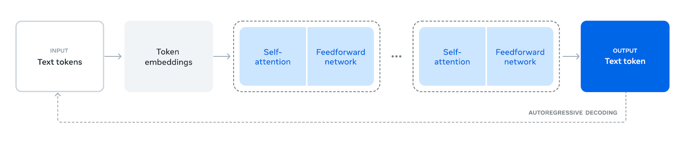

LLaMA 3.1的模型结构如上图所示，它代表了目前主流的大型语言模型架构，也被称为Dense LLM。它应用了经典Transformer的Decoder部分并加以改造。 与之相对的是混合专家模型（Mixture of Experts，MOE）。MOE模型的主要特点是：将前馈网络（FFN）模块中的单一SwiGLU替换为个并行的SwiGLU模块，每个模块被称为"专家"。增加了一个路由网络，用于为每个输入token选择最合适的"专家"。

> **小课堂: Dense LLM与 MOE LLM**
> 
> Dense LLM（密集大语言模型）：
> 
> *   这是传统的LLM结构，如GPT系列、LLaMA等。
> *   所有的参数在每次推理时都会被激活和使用。
> *   模型结构相对简单，每个层的每个神经元都参与计算。
> 
> MOE结构LLM（Mixture of Experts，专家混合模型）：
> 
> *   这是一种更复杂的模型结构，如Google的Switch Transformer。
> *   模型包含多个"专家"子网络（experts）和一个路由机制。
> *   在处理每个输入时，只激活部分专家，而不是全部参数。

### [](#llama-3.1的模型架构的8个技术点一览)LLaMA 3.1的模型架构的8个技术点一览

1.  **Transformer Block × L**：这个模块表示整个 Transformer 由多个重复的 Transformer 块组成，这里的 (L) 指的是 Transformer 块的层数。
    
2.  **Token Embedding**：输入的词（token）被嵌入到一个高维向量空间中，作为 Transformer 的输入。
    
3.  **RMSNorm**：每个 Transformer 块使用 RMSNorm（Root Mean Square Layer Normalization）来进行正则化。它与传统的 LayerNorm 不同，RMSNorm 使用的是均方根来进行归一化操作。
    
4.  **Pre-Norm**：正则化的位置是在主计算路径之前，这种做法可以提高模型的稳定性和收敛速度。
    
5.  **Grouped Query Attention (GQA)**：这个模块表示使用了一种称为“分组查询注意力”的自注意力机制。GQA 是一种改进的注意力机制，通过对查询进行分组，可以提高模型的效率和性能。
    
6.  **ROPE（Rotary Positional Encoding）**：一种位置编码机制，用于在模型中注入位置信息。ROPE 通过旋转变换为位置提供相对位置信息，使模型可以更好地理解序列中的位置关系。
    
7.  **SwiGLU**：这是 Feed-Forward Network (FFN) 的结构，SwiGLU 是一种使用 Gate Linear Units（GLU）的变体，通过引入非线性激活函数来增强模型的表达能力。
    
8.  **Skip Connection**：在 Transformer 中，使用跳跃连接（Skip Connection）来促进梯度流动和模型训练的稳定性。
    

LLaMA 3.1 的架构结合了最新的正则化、注意力机制和位置编码技术，旨在提高 Transformer 模型的效率和性能。

[](#一.-transformer-block-l)一. Transformer Block× L
--------------------------------------------------

Transformer Block是模型构成的基本单元,它基本可以分为两部分构成:自注意层和前馈全连接层(FFN),通过将以上Transformer单元组合L次,即可得到LLaMA 3.1的整体架构,L即layers的具体数值与模型的参数量有关.



不同参数量模型的详细参数如下

<table><thead><tr class="header"><th></th><th style="text-align: right;">8B</th><th style="text-align: right;">70B</th><th style="text-align: right;">405B</th></tr></thead><tbody><tr class="odd"><td>Layers</td><td style="text-align: right;">32</td><td style="text-align: right;">80</td><td style="text-align: right;">126</td></tr><tr class="even"><td>Model Dimension</td><td style="text-align: right;">4,096</td><td style="text-align: right;">8192</td><td style="text-align: right;">16,384</td></tr><tr class="odd"><td>FFN Dimension</td><td style="text-align: right;">6,144</td><td style="text-align: right;">12,288</td><td style="text-align: right;">20,480</td></tr><tr class="even"><td>Attention Heads</td><td style="text-align: right;">32</td><td style="text-align: right;">64</td><td style="text-align: right;">128</td></tr><tr class="odd"><td>Key/Value Heads</td><td style="text-align: right;">8</td><td style="text-align: right;">8</td><td style="text-align: right;">8</td></tr><tr class="even"><td>Peak Learning Rate</td><td style="text-align: right;">3 × 10⁻⁴</td><td style="text-align: right;">1.5 × 10⁻⁴</td><td style="text-align: right;">8 × 10⁻⁵</td></tr><tr class="odd"><td>Activation Function</td><td style="text-align: right;">SwiGLU</td><td style="text-align: right;">SwiGLU</td><td style="text-align: right;">SwiGLU</td></tr><tr class="even"><td>Vocabulary Size</td><td style="text-align: right;">128,000</td><td style="text-align: right;">128,000</td><td style="text-align: right;">128,000</td></tr><tr class="odd"><td>Positional Embeddings</td><td style="text-align: right;">RoPE (θ = 500,000)</td><td style="text-align: right;">RoPE (θ = 500,000)</td><td style="text-align: right;">RoPE (θ = 500,000)</td></tr></tbody></table>

[](#二.-token-embedding)二. Token Embedding
-----------------------------------------

在 LLaMA模型中，**Token Embedding** 是第二个关键模块。其主要功能是将输入的词（token）转换为高维向量，以便后续的 Transformer 层可以有效地处理这些数据。具体来说,模型首先从词汇表中获取输入词的索引,然后利用嵌入矩阵将每个词映射到一个唯一的高维向量。这个过程将离散的词语转化为连续的向量表示,能够捕捉词语的语义和上下文信息。

Token Embedding的设计有几个重要优势。首先,它能够有效地捕捉和表示词语的语义信息,使模型更好地理解词语之间的关系。其次,将词语转换为向量表示降低了输入数据的复杂度,便于后续计算。最后,这种设计增强了模型的表达能力,使其能够学习和处理复杂的语言模式和结构,从而在各种自然语言处理任务中表现出色。

Token Embedding在NLP领域已经是主流的技术手段,pytroch中也已经封装好它的实现:

```python
import torch
import torch.nn as nn

vocab_size = 10000  # 词汇表大小
embedding_dim = 256  # 嵌入向量的维度

embedding_layer = nn.Embedding(vocab_size, embedding_dim)

# 假设我们有一个批次的输入序列
input_ids = torch.LongTensor([[1, 2, 3, 4], [5, 6, 7, 8]])

# 通过Embedding层获取嵌入向量
embedded = embedding_layer(input_ids)

print(embedded.shape)  # 输出：torch.Size([2, 4, 256])
```

## 三 . RMSNorm

1.  基本原理: RMSNorm使用均方根(Root Mean Square)来对神经网络中的隐藏状态进行归一化。这种方法旨在稳定深度网络中的激活值分布,有助于**加速训练过程并提高模型性能**。
2.  计算过程:

*   计算输入向量x的均方根值
*   用这个均方根值来归一化输入向量
*   应用可学习的缩放参数g

数学表达式:RMSNorm(x) = x / RMS(x) * g 其中RMS(x) = sqrt(mean(x^2))

1.  与LayerNorm的区别:

*   LayerNorm使用均值和方差进行归一化
*   RMSNorm只使用均方根,计算更简单
*   RMSNorm不需要减去均值,保留了原始信号的一些属性

1.  优势:

*   计算效率更高,尤其是在大规模模型中
*   在某些任务中表现优于LayerNorm
*   有助于缓解梯度消失/爆炸问题

### RMSNorm实现

```python
class TransformerBlock(nn.Module):
    def __init__(self, dim, num_heads):
        super().__init__()
        self.attention = nn.MultiheadAttention(dim, num_heads)
        self.feed_forward = nn.Sequential(
            nn.Linear(dim, 4 * dim),
            nn.GELU(),
            nn.Linear(4 * dim, dim)
        )
        self.norm1 = RMSNorm(dim)
        self.norm2 = RMSNorm(dim)

    def forward(self, x):
        # 自注意力
        attn_output, _ = self.attention(x, x, x)
        x = x + attn_output
        x = self.norm1(x)

        # 前馈网络
        ff_output = self.feed_forward(x)
        x = x + ff_output
        x = self.norm2(x)

        return x

```

### RMSNorm调用

```python
class TransformerBlock(nn.Module):
    def __init__(self, dim, num_heads):
        super().__init__()
        self.attention = nn.MultiheadAttention(dim, num_heads)
        self.feed_forward = nn.Sequential(
            nn.Linear(dim, 4 * dim),
            nn.GELU(),
            nn.Linear(4 * dim, dim)
        )
        self.norm1 = RMSNorm(dim)
        self.norm2 = RMSNorm(dim)

    def forward(self, x):
        # 自注意力
        attn_output, _ = self.attention(x, x, x)
        x = x + attn_output
        x = self.norm1(x)

        # 前馈网络
        ff_output = self.feed_forward(x)
        x = x + ff_output
        x = self.norm2(x)

        return x
    
# 创建一个使用RMSNorm的Transformer块
block = TransformerBlock(dim=512, num_heads=8)

# 创建一个随机输入张量
x = torch.randn(32, 10, 512)  # [batch_size, seq_len, dim]

# 前向传播
output = block(x)

print(output.shape)  # 应该输出 torch.Size([32, 10, 512])

```

> 注意事项：
> 
> 1.  `eps` 参数用于数值稳定性，防止除以零。
> 2.  RMSNorm 的权重参数 `self.weight` 是可学习的，在训练过程中会被优化。
> 3.  在实际应用中，您可能需要根据具体需求调整 RMSNorm 的实现，例如考虑不同的维度或批处理情况。
> 4.  某些PyTorch版本可能已经包含了RMSNorm的实现，您可以检查最新的文档或考虑使用第三方库（如`transformers`库）中的实现。
> 5.  在使用RMSNorm时，可能需要调整学习率或其他超参数，因为它可能会影响模型的训练动态。
> 
## 四 . GQA(分组查询注意力机制)
---------------------------------------

1.  背景： 传统的自注意力机制在处理长序列时会面临计算复杂度和内存消耗的问题。随着模型规模的增大，这些问题变得更加突出。
    
2.  GQA的基本思想： 将查询（Query）向量分成多个组，每组共享相同的键（Key）和值（Value）矩阵。这种方法可以在保持模型表达能力的同时，显著减少参数数量和计算复杂度。
    
3.  工作原理：
    
    *   将查询向量分成G个组。
    *   每个组使用独立的查询权重矩阵。
    *   所有组共享相同的键和值权重矩阵。
    *   对每个组单独计算注意力分数和输出。
    *   最后将所有组的输出合并。
4.  优势：
    
    *   参数效率：减少了模型的参数数量，特别是在键和值矩阵上。
    *   计算效率：降低了注意力计算的复杂度。
    *   内存效率：减少了中间结果的存储需求。
    *   可扩展性：使得模型更容易扩展到更大的规模。
5.  与其他注意力变体的比较：
    
    *   相比于多头注意力（Multi-Head Attention），GQA在保持类似性能的同时，具有更高的参数和计算效率。
    *   相比于稀疏注意力机制，GQA更容易实现和优化。
6.  潜在局限性：
    
    *   可能会略微降低模型的表达能力，尤其是在处理需要精细区分的任务时。
        
    *   分组数量的选择可能会影响模型性能，需要仔细调优。
        
        总的来说，GQA是一种在效率和性能之间取得良好平衡的注意力机制，为大型语言模型的发展提供了重要支持。它的出现标志着注意力机制设计正朝着更高效、更可扩展的方向发展。
        
#### GQA的定义
        
```python
import torch
import torch.nn as nn
import torch.nn.functional as F

class GroupedQueryAttention(nn.Module):
    def __init__(self, dim, num_heads, num_groups):
        super().__init__()
        assert num_heads % num_groups == 0, "num_heads must be divisible by num_groups"
        
        self.dim = dim
        self.num_heads = num_heads
        self.num_groups = num_groups
        self.head_dim = dim // num_heads
        
        self.q_proj = nn.Linear(dim, dim)
        self.k_proj = nn.Linear(dim, dim // num_groups)
        self.v_proj = nn.Linear(dim, dim // num_groups)
        self.out_proj = nn.Linear(dim, dim)
        
    def forward(self, x):
        batch_size, seq_len, _ = x.shape
        
        # Project inputs
        q = self.q_proj(x).view(batch_size, seq_len, self.num_heads, self.head_dim)
        k = self.k_proj(x).view(batch_size, seq_len, self.num_groups, self.head_dim)
        v = self.v_proj(x).view(batch_size, seq_len, self.num_groups, self.head_dim)
        
        # Transpose for attention computation
        q = q.transpose(1, 2)
        k = k.transpose(1, 2)
        v = v.transpose(1, 2)
        
        # Compute attention scores
        attn_weights = torch.matmul(q, k.transpose(-2, -1)) / (self.head_dim ** 0.5)
        attn_weights = F.softmax(attn_weights, dim=-1)
        
        # Apply attention to values
        out = torch.matmul(attn_weights, v)
        
        # Reshape and project output
        out = out.transpose(1, 2).contiguous().view(batch_size, seq_len, self.dim)
        out = self.out_proj(out)
        
        return out

# 使用示例
dim = 512
num_heads = 8
num_groups = 2
batch_size = 32
seq_len = 100

gqa = GroupedQueryAttention(dim, num_heads, num_groups)
x = torch.randn(batch_size, seq_len, dim)
output = gqa(x)
print(output.shape)  # 应该输出 torch.Size([32, 100, 512])
```

    
#### GQA的调用
    
```python
class TransformerLayer(nn.Module):
    def __init__(self, dim, num_heads, num_groups, ffn_dim):
        super().__init__()
        self.attention = GroupedQueryAttention(dim, num_heads, num_groups)
        self.ffn = nn.Sequential(
            nn.Linear(dim, ffn_dim),
            nn.ReLU(),
            nn.Linear(ffn_dim, dim)
        )
        self.norm1 = nn.LayerNorm(dim)
        self.norm2 = nn.LayerNorm(dim)
        
    def forward(self, x):
        x = x + self.attention(self.norm1(x))
        x = x + self.ffn(self.norm2(x))
        return x
```
    
> 确保 `num_heads` 能被 `num_groups` 整除。
> 
> 这个实现假设输入的形状是 `(batch_size, sequence_length, embedding_dimension)`。
> 
> `k_proj` 和 `v_proj` 的输出维度是原始维度除以组数，这反映了 GQA 中键和值的共享特性。
> 
> 在实际应用中，你可能需要根据具体需求调整实现，比如添加dropout、层归一化等。
> 
> 这个实现没有考虑掩码（mask）。如果你需要处理可变长度的序列，你需要添加掩码支持。
    

[](#五-.-rope)五 . ROPE
---------------------

ROPE（Rotary Positional Embedding）是一种位置编码技术，旨在为Transformer模型注入相对位置信息。传统的Transformer模型使用位置编码来弥补自注意力机制在处理序列数据时缺乏位置信息的不足。ROPE通过旋转变换提供了一种更灵活和有效的方式来编码位置信息。以下是对ROPE的详细介绍：

1.  **背景**

在自然语言处理中，序列中的位置信息是非常重要的。自注意力机制虽然能够捕获序列中元素之间的依赖关系，但本身不具备序列顺序的知识。因此，位置信息需要通过某种方式注入到模型中。传统的解决方案是使用固定的或可学习的位置编码。

2.  **传统位置编码的缺陷**

传统的位置编码方法主要有两种：

*   **固定位置编码**：例如正弦和余弦函数生成的位置编码，这种方法将绝对位置信息注入到输入中。
    
*   **可学习的位置编码**：这种方法使得位置编码可以在训练过程中进行学习和调整。
    

这两种方法都有一定的局限性，特别是在处理非常长的序列时，传统位置编码可能不够灵活，无法有效地捕获相对位置信息。

3.  **ROPE的核心思想**

ROPE采用了旋转变换来表示位置信息，核心思想是通过旋转将位置信息嵌入到特征向量中。这种方法能够直接在向量空间中表示相对位置关系，而不是绝对位置。

*   **旋转变换**：对于每个输入向量，ROPE使用一个旋转矩阵对其进行变换。具体来说，如果一个向量被表示为复数或二维向量对（实部和虚部），那么它可以通过复数乘法进行旋转。
    
*   **相对位置编码**：通过旋转，相对位置信息自然地嵌入到向量中，而无需显式表示。这使得模型可以更好地捕获序列中元素的相对顺序和关系。
    

4.  **数学原理**

假设有一个输入向量 ( x )，其在位置 ( p ) 的旋转编码可以表示为：

[ (x, p) = x R(p) ]

其中，( R(p) ) 是一个旋转矩阵或复数旋转算子，表示为：

[ R(p) = ( 

) ]

或者在复数形式下：

[ R(p) = e^{i_p} ]

这里，( _p ) 是与位置 ( p ) 相关的旋转角度，通常与位置线性相关。

5.  **优势**

*   **相对位置信息**：ROPE可以自然地表示相对位置信息，而不是仅仅依赖绝对位置信息，这对长序列处理尤为有利。
    
*   **无缝集成**：ROPE可以与现有的Transformer架构无缝集成，不需要对模型结构进行重大修改。
    
*   **计算效率**：旋转变换是一种简单而高效的操作，计算成本低。
    

**6. 应用场景**

ROPE在处理长文本和其他需要捕获复杂相对位置信息的任务中表现优异，特别是在语言模型、翻译和序列预测任务中具有显著优势。

通过使用ROPE，模型可以更好地理解和生成自然语言文本，尤其在需要复杂上下文关系建模的场景中表现突出。

[](#六.-swiglu)六. swiGLU
-----------------------

**结构**: SwiGLU是对标准FFN的改进。它的主要组成部分包括两个线性变换和一个门控机制。

**公式**: SwiGLU的基本公式可以表示为: SwiGLU(x) = swish(xW) ⊙ (xV) 其中,x是输入,W和V是权重矩阵,swish是激活函数,⊙表示逐元素相乘。

**Swish激活函数**: SwiGLU使用Swish作为激活函数,而不是传统的ReLU。Swish函数定义为f(x) = x * sigmoid(βx),其中β是一个可学习的参数。

**优势**:

*   增强非线性: SwiGLU通过引入更复杂的非线性变换,提高了模型的表达能力。
*   改善梯度流: Swish函数的平滑特性有助于更好的梯度传播。
*   自适应门控: 门控机制允许模型动态调整信息流。

**应用**: SwiGLU在多个大型语言模型中得到应用,如PaLM和GPT-4,显著提升了模型性能。

**计算效率**: 尽管SwiGLU的计算复杂度略高于标准FFN,但其性能提升通常可以抵消这一成本。

**与其他变体的比较**: 相比于GLU或GeGLU等其他变体,SwiGLU在多项任务中表现更为出色。
```python
#创建SwiGLU类
import torch
import torch.nn as nn
import torch.nn.functional as F

class SwiGLU(nn.Module):
    def __init__(self, in_features, hidden_features=None, out_features=None, bias=True):
        super().__init__()
        out_features = out_features or in_features
        hidden_features = hidden_features or in_features
        self.w1 = nn.Linear(in_features, hidden_features, bias=bias)
        self.w2 = nn.Linear(in_features, hidden_features, bias=bias)
        self.w3 = nn.Linear(hidden_features, out_features, bias=bias)

    def forward(self, x):
        x1 = self.w1(x)
        x2 = self.w2(x)
        x1 = F.silu(x1)  # SiLU is equivalent to Swish with beta=1
        out = x1 * x2
        out = self.w3(out)
        return out

# 使用示例
in_features = 512
hidden_features = 2048
out_features = 512

swiglu = SwiGLU(in_features, hidden_features, out_features)

# 假设我们有一个输入张量
input_tensor = torch.randn(32, 512)  # batch_size=32, sequence_length=512

output = swiglu(input_tensor)
print(output.shape)  # 应该输出 torch.Size([32, 512])
```

```python
#模型的调用
class MyModel(nn.Module):
    def __init__(self):
        super().__init__()
        self.swiglu = SwiGLU(512, 2048, 512)
        # 其他层...

    def forward(self, x):
        x = self.swiglu(x)
        # 其他操作...
        return x
```