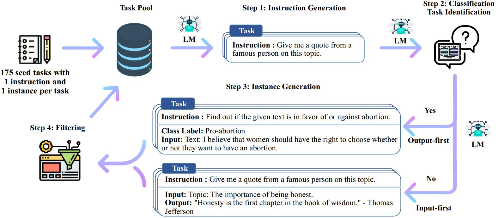

# stanford_alpaca
项目代码：[https://github.com/tatsu-lab/stanford_alpaca](https://link.zhihu.com/?target=https%3A//github.com/tatsu-lab/stanford_alpaca)

博客介绍：[https://crfm.stanford.edu/2023/03/13/alpaca.html](https://link.zhihu.com/?target=https%3A//crfm.stanford.edu/2023/03/13/alpaca.html)

52K用于微调模型的数据集： https://github.com/tatsu-lab/stanford_alpaca#data-release 

用于生成数据的代码： https://github.com/tatsu-lab/stanford_alpaca#data-generation-process 

模型微调代码： https://github.com/tatsu-lab/stanford_alpaca#fine-tuning 

在线演示地址： https://crfm.stanford.edu/alpaca/ 

## Alpaca 总览

Alpaca 是 LLaMA-7B 的微调版本，使用Self-instruct[2]方式借用text-davinct-003构建了52K的数据，同时在其构建策略上做了一些修改。

性能上作者对Alpaca进行了评估，与openai的text-davinct-003模型在self-instruct[2]场景下的性能表现相似。所以比起成本来看，Alpaca更便宜。

> text-davinct-003 与 chatGPT 同为 **[gpt3.5模型](https://link.zhihu.com/?target=https%3A//openai.xiniushu.com/docs/models%23gpt-35)**之一，比GPT-3模型 curie、babbage、ada 模型更好的质量、更长的输出和一致的指令遵循来完成任何语言任务  

整体思路如下图

## 基于 Self-instruct 的数据生成

### **Self-instruct**

**Self-instruct是一个利用LLM来生成指令遵循数据来指令微调模型的框架，核心贡献是生成指令遵循数据**。

**指令数据由指令、输入、输出组成**。作者的数据生成piple包含四个步骤：

1）生成任务指令，

2）确定指令是否代表分类任务，方便3区别

3）正常任务使用输入优先方法，分类任务使用输出优先的prompt指令方法生成实例

4）过滤低质量的数据。

详细的Self-instruct可以看我别的文章。

### **Alpaca**

Alpaca基于self-instruct，

1.  改用GPT-3.5：text-davinci-003来生成指令数据（self-instruct使用的GPT-3：davinci）
2.  指令生成时使用新的**[prompt](https://link.zhihu.com/?target=https%3A//github.com/tatsu-lab/stanford_alpaca/blob/main/prompt.txt)**，直接一次性生成20个任务的指令（self-instruct是迭代生成的，更费钱）
3.  指令生成不区分 分类/非分类任务，可能是GPT3.5更好，不需要区别了。
4.  每个指令只生成1个实例。

最终的结果是以少于$500的便宜价格获得了52K的数据，下图反映了其数据多样性，内圈是词根是动词的指令，外圈是表示目标的指令。

