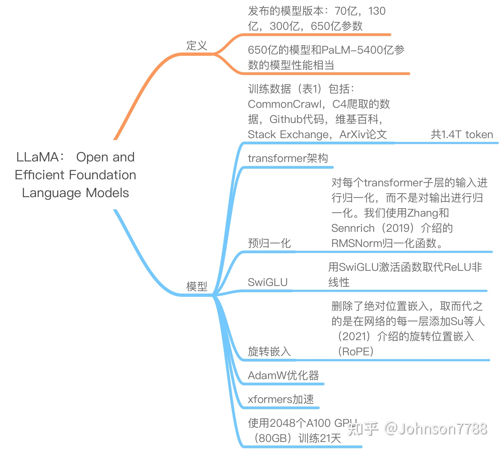
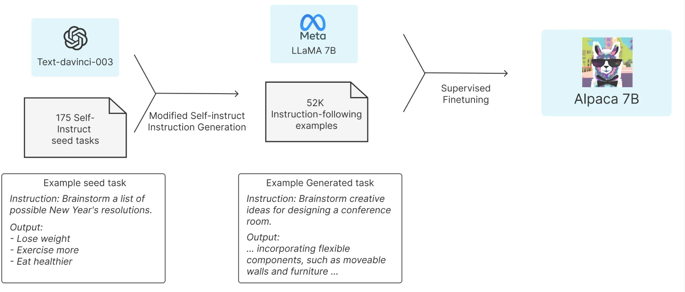

1.ChatGLM
---------

由清华技术成果转化的公司智谱 AI 宣布开源了 GLM 系列模型的最新成员——中英双语对话模型 ChatGLM-6B，并且该模型支持在单张消费级显卡上进行推理使用。这是继之前开源的 GLM-130B 千亿基座模型之后，智谱 AI 再次在大模型领域取得的研究成果。

ChatGLM-6B 是一个开源的对话语言模型，支持中英双语问答，并且针对中文进行了优化。该模型基于 General Language Model (GLM)架构，拥有 62 亿参数。通过模型量化技术，用户可以在消费级显卡上进行本地部署（INT4 量化级别下最低只需 6GB 显存）。

ChatGLM-6B 采用了和 ChatGLM 相同的技术，专注于中文问答和对话的优化。经过约 1T 标识符的中英双语训练，并结合了监督微调、反馈自助和人类反馈强化学习等技术手段，62 亿参数的 ChatGLM-6B 虽然规模较小于千亿模型，但极大地降低了推理成本，提高了效率，并且能够生成与人类偏好相符的回答。

ChatGLM-6B 具备以下特点：

1.  充分的中英双语预训练：ChatGLM-6B 在中英语料的 1:1 比例上进行了 1T 的 token 训练，具备双语能力。
2.  优化的模型架构和大小：借鉴了 GLM-130B 的训练经验，修正了二维 RoPE 位置编码实现，采用传统的 FFN 结构。62 亿参数的模型大小使得研究者和个人开发者可以自行微调和部署 ChatGLM-6B。
3.  较低的部署门槛：在 FP16 半精度下，ChatGLM-6B 推理所需的显存至少为 13GB。结合模型量化技术，这一需求可以进一步降低到 10GB（INT8）和 6GB（INT4），使得 ChatGLM-6B 可以在消费级显卡上进行部署。
4.  更长的序列长度：相较于 GLM-10B（序列长度 1024），ChatGLM-6B 支持 2048 的序列长度，能够应对更长的对话和应用场景。
5.  人类意图对齐训练：采用了监督微调、反馈自助和人类反馈强化学习等训练方式，使得模型具备初步理解人类指令意图的能力，并且输出格式为 Markdown，便于展示。

基于以上特点，ChatGLM-6B 在一定条件下展现出良好的对话和问答能力。

2.LLaMA
-------

LLaMA 出自于 Meta AI 的论文[LLaMA: Open and Efficient Foundation Language Models](https://arxiv.org/pdf/2302.13971v1.pdf)。也进行了指令微调训练，主要对比的是 GPT-3/OPT，相对 GPT- 3 有更好的表现。

类似于 GPT 系列，LLaMA 模型也采用了 Decoder-only 架构，但在前人工作的基础上进行了一些改进，以提升性能和训练稳定性。以下是 LLaMA 模型的改进之处：

1.  Pre-normalization [GPT3]: LLaMA 使用了 Pre-normalization 的方法，对每个 transformer 子层的输入进行了归一化处理。这种归一化采用了 RMSNorm 归一化函数，旨在提高训练的稳定性。这个改进最初由 Zhang 和 Sennrich（2019）提出。
2.  SwiGLU 激活函数 [PaLM]: LLaMA 将 ReLU 非线性激活函数替换为 SwiGLU 激活函数，并使用了 234d 维度的参数，而不是 PaLM 论文中的 4d 维度。SwiGLU 激活函数由 Shazeer（2020）引入，旨在提高模型的性能。
3.  Rotary Embeddings [GPTNeo]: LLaMA 模型不再使用传统的 positional embeddings 作为输入，而是在网络的每一层都添加了 Rotary Embeddings（RoPE）。RoPE 是一种位置编码方法，由 Su 等人（2021）提出。这种方法在每一层中引入了位置信息，有助于提高模型的表达能力。

通过以上改进，LLaMA 模型在一定程度上优化了性能，并提升了训练的稳定性。

论文内容就是下面这张图，来自于参考 2 链接。



3.Alpaca
--------

斯坦福的 Alpaca 模型基于 LLaMA-7B 和指令微调，仅使用约 5 万条训练数据，就能达到类似 GPT-3.5 的效果。该项目提供了廉价的对 LLaMA 模型进行微调的方法，大体思路如下：首先，利用 OpenAI 提供的 GPT 模型 API 生成质量较高的指令数据（仅 52k），例如：



```JSON
{
    "instruction": "Rewrite the following sentence in the third person",
    "input": "I am anxious",
    "output": "She is anxious."
}, {
    "instruction": "What are the three primary colors?",
    "input": "","output":"The three primary colors are red, blue, and yellow."
}

```

然后，基于这些指令数据使用 HuggingFace Transformers 框架精调 LLaMA-7B 模型。

[开源代码地址](https://github.com/tatsu-lab/stanford_alpaca)。

4.Vicuna
--------

Vicuna 是基于 LLaMa-13B 模型进行监督数据微调而得到的模型。监督数据来自于 ShareGPT.com 生成的用户对话数据，总共包含 70K 条对话。Vicuna 采用了 Pytorch FSDP，在 8 张 A100 显卡上进行了一天的训练。相较于 Alpaca，Vicuna 在训练过程中对序列长度进行了扩展，从 512 扩展到了 2048，并通过梯度检测和闪存注意力机制来解决内存问题。此外，Vicuna 还调整了训练损失以考虑多轮对话，并仅根据模型的输出进行微调。经过使用 GPT4 进行评估，Vicuna 能够达到与 ChatGPT 90% 相当的效果。另外，Vicuna 还提供了可调用的分布式聊天服务，称为 FastChat，详细信息可在 [FastChat](https://github.com/lm-sys/FastChat) 中找到。

参考
--

[1] [清华大学开源中文版 ChatGLM-6B 模型学习与实战](https://zhuanlan.zhihu.com/p/615906001)

[2] [LLaMA：开放和高效的基础语言模型](https://zhuanlan.zhihu.com/p/609843048)

[3] [LLaMA 模型介绍](https://zhuanlan.zhihu.com/p/617952293)

[4] [LLaMA 及其子孙模型概述](https://juejin.cn/post/7220985690795851836)

[5] [大模型入门（一）—— LLaMa/Alpaca/Vicuna](https://www.cnblogs.com/jiangxinyang/p/17310398.html)

[6] [从 0 到 1 复现斯坦福羊驼（Stanford Alpaca 7B）](https://zhuanlan.zhihu.com/p/618321077