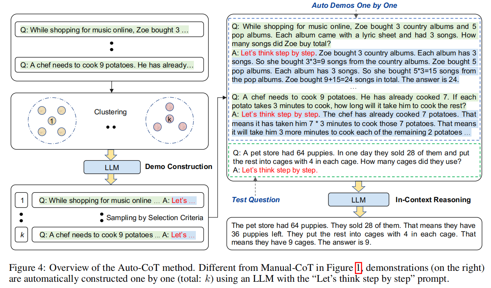
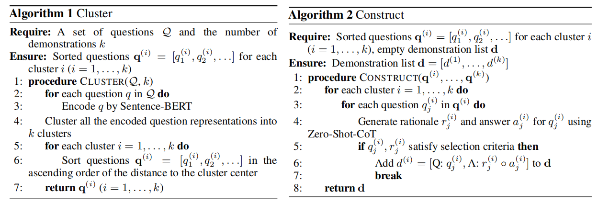
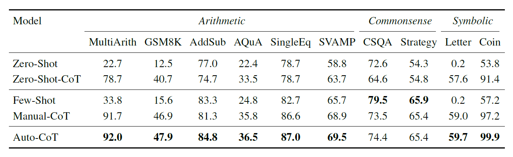

# 自动思维链（Auto-CoT）

## 动机
首先作者对比Retrieval-Q-CoT和Random-Q-CoT方法在MultiArith，GSM8K，AQuA三个数据集上进行试验。作者发现在MultiArith问题上，Retrieval-Q-CoT甚至不如Random-Q-CoT，这显然是不符合常理的。作者怀疑，这是因为Zero-shot生成的CoT质量太差。于是，作者又在GSM8K，AQuA两个数据集上进行实验，与MultiArith数据集不同的是，这两个数据集的CoT是人工标注的。果然，在这两个数据集上Retrieval-Q-CoT好于Random-Q-CoT。于是作者得出结论，Zero-shot生成的CoT并不如人工编制的。

>Retrieval-Q-CoT：使用Sentence-BERT对问题进行编码，然后将相似度最高的前k个相似问题作为demo，$Q_i(i=1,...,k)$。对于这$k$个问题，使用Zero-shot生成CoT——$c_i$，然后将$Q_i$，$C_i(1,...,k)$，$Q^{test}$串联拼接作为输入提问大模型。\
>Random-Q-CoT：相比Retrieval-Q-CoT随机选取k个问题

## 方法
基于第3节的观察和考虑，我们提出了一种自动化的Auto-CoT方法，用于自动构建带有问题和推理链的示例。

Auto-CoT包含两个主要阶段：
1. 问题聚类：将给定数据集中的问题划分为几个簇；
2. 示例采样：从每个簇中选择一个代表性问题，并使用Zero-Shot-CoT和简单的启发式方法生成其推理链。整个过程如图所示。

两阶段的详细步骤如下

### Question Clustering
由于基于多样性的聚类可能减轻相似性引起的误导，我们对给定的问题集$Q$进行聚类分析。首先，通过`Sentence-BERT`将$Q$中的每个问题编码成一个向量表示，并且编码后的向量维度相同。然后，使用$k-means$聚类算法，对问题集$Q$进行聚类，聚类成k个问题簇。对于第$i$个簇中的问题，根据与簇中心的距离进行升序排序，形成列表$q^{(i)} = [q_1^{(i)}, q_2^{(i)}, ...]$。伪代码如下图所示。

### Demonstration Sampling
在抽样阶段，对于每一个簇，按照升序列表依次遍历每一个问题，对于当前问题，使用Zero-shot生成CoT，如果CoT满足token不大于60个且不超过五个步骤，则将此问题和CoT作为此簇中的每个问题的样例CoT，拼接在这类问题的前面。

## 实验
实验在三类推理任务、十个基准数据集和GPT-3上进行

1. 算术推理（MultiArith，GSM8K，AddSub，AQUA-RAT，SingleEq，SVAMP）
2. 常识推理（CSQA，StrategyQA）
3. 符号推理（Last Letter Concatenation，Coin Flip）

作为对比的方法有Zero-Shot，Zero-Shot-CoT，Few-Shot和Manual-CoT。

实验结果如下图所示，Auto-CoT 一贯匹配或超越了需要手动设计演示的CoT方法的性能。

# Github
[amazon-science auto-cot](https://github.com/amazon-science/auto-cot)

# 参考资料
1. [论文解读 | Auto CoT——利用聚类自动生成CoT](https://geyuyao.com/post/auto-cot/)
2. [Automatic Chain of Thought Prompting in Large Language Models](https://arxiv.org/abs/2210.03493)