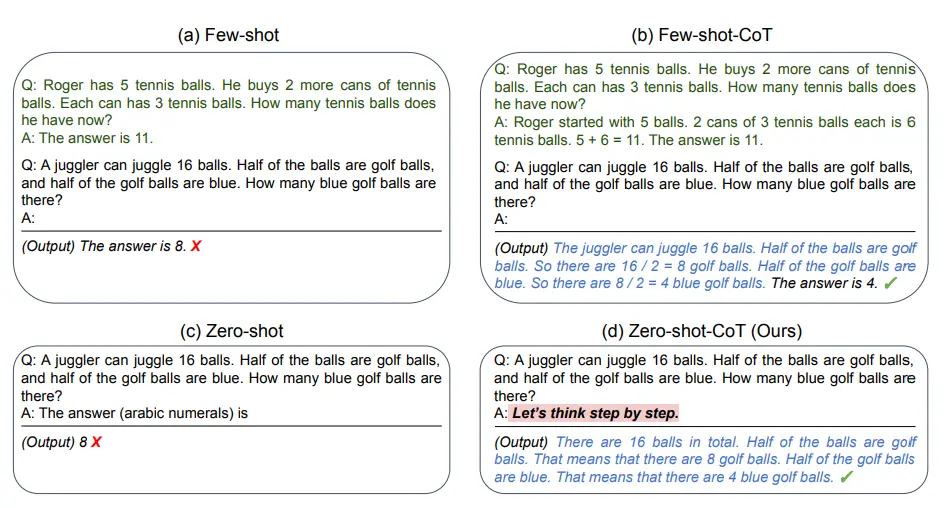
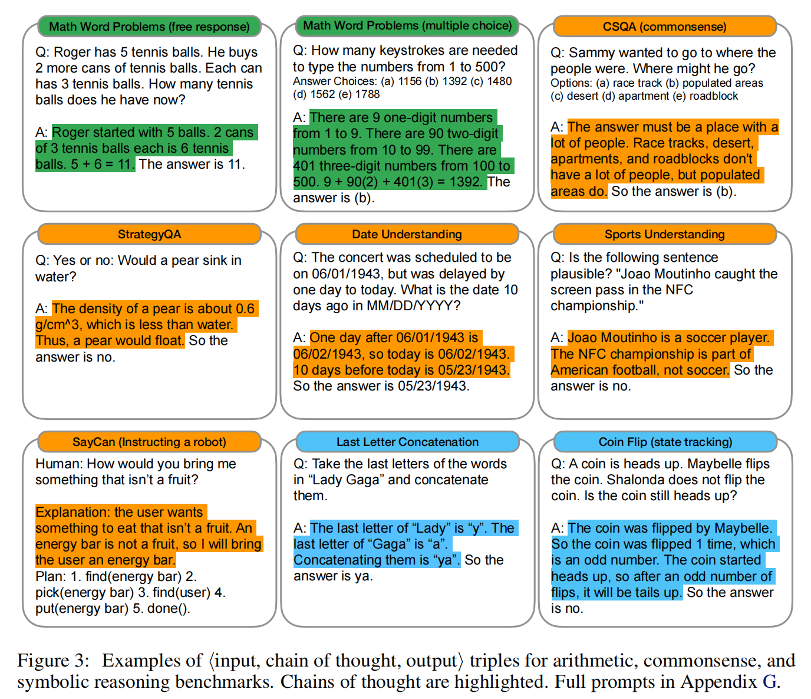
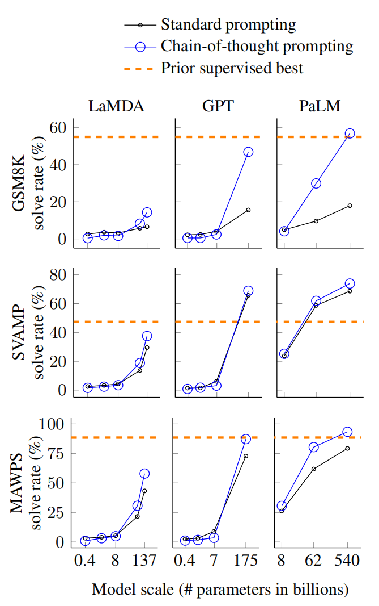
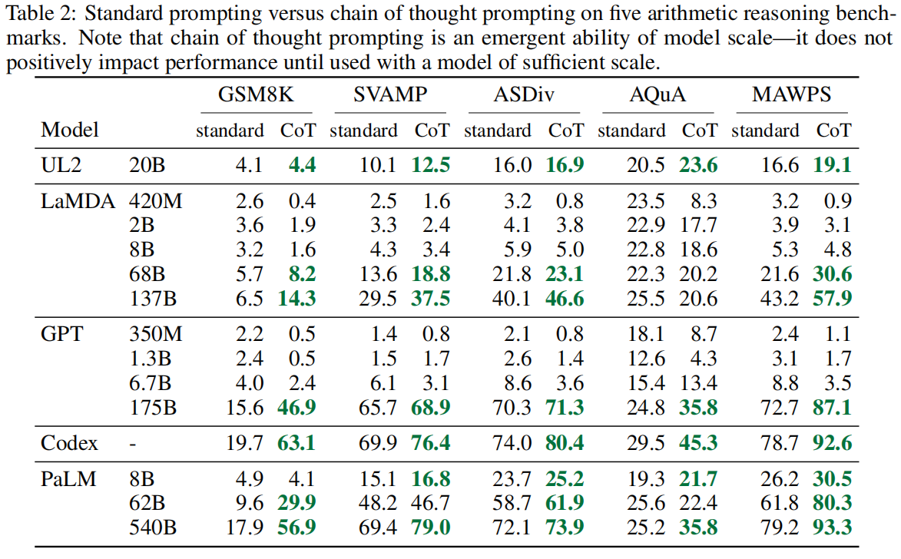
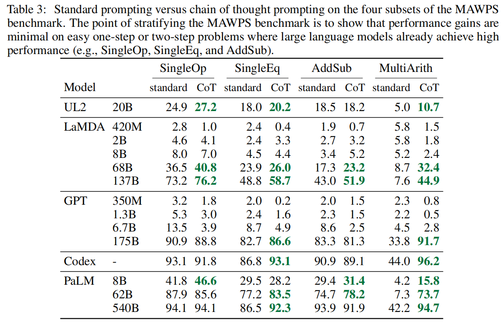

# CoT
Chain-of-Thought(CoT)是一种提高模型推理能力的Prompt技巧，能够简单高效的提升大语言模型在复杂任务上的推理能力。对于复杂问题，例如算术推理（arithmetic reasoning）、常识推理（commonsense reasoning）、符号推理（symbolic reasoning），大语言模型很难直接给出正确答案。而通过简单的给模型一“Let's think step by step!”就能够让模型输出中间步骤，并显著的提高模型输出正确答案的能力。

> CoT最先由由谷歌大脑的高级研究员 Jason Wei 提出，并在 2022 年 1 月发表的论文[Chain-of-Thought Prompting Elicits Reasoning in Large Language Models](https://arxiv.org/abs/2201.11903)中进行了详细阐述。CoT 技术通过将复杂问题分解为一系列逐步的子问题解答，引导模型生成详细的推理过程，从而提高模型在算术推理、常识推理和符号推理等复杂任务上的表现。

直接看下面这个经典图例。

模型原本Few-shot和Zero-shot均不能直接输出正确答案，但是在Few-shot的任务示例中给出了解题过程，以及在Zero-shot中添加“Let's think step by step!”后，就能够引导模型输出解题过程，并最终输出了正确答案。

论文中的更多示例如下：

## 实验对比
在原论文中，作者使用`Standard prompting`和`Chain-of-thought prompting`做对比。实验结果如下：

1. 如下图所示，思维链CoT是大语言模型的涌现能力，也就是说，链式思维提示对于小型模型没有正面影响，只有在使用大约100B参数的模型时才会产生性能增益。

    
    

2. 其次，链式思维提示对于更复杂的问题有更大的性能提升。如上图的表格中所示，在`GSM8K`（基准性能最低的数据集）上，对于最大的`GPT`和`PaLM`模型，性能提升了一倍多。另一方面，如下图表格所示，对于`MAWPS`中最容易的子集`SingleOp`，`PaLM`只需要一步就能解决，性能提升要么是负的，要么非常小。

    

3. 第三，通过`GPT-3 175B`和`PaLM 540B`进行的链式思维提示（chain-of-thought prompting）与以往的最先进水平相比具有优势，后者通常是在有标签的训练数据集上微调特定任务的模型。如上面的折线图所示，展示了`PaLM 540B`如何使用链式思维提示在`GSM8K`、`SVAMP`和`MAWPS`上达到新的最先进水平。在另外两个数据集AQuA和ASDiv上，使用链式思维提示的PaLM接近最先进水平，差距在2%以内（附录表2）。

# 参考资料
1. [Chain-of-Thought Prompting](https://www.promptingguide.ai/zh/techniques/cot)
2. [Chain-of-Thought Prompting Elicits Reasoning in Large Language Models](https://arxiv.org/abs/2201.11903)