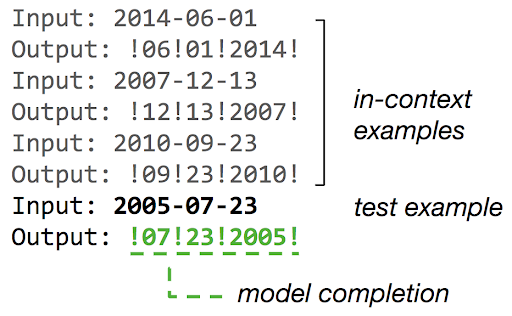
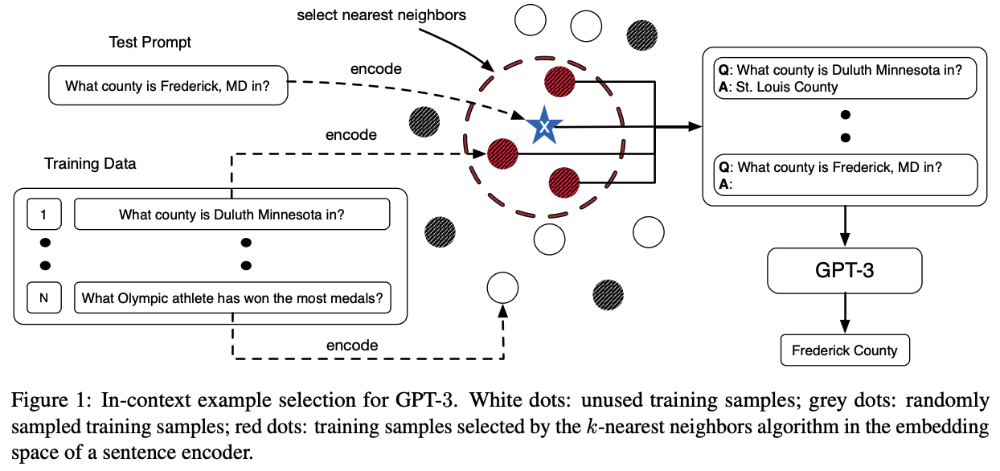
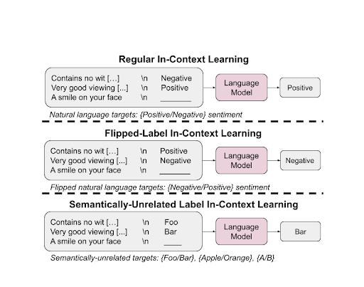

# In-context Learning 上下文学习
In-context Learning(ICL)允许模型在没有梯度更新或微调的情况下,仅通过上下文示例就能使模型快速适应新任务,展现出了强大的泛化能力。

## 什么是In-context Learning
In-context Learning(ICL)上下文学习是一种将任务示例以自然语言格式整合到提示词Prompt中的技术。这种方法允许预训练的 LLMs 在不微调模型的情况下处理新任务。ICM在不更新模型参数的情况下，使用预训练的语言模型进行预测，模型能够学习到给出的任务示例中的潜在模式或规律，从而完成给出的任务。如下图所示。

## In-context Learning为什么重要
1. ICL通过修改任务示例案例和Prompt模板，简化了将人类专业知识整合到LLMs中的过程。
2. ICL 的方法反映了人类的认知推理过程，使其成为一种更直观的问题解决模型。
3. 任务特定模型适应的计算开销显著减少，为将语言模型作为服务进行部署铺平了道路，便利了它们在现实场景中的应用。
4. ICL 在各种 NLP 基准测试中表现出竞争力，即使与在更大标记数据集上训练的模型相比也是如此。

## In-context Learning是如何工作的

## ICL相关模型训练策略
为了提升模型的ICL能力,研究人员提出了多种专门的训练策略。这些策略主要分为预训练阶段和微调阶段两类。

### 预训练阶段策略
1. PICL (Pre-training to learn In-Context)
> PICL是一种专门设计的预训练方法,旨在增强模型的ICL能力。该方法在预训练阶段就模拟ICL的过程,使模型能够学习如何利用上下文信息进行推理。
> 具体来说,PICL构造了大量的ICL样本,每个样本包含多个输入-输出对和一个待预测的输入。模型需要学会如何从给定的示例中提取规律,并应用到新的输入上。这种训练方式使得模型在预训练阶段就能够适应ICL的推理模式。

2. ICLM (In-context Language Modeling)
> ICLM是另一种创新的预训练方法,它打破了传统语言模型仅在单个文档内建模的限制。ICLM引入了跨文档的上下文建模,使模型能够学习利用更广泛的上下文信息。
> 在ICLM中,模型不仅需要预测下一个词,还需要预测给定上下文中的缺失部分。这种训练方式增强了模型对长距离依赖关系的建模能力,有利于提升ICL性能。

### 微调阶段策略
1. MetaICL
> MetaICL是一种元学习方法,旨在通过大规模任务集上的微调来提升模型的ICL能力。该方法的核心思想是让模型在多样化的任务上进行"ICL训练",从而学会如何更好地利用上下文信息。
> 在MetaICL中,每个训练样本都模拟了一个完整的ICL过程。模型需要根据给定的示例来完成目标任务。通过在大量不同任务上重复这一过程,模型逐渐掌握了ICL的一般性技巧。

2. 符号调优(Symbol Tuning)
> 符号调优是一种简单而有效的方法,通过在预训练模型中引入特殊符号来增强ICL性能。这些特殊符号在微调阶段被用来标记输入-输出对的边界,帮助模型更好地识别示例的结构。
> 研究表明,使用符号调优可以显著提升模型的ICL能力,尤其是在处理结构化任务时效果更为明显。

## Prompt优化
怎么用好ICL来提高模型性能，是一个值得研究的课题，并不是随便给几个与任务相关的示例即可。针对同一个测试数据，选取不同的任务示例，得到的结果可能并不相同。为了使LLM生成更加准确的结果，就需要设计一定的策略来选取更加合适的任务示例。

### 启发式方法
原文出处：[What Makes Good In-Context Examples for GPT-3?](https://arxiv.org/abs/2101.06804)

简单讲就是：选取与测试样本在语义上最相似的几个任务示例，能够使效果更好。如下图所示：

## In-context Learning变体
### Regular ICL
常规上下文学习 (ICL) 是一种基础的特定任务学习方法。模型利用在预训练阶段获得的语义先验知识，根据上下文示例的格式来预测标签。例如，如果任务涉及情感分析，模型将利用其预训练对“积极情感”和“消极情感”的理解来生成适当的标签。

### Flipped-Label ICL
Flipped-Label ICL通过反转上下文示例的标签引入了复杂性。这迫使模型覆盖其语义先验，挑战其遵循输入标签映射的能力。在这种情况下，较大的模型可以覆盖其预训练的语义先验，而这一能力在较小的模型中并未观察到。

### Semantically-Unrelated Label ICL (SUL-ICL)
SUL-ICL 采用不同的方法，通过用语义无关的术语替换上下文示例的标签。它指引模型从头学习输入-标签映射，因为模型不再能够依赖其语义先验来完成任务。更大的模型在这种学习方式上更为擅长，表明它们能够在不完全依赖于预训练的语义知识的情况下适应新的任务描述。

