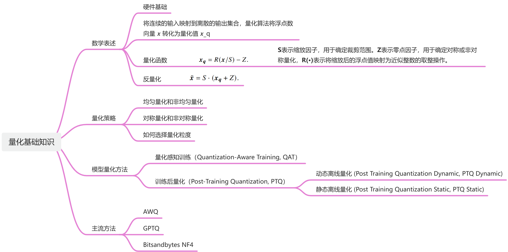

# 量化
模型量化就是通过降低模型参数的表示精度，以此降低模型的存储空间，内存占用和计算复杂度。

# 学习路线

    

## 资源整理
1. B站视频课：[TensorRT下的模型量化](https://www.bilibili.com/video/BV18L41197Uz/?share_source=copy_web&vd_source=bae123c791941d42dda0fe590dc54c21)
2. 优质文档：[低比特量化原理](https://chenzomi12.github.io/04Inference03Slim/02Quant.html)
3. **强推**优质综述：[A Visual Guide to Quantization](https://www.maartengrootendorst.com/blog/quantization/)
4. 手写算法的代码仓库：[TensorRT Quantization Tutorial](https://github.com/shouxieai/tensorRT_quantization)