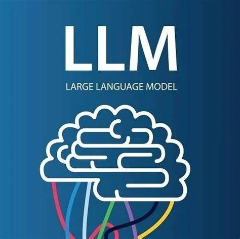
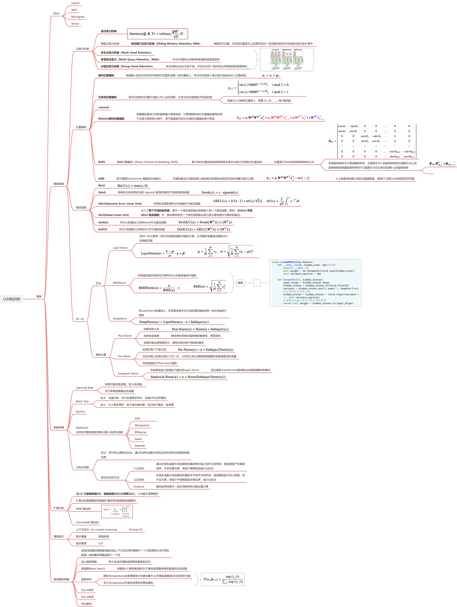
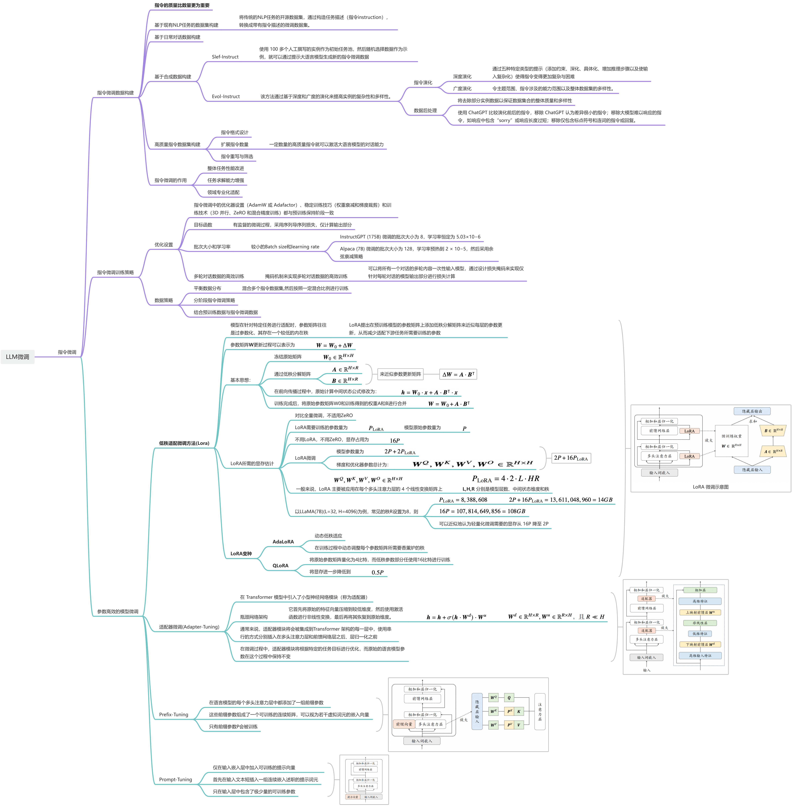
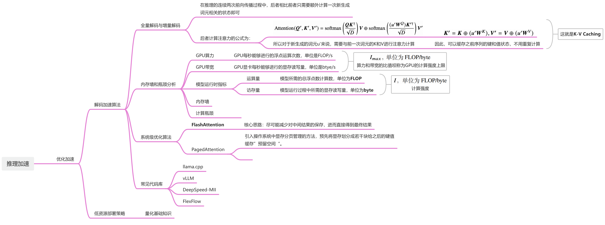

  
  <h1>大语言模型知识大熔炉</h1>
  <h3>LLM-tutorial-AllinOne<h3>

&emsp;&emsp;本项目是一个完整LLM学习教程，有完备的学习路线，面向于刚刚入门开始学习LLM的同学，也适合有工作经验的大佬来继续学习，当然也非常欢迎有大佬来分享自己的大模型经验。本项目的模板是能够尽可能多的囊括大语言模型各方面的知识，包括NLP基础知识，LLM基本原理，LLM应用开发，LLM开发进阶，Prompt工程，Agent开发，大模型预训练和微调，人类对齐等方面。囊括原理的同时，也会包含详细的动手教程，帮助每一位学习者、研究者更快速的上手大语言模型领域。

## 学习路线
1. 扎实NLP基础 \
   重点：**Pytorch**知识， **MLP**，**Word2Vec**，**CNN**建议也了解一下
2. Transformer \
   看这个学习：[https://github.com/Ace-bb/Transformer](https://github.com/Ace-bb/Transformer)
   Transformer多看多学，尽可能掌握细节。
3. 主流模型架构 \
   重点：**LlaMA**，**Qwen**，**InternVL**
4. Prompt工程、应用开发 \
5. 预训练+微调 \
   重点：**LoRA**
6. 分布式训练 \
   重点：**DP**，**DDP**
7. 人类对齐 \
   重点：**DPO**
8. 推理部署 \
   重点：**量化方法**，**QAT**，**PTQ**，**FlashAttention**，**PageAttention**
9. 多模态相关 \
   重点：**视觉模型**，**VIT**，**CLIP**

## 项目计划囊括内容
1. NLP基础

2. 大模型核心原理
    - 模型基础
        - 注意力机制
        - 位置编码
        - 激活函数
        - 归一化
    - Transformer架构
    - 模型解码策略
    - 参数详解
    - 扩展法则
    - 涌现能力
    

    
思维导图

    
    

3. Prompt工程
    - API调用
    - 提示词工程基础
    - 提示词工程进阶
4. LLM应用开发
    - Function Calling
    - RAG
    - GPTs
    - Langchain
    - Agent
5. 数据处理
    - 预处理
        - 质量过滤
        - 数据去重
    - 词元化
        - BPE分词
        - WordPiece分词
        - Unigram分词
    - 数据调度
6. 大模型预训练
    - 预训练任务
        - 语言建模
        - 去噪自编码
        - 混合自编码
    - 预训练技术
        - 优化参数设置
        - 稳定化技术
        - 可扩展预训练技术
    - 模型参数计算
    - 预训练实操
    

    
思维导图

    
    

    
7. 指令微调
    - 微调数据集构造
    - 指令微调训练策略
    - 参数高效的微调方法
    

    
思维导图

    
    

8. 人类对齐
    - 对其标准
    - RLHF
    - DPO
    

    
思维导图

    
    

9. 优化加速
    - 解码加速算法
    - 低资源部署策略
    

    
思维导图

    
    

10. 评估方法

## 亲测优质学习资源
### Github仓库

1. [开源大模型食用指南](https://github.com/datawhalechina/self-llm)
&emsp;&emsp; 这里面有非常详细的模型微调指南
2. [LLM综述](https://github.com/RUCAIBox/LLMSurvey)
&emsp;&emsp; 非常不错的一本LLM综述书籍，强烈建议阅读，非常详细的讲述了LLM的基础知识和发展状况。
3. [大模型快速上手](https://github.com/DjangoPeng/LLM-quickstart)
&emsp;&emsp; 这里面各种大语言模型微调策略，同时有示例可以正常运行，强烈建议作为上手练习使用
4. [Build a Large Language Model (From Scratch)](https://github.com/rasbt/LLMs-from-scratch)