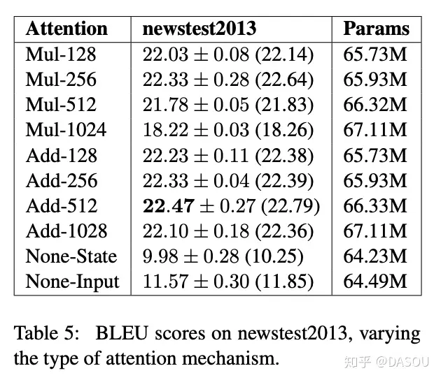
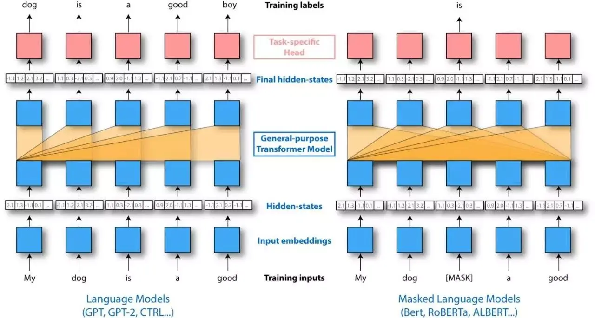
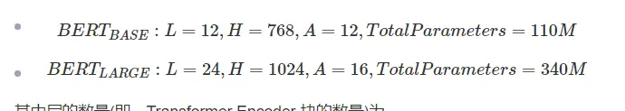
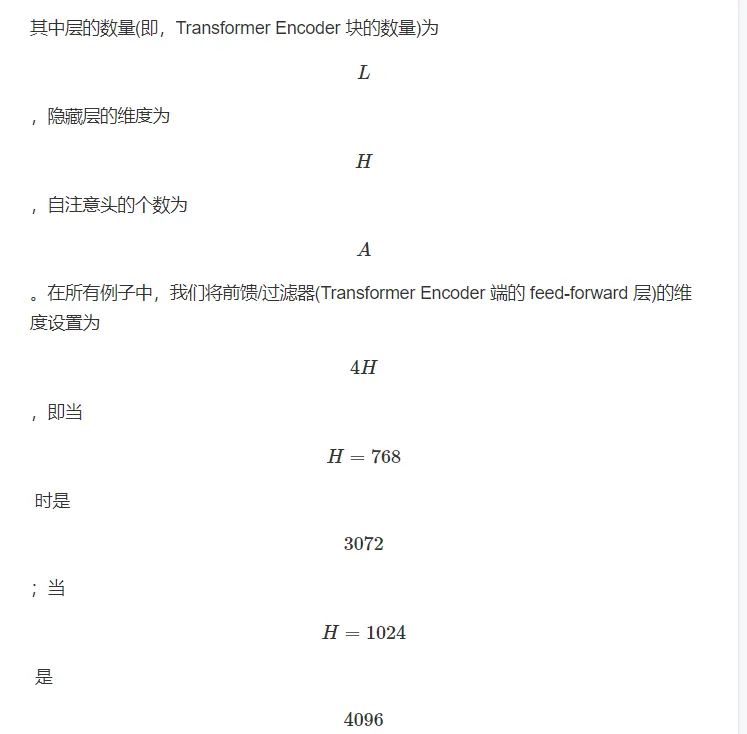
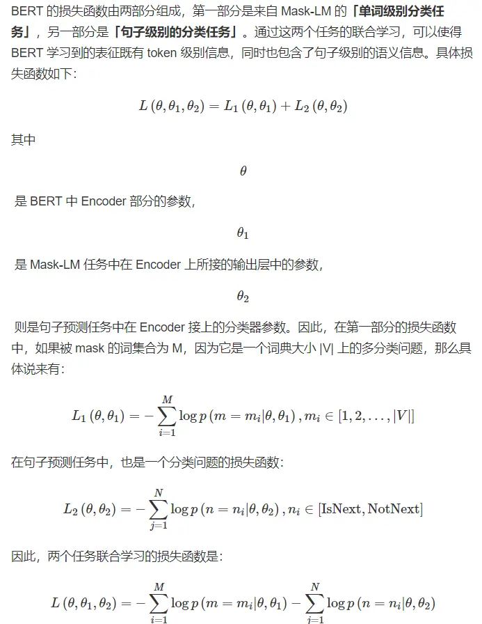

1.Transformer为何使用多头注意力机制？（为什么不使用一个头）
====================================

答案解析参考这里：为什么Transformer 需要进行 Multi-head Attention？ [https://www.zhihu.com/question/3412](https://links.jianshu.com/go?to=https%3A%2F%2Fwww.zhihu.com%2Fquestion%2F341222779)

多头保证了transformer可以注意到不同子空间的信息，捕捉到更加丰富的特征信息。其实本质上是论文原作者发现这样效果确实好

* * *

多头可以使参数矩阵形成多个子空间，矩阵整体的size不变，只是改变了每个head对应的维度大小，这样做使矩阵对多方面信息进行学习，但是计算量和单个head差不多。

* * *

答：类似于cnn中多个卷积核的作用，使用多头注意力，能够从不同角度提取信息，提高信息提取的全面性。

1. Transformer为什么Q和K使用不同的权重矩阵生成，为何不能使用同一个值进行自身的点乘？
==================================================

答案解析参考这里：transformer中为什么使用不同的K 和 Q， 为什么不能使用同一个值？ - 知乎 [https://www.zhihu.com/question/319339652](https://links.jianshu.com/go?to=https%3A%2F%2Fwww.zhihu.com%2Fquestion%2F319339652)

注解：简单回答就是，使用Q/K/V不相同可以保证在不同空间进行投影，增强了表达能力，提高了泛化能力。

* * *

请求和键值初始为不同的权重是为了解决可能输入句长与输出句长不一致的问题。并且假如QK维度一致，如果不用Q，直接拿K和K点乘的话，你会发现attention score 矩阵是一个对称矩阵。因为是同样一个矩阵，都投影到了同样一个空间，所以泛化能力很差。

3.Transformer计算attention的时候为何选择点乘而不是加法？两者计算复杂度和效果上有什么区别？
========================================================

为了计算更快。矩阵加法在加法这一块的计算量确实简单，但是作为一个整体计算attention的时候相当于一个隐层，整体计算量和点积相似。在效果上来说，从实验分析，两者的效果和dk相关，dk越大，加法的效果越显著。更具体的结果，大家可以看一下实验图：

  

* * *

K和Q的点乘是为了得到一个attention score 矩阵，用来对V进行提纯。K和Q使用了不同的W_k, W_Q来计算，可以理解为是在不同空间上的投影。正因为 有了这种不同空间的投影，增加了表达能力，这样计算得到的attention score矩阵的泛化能力更高。

4.为什么在进行softmax之前需要对attention进行scaled（为什么除以dk的平方根），并使用公式推导进行讲解
==============================================================

答案解析参考这里：transformer中的attention为什么scaled? - LinT的回答 - 知乎 [https://www.zhihu.com/question/3397](https://links.jianshu.com/go?to=https%3A%2F%2Fwww.zhihu.com%2Fquestion%2F339723385%2Fanswer%2F782509914)  
方差变为1，避免softmax输出onhot从而梯度消失

* * *

假设 Q 和 K 的均值为0，方差为1。它们的矩阵乘积将有均值为0，方差为dk，因此使用dk的平方根被用于缩放，因为，Q 和 K 的矩阵乘积的均值本应该为 0，方差本应该为1，这样可以获得更平缓的softmax。当维度很大时，点积结果会很大，会导致softmax的梯度很小。为了减轻这个影响，对点积进行缩放。

5.在计算attention score的时候如何对padding做mask操作？
=========================================

答案解析：padding位置置为负无穷(一般来说-1000就可以)。

6. self-attention是什么？
=====================

「self-attention」，也叫 「intra-attention」，是一种通过自身和自身相关联的 attention 机制，从而得到一个更好的 representation 来表达自身，self-attention 可以看成一般 attention 的一种特殊情况。在 self-attention 中， ，序列中的每个单词(token)和该序列中其余单词(token)进行 attention 计算。self-attention 的特点在于「无视词(token)之间的距离直接计算依赖关系，从而能够学习到序列的内部结构」，实现起来也比较简单，值得注意的是，在后续一些论文中，self-attention 可以当成一个层和 RNN，CNN 等配合使用，并且成功应用到其他 NLP 任务。

7.关于 self-attention 为什么它能发挥如此大的作用
=================================

在上述 self-attention 的介绍中实际上也有所提及，self-attention 是一种自身和自身相关联的 attention 机制，这样能够得到一个更好的 representation 来表达自身，在多数情况下，自然会对下游任务有一定的促进作用，但是 Transformer 效果显著及其强大的特征抽取能力是否完全归功于其 self-attention 模块，还是存在一定争议的，参见论文：How Much Attention Do You Need?A Granular Analysis of Neural Machine Translation Architectures

8. 关于 self-attention 为什么要使用 Q、K、V，仅仅使用 Q、V/K、V 或者 V 为什么不行？
==========================================================

这个问题我觉得并不重要，self-attention 使用 Q、K、V，这样三个参数独立，模型的表达能力和灵活性显然会比只用 Q、V 或者只用 V 要好些，当然主流 attention 的做法还有很多种，比如说 seq2seq with attention 也就只有 hidden state 来做相似性的计算，处理不同的任务，attention 的做法有细微的不同，但是主体思想还是一致的，不知道有没有论文对这个问题有过细究，有空去查查~

「其实还有个小细节，因为 self-attention 的范围是包括自身的(masked self-attention 也是一样)，因此至少是要采用 Q、V 或者 K、V 的形式，而这样“询问式”的 attention 方式，个人感觉 Q、K、V 显然合理一些。」

9. Transformer 为什么需要进行 Multi-head Attention？这样做有什么好处？Multi-head Attention 的计算过程？各方论文的观点是什么？
===========================================================================================

1 Why Multi-head Attention
--------------------------

原论文中说到进行 Multi-head Attention 的原因是将模型分为多个头，形成多个子空间，可以让模型去关注不同方面的信息，最后再将各个方面的信息综合起来。其实直观上也可以想到，如果自己设计这样的一个模型，必然也不会只做一次 attention，多次 attention 综合的结果至少能够起到增强模型的作用，也可以类比 CNN 中同时使用「多个卷积核」的作用，直观上讲，多头的注意力「有助于网络捕捉到更丰富的特征/信息」。

2 关于 Multi-head Attention 的计算过程
-------------------------------

在 1 中也有详细的介绍，但是需要注意的是，论文中并没有对 Multi-head Attention 有很强的理论说明，因此后续有不少论文对 Multi-head Attention 机制都有一定的讨论，一些相关工作的论文如下(还没看，先攒着)

3 Multi-head Attention 机制相关的论文：
-------------------------------

A Structured Self-attentive Sentence Embedding[4]

Analyzing Multi-Head Self-Attention: Specialized Heads Do the Heavy Lifting, the Rest Can Be Pruned[5]

Are Sixteen Heads Really Better than One?[6]

What Does BERT Look At? An Analysis of BERT's Attention[7]

A Multiscale Visualization of Attention in the Transformer Model[8]

Improving Deep Transformer with Depth-Scaled Initialization and Merged Attention[9]

10. Transformer 相比于 RNN/LSTM，有什么优势？为什么？
=======================================

1 RNN 系列的模型，并行计算能力很差
--------------------

RNN 系列的模型 时刻隐层状态的计算，依赖两个输入，一个是 时刻的句子输入单词 ，另一个是 时刻的隐层状态的输出 ，这是最能体现 RNN 本质特征的一点，RNN 的历史信息是通过这个信息传输渠道往后传输的。而 RNN 并行计算的问题就出在这里，因为 时刻的计算依赖 时刻的隐层计算结果，而 时刻的计算依赖 时刻的隐层计算结果，如此下去就形成了所谓的序列依赖关系。

2 Transformer 的特征抽取能力比 RNN 系列的模型要好
----------------------------------

上述结论是通过一些主流的实验来说明的，并不是严格的理论证明，具体实验对比可以参见：

放弃幻想，全面拥抱 Transformer：自然语言处理三大特征抽取器（CNN/RNN/TF）比较[10]

但是值得注意的是，并不是说 Transformer 就能够完全替代 RNN 系列的模型了，任何模型都有其适用范围，同样的，RNN 系列模型在很多任务上还是首选，熟悉各种模型的内部原理，知其然且知其所以然，才能遇到新任务时，快速分析这时候该用什么样的模型，该怎么做好。

11. .Transformer 是如何训练的？测试阶段如何进行测试呢？
====================================

0基础结构
-----

[https://blog.csdn.net/fengdu78/article/details/104629336](https://links.jianshu.com/go?to=https%3A%2F%2Fblog.csdn.net%2Ffengdu78%2Farticle%2Fdetails%2F104629336)

1 训练
----

Transformer 训练过程与 seq2seq 类似，首先 Encoder 端得到输入的 encoding 表示，并将其输入到 Decoder 端做交互式 attention，之后在 Decoder 端接收其相应的输入(见 1 中有详细分析)，经过多头 self-attention 模块之后，结合 Encoder 端的输出，再经过 FFN，得到 Decoder 端的输出之后，最后经过一个线性全连接层，就可以通过 softmax 来预测下一个单词(token)，然后根据 softmax 多分类的损失函数，将 loss 反向传播即可，所以从整体上来说，Transformer 训练过程就相当于一个有监督的多分类问题。

需要注意的是，「Encoder 端可以并行计算，一次性将输入序列全部 encoding 出来，但 Decoder 端不是一次性把所有单词(token)预测出来的，而是像 seq2seq 一样一个接着一个预测出来的。」

2 测试
----

而对于测试阶段，其与训练阶段唯一不同的是 Decoder 端最底层的输入，详细分析见问题

12 Transformer 中的 Add & Norm 模块，具体是怎么做的？
========================================

13.6.为什么在进行多头注意力的时候需要对每个head进行降维？
=================================

答：将原有的高维空间转化为多个低维空间并再最后进行拼接，形成同样维度的输出，借此丰富特性信息，降低了计算量

14简单介绍一下Transformer的位置编码？有什么意义和优缺点？
===================================

答：因为self-attention是位置无关的，无论句子的顺序是什么样的，通过self-attention计算的token的hidden embedding都是一样的，这显然不符合人类的思维。因此要有一个办法能够在模型中表达出一个token的位置信息，transformer使用了固定的positional encoding来表示token在句子中的绝对位置信息。

15你还了解哪些关于位置编码的技术，各自的优缺点是什么？
============================

答：相对位置编码（RPE）1.在计算attention score和weighted value时各加入一个可训练的表示相对位置的参数。2.在生成多头注意力时，把对key来说将绝对位置转换为相对query的位置3.复数域函数，已知一个词在某个位置的词向量表示，可以计算出它在任何位置的词向量表示。前两个方法是词向量+位置编码，属于亡羊补牢，复数域是生成词向量的时候即生成对应的位置信息。

16为什么transformer块使用LayerNorm而不是BatchNorm？LayerNorm 在Transformer的位置是哪里？
======================================================================

答：多头注意力层和激活函数层之间。CV使用BN是认为channel维度的信息对cv方面有重要意义，如果对channel维度也归一化会造成不同通道信息一定的损失。而同理nlp领域认为句

17.Encoder端和Decoder端是如何进行交互的？
=============================

答：通过转置encoder_ouput的seq_len维与depth维，进行矩阵两次乘法，即q_kT_v输出即可得到target_len维度的输出

18.Decoder阶段的多头自注意力和encoder的多头自注意力有什么区别？
========================================

答：Decoder有两层mha，encoder有一层mha，Decoder的第二层mha是为了转化输入与输出句长，Decoder的请求q与键k和数值v的倒数第二个维度可以不一样，但是encoder的qkv维度一样。

19**bert的mask为何不学习transformer在attention处进行屏蔽score的技巧？**
=======================================================

答：BERT和transformer的目标不一致，bert是语言的预训练模型，需要充分考虑上下文的关系，而transformer主要考虑句子中第i个元素与前i-1个元素的关系。

20. 如果你知道你的训练数据有错误，你会对你的深度学习代码做什么改变？
====================================

我们可以做标签平滑，其中的平滑值是基于百分误差。如果任何特定的类有已知的误差，我们还可以使用类权值来修正损失。

21在transformer中使用最多的层是哪一层?
==========================

Dropout

22GPT和BERT有什么不同？
================



GPT不是双向的，没有masking的概念  
BERT在训练中加入了下一个句子预测任务，所以它也有 segment嵌入

23如何减少训练好的神经网络模型的推理时间？
======================

*   在GPU/TPU/FPGA上进行服务
*   16位量化，部署在支持fp16的GPU上提供服务
*   剪枝以减少参数
*   知识蒸馏(用于较小的transformer模型或简单的神经网络)
*   分层softmax

24 BERT 的三个 Embedding 直接相加会对语义有影响吗？
===================================

、Embedding 的数学本质，就是以 one hot 为输入的单层全连接。

也就是说，世界上本没什么 Embedding，有的只是 one hot。

现在我们将 token, position, segment 三者都用 one hot 表示，然后 concat 起来，然后才去过一个单层全连接，等价的效果就是三个 Embedding 相加。

因此，BERT 的三个 Embedding 相加，其实可以理解为 token, position, segment 三个用 one hot 表示的特征的 concat，而特征的 concat 在深度学习领域是很常规的操作了。

用一个例子理解一下：

假设 token Embedding 矩阵维度是 [4,768]；position Embedding 矩阵维度是 [3,768]；segment Embedding 矩阵维度是 [2,768]。

对于一个字，假设它的 token one-hot 是 [1,0,0,0]；它的 position one-hot 是 [1,0,0]；它的 segment one-hot 是 [1,0]。

那这个字最后的 word Embedding，就是上面三种 Embedding 的加和。

如此得到的 word Embedding，和 concat 后的特征：[1,0,0,0,1,0,0,1,0]，再经过维度为 [4+3+2,768] = [9, 768] 的 Embedding 矩阵，得到的 word Embedding 其实就是一样的。

Embedding 就是以 one hot 为输入的单层全连接。

25 在 BERT 中，token 分 3 种情况 mask，分别的作用是什么？
========================================

在 BERT 的 Masked LM 训练任务中， 会用 [MASK] token 去替换语料中 15% 的词，然后在最后一层预测。但是下游任务中不会出现 [MASK] token，导致预训练和 fine-tune 出现了不一致，为了减弱不一致性给模型带来的影响，在这被替换的 15% 语料中：

80% 的 tokens 会被替换为 [MASK] token

10% 的 tokens 会称替换为随机的 token

10% 的 tokens 会保持不变但需要被预测

* * *

上面第一点中的替换，是 Masked LM 中的主要部分，可以在不泄露 label 的情况下融合真双向语义信息；

第二点的随机替换，因为需要在最后一层随机替换的这个 token 位去预测它真实的词，而模型并不知道这个 token 位是被随机替换的，就迫使模型尽量在每一个词上都学习到一个 全局语境下的表征，因而也能够让 BERT 获得更好的语境相关的词向量（这正是解决一词多义的最重要特性）；

第三点的保持不变，也就是真的有 10% 的情况下是 泄密的（占所有词的比例为15% * 10% = 1.5%），这样能够给模型一定的 bias ，相当于是额外的奖励，将模型对于词的表征能够拉向词的 真实表征（此时输入层是待预测词的真实 embedding，在输出层中的该词位置得到的embedding，是经过层层 Self-attention 后得到的，这部分 embedding 里多少依然保留有部分输入 embedding 的信息，而这部分就是通过输入一定比例的真实词所带来的额外奖励，最终会使得模型的输出向量朝输入层的真实 embedding 有一个 偏移）。

而如果全用 mask 的话，模型只需要保证输出层的分类准确，对于输出层的向量表征并不关心，因此 可能会导致最终的向量输出效果并不好 [4]。

27 BERT的模型架构，多少层，什么任务适合bert，什么任务不适合，应用在你写的项目改怎么做
================================================





BERT由12层transformer layer（encoder端）构成，首先word emb , pos emb（可能会被问到有哪几种position embedding的方式，bert是使用的哪种）, sent emb做加和作为网络输入，每层由一个multi-head attention, 一个feed forward 以及两层layerNorm构成，一般会被问到multi-head attention的结构，具体可以描述为，

  
 image.png

28 .BERT 的 embedding 向量如何得来的？
=============================

以中文为例，「BERT 模型通过查询字向量表将文本中的每个字转换为一维向量，作为模型输入(还有 position embedding 和 segment embedding)；模型输出则是输入各字对应的融合全文语义信息后的向量表示。」

而对于输入的 token embedding、segment embedding、position embedding 都是随机生成的，需要注意的是在 Transformer 论文中的 position embedding 由 sin/cos 函数生成的固定的值，而在这里代码实现中是跟普通 word embedding 一样随机生成的，可以训练的。作者这里这样选择的原因可能是 BERT 训练的数据比 Transformer 那篇大很多，完全可以让模型自己去学习。

29 .BERT 模型为什么要用 mask？它是如何做 mask 的？其 mask 相对于 CBOW 有什么异同点？
==========================================================

29.1 BERT 模型为什么要用 mask?  
BERT 通过在输入 X 中随机 Mask 掉一部分单词，然后预训练过程的主要任务之一是根据上下文单词来预测这些被 Mask 掉的单词。其实这个就是典型的 Denosing Autoencoder 的思路，那些被 Mask 掉的单词就是**在输入侧加入的所谓噪音。**类似 BERT 这种预训练模式，被称为 DAE LM。因此总结来说 BERT 模型 [Mask] 标记就是引入噪音的手段。

关于 DAE LM 预训练模式，优点是它能比较自然地融入双向语言模型，同时看到被预测单词的上文和下文，然而缺点也很明显，主要在输入侧引入[Mask]标记，导致预训练阶段和 Fine-tuning 阶段不一致的问题。

29.2 它是如何做 mask 的？  
给定一个句子，会随机 Mask 15%的词，然后让 BERT 来预测这些 Mask 的词，如同上述 10.1 所述，在输入侧引入[Mask]标记，会导致预训练阶段和 Fine-tuning 阶段不一致的问题，因此在论文中为了缓解这一问题，采取了如下措施：

如果某个 Token 在被选中的 15%个 Token 里，则按照下面的方式随机的执行：

80%的概率替换成[MASK]，比如 my dog is hairy → my dog is [MASK]  
10%的概率替换成随机的一个词，比如 my dog is hairy → my dog is apple  
10%的概率替换成它本身，比如 my dog is hairy → my dog is hairy  
这样做的好处是，BERT 并不知道[MASK]替换的是这 15%个 Token 中的哪一个词(「注意：这里意思是输入的时候不知道[MASK]替换的是哪一个词，但是输出还是知道要预测哪个词的」)，而且任何一个词都有可能是被替换掉的，比如它看到的 apple 可能是被替换的词。这样强迫模型在编码当前时刻的时候不能太依赖于当前的词，而要考虑它的上下文，甚至对其上下文进行”纠错”。比如上面的例子模型在编码 apple 是根据上下文 my dog is 应该把 apple(部分)编码成 hairy 的语义而不是 apple 的语义。

29.3 其 mask 相对于 CBOW 有什么异同点？  
「相同点」：CBOW 的核心思想是：给定上下文，根据它的上文 Context-Before 和下文 Context-after 去预测 input word。而 BERT 本质上也是这么做的，但是 BERT 的做法是给定一个句子，会随机 Mask 15%的词，然后让 BERT 来预测这些 Mask 的词。

「不同点」：首先，在 CBOW 中，每个单词都会成为 input word，而 BERT 不是这么做的，原因是这样做的话，训练数据就太大了，而且训练时间也会非常长。

其次，对于输入数据部分，CBOW 中的输入数据只有待预测单词的上下文，而 BERT 的输入是带有[MASK] token 的“完整”句子，也就是说 BERT 在输入端将待预测的 input word 用[MASK] token 代替了。

另外，通过 CBOW 模型训练后，每个单词的 word embedding 是唯一的，因此并不能很好的处理一词多义的问题，而 BERT 模型得到的 word embedding(token embedding)融合了上下文的信息，就算是同一个单词，在不同的上下文环境下，得到的 word embedding 是不一样的。

其实自己在整理这个问题时，萌生了新的问题，具体描述如下：

「为什么 BERT 中输入数据的[mask]标记为什么不能直接留空或者直接输入原始数据，在 self-attention 的 Q K V 计算中，不与待预测的单词做 Q K V 交互计算？」

这个问题还要补充一点细节，就是数据可以像 CBOW 那样，每一条数据只留一个“空”，这样的话，之后在预测的时候，就可以将待预测单词之外的所有单词的表示融合起来(均值融合或者最大值融合等方式)，然后再接上 softmax 做分类。

乍一看，感觉这个 idea 确实有可能可行，而且也没有看到什么不合理之处，但是需要注意的是，这样做的话，需要每预测一个单词，就要计算一套 Q、K、V。就算不每次都计算，那么保存每次得到的 Q、K、V 也需要耗费大量的空间。总而言之，这种做法确实可能也是可行，但是实际操作难度却很大，从计算量来说，就是预训练 BERT 模型的好几倍(至少)，而且要保存中间状态也并非易事。其实还有挺重要的一点，如果像 CBOW 那样做，那么文章的“创新”在哪呢~

30 .BERT 模型为什么要用 mask？它是如何做 mask 的？其 mask 相对于 CBOW 有什么异同点？
==========================================================

30.1 BERT 模型为什么要用 mask?  
BERT 通过在输入 X 中随机 Mask 掉一部分单词，然后预训练过程的主要任务之一是根据上下文单词来预测这些被 Mask 掉的单词。其实这个就是典型的 Denosing Autoencoder 的思路，那些被 Mask 掉的单词就是**在输入侧加入的所谓噪音。**类似 BERT 这种预训练模式，被称为 DAE LM。因此总结来说 BERT 模型 [Mask] 标记就是引入噪音的手段。

关于 DAE LM 预训练模式，优点是它能比较自然地融入双向语言模型，同时看到被预测单词的上文和下文，然而缺点也很明显，主要在输入侧引入[Mask]标记，导致预训练阶段和 Fine-tuning 阶段不一致的问题。

30.2 它是如何做 mask 的？  
给定一个句子，会随机 Mask 15%的词，然后让 BERT 来预测这些 Mask 的词，如同上述 10.1 所述，在输入侧引入[Mask]标记，会导致预训练阶段和 Fine-tuning 阶段不一致的问题，因此在论文中为了缓解这一问题，采取了如下措施：

如果某个 Token 在被选中的 15%个 Token 里，则按照下面的方式随机的执行：

80%的概率替换成[MASK]，比如 my dog is hairy → my dog is [MASK]  
10%的概率替换成随机的一个词，比如 my dog is hairy → my dog is apple  
10%的概率替换成它本身，比如 my dog is hairy → my dog is hairy  
这样做的好处是，BERT 并不知道[MASK]替换的是这 15%个 Token 中的哪一个词(「注意：这里意思是输入的时候不知道[MASK]替换的是哪一个词，但是输出还是知道要预测哪个词的」)，而且任何一个词都有可能是被替换掉的，比如它看到的 apple 可能是被替换的词。这样强迫模型在编码当前时刻的时候不能太依赖于当前的词，而要考虑它的上下文，甚至对其上下文进行”纠错”。比如上面的例子模型在编码 apple 是根据上下文 my dog is 应该把 apple(部分)编码成 hairy 的语义而不是 apple 的语义。

30.3 其 mask 相对于 CBOW 有什么异同点？  
「相同点」：CBOW 的核心思想是：给定上下文，根据它的上文 Context-Before 和下文 Context-after 去预测 input word。而 BERT 本质上也是这么做的，但是 BERT 的做法是给定一个句子，会随机 Mask 15%的词，然后让 BERT 来预测这些 Mask 的词。

「不同点」：首先，在 CBOW 中，每个单词都会成为 input word，而 BERT 不是这么做的，原因是这样做的话，训练数据就太大了，而且训练时间也会非常长。

其次，对于输入数据部分，CBOW 中的输入数据只有待预测单词的上下文，而 BERT 的输入是带有[MASK] token 的“完整”句子，也就是说 BERT 在输入端将待预测的 input word 用[MASK] token 代替了。

另外，通过 CBOW 模型训练后，每个单词的 word embedding 是唯一的，因此并不能很好的处理一词多义的问题，而 BERT 模型得到的 word embedding(token embedding)融合了上下文的信息，就算是同一个单词，在不同的上下文环境下，得到的 word embedding 是不一样的。

其实自己在整理这个问题时，萌生了新的问题，具体描述如下：

「为什么 BERT 中输入数据的[mask]标记为什么不能直接留空或者直接输入原始数据，在 self-attention 的 Q K V 计算中，不与待预测的单词做 Q K V 交互计算？」

这个问题还要补充一点细节，就是数据可以像 CBOW 那样，每一条数据只留一个“空”，这样的话，之后在预测的时候，就可以将待预测单词之外的所有单词的表示融合起来(均值融合或者最大值融合等方式)，然后再接上 softmax 做分类。

乍一看，感觉这个 idea 确实有可能可行，而且也没有看到什么不合理之处，但是需要注意的是，这样做的话，需要每预测一个单词，就要计算一套 Q、K、V。就算不每次都计算，那么保存每次得到的 Q、K、V 也需要耗费大量的空间。总而言之，这种做法确实可能也是可行，但是实际操作难度却很大，从计算量来说，就是预训练 BERT 模型的好几倍(至少)，而且要保存中间状态也并非易事。其实还有挺重要的一点，如果像 CBOW 那样做，那么文章的“创新”在哪呢~

31 .BERT 的两个预训练任务对应的损失函数是什么(用公式形式展示)？
=====================================



32BERT中的NSP任务是否有必要？
===================

```
答：在此后的研究（论文《Crosslingual language model pretraining》等）中发现，NSP任务可能并不是必要的，消除NSP损失在下游任务的性能上能够与原始BERT持平或略有提高。这可能是由于Bert以单句子为单位输入，模型无法学习到词之间的远程依赖关系。针对这一点，后续的RoBERTa、ALBERT、spanBERT都移去了NSP任务。 
```

33BERT深度双向的特点，双向体现在哪儿？
======================

BERT使用Transformer-encoder来编码输入，encoder中的Self-attention机制在编码一个token的时候同时利用了其上下文的token，其中‘同时利用上下文’即为双向的体现，而并非想Bi-LSTM那样把句子倒序输入一遍。

* * *

针对特征提取器，Transformer只用了self-attention，没有使用RNN、CNN，并且使用了残差连接有效防止了梯度消失的问题，使之可以构建更深层的网络，所以BERT构建了多层深度Transformer来提高模型性能。

34BERT中Transformer中Self-attention后为什么要加前馈网络？
============================================

```
答：由于self-attention中的计算都是线性了，为了提高模型的非线性拟合能力，需要在其后接上前馈网络。 
```

35 Transformer 在哪里做了权重共享，为什么可以做权重共享？
====================================

Transformer 在两个地方进行了权重共享：

1.  Encoder 和 Decoder 间的 Embedding 层权重共享；
2.  Decoder 中 Embedding 层和 Full Connect（FC）层权重共享。

对于第一点，《Attention is all you need》中 Transformer 被应用在机器翻译任务中，源语言和目标语言是不一样的，但它们可以共用一张大词表，对于两种语言中共同出现的词（比如：数字，标点等等）可以得到更好的表示，而且对于 Encoder 和 Decoder，嵌入时都只有对应语言的 embedding 会被激活，因此是可以共用一张词表做权重共享的。

论文中，Transformer 词表用了 bpe 来处理，所以最小的单元是 subword。英语和德语同属日耳曼语族，有很多相同的 subword，可以共享类似的语义。而像中英这样相差较大的语系，语义共享作用可能不会很大 [1]。

但是，共用词表会使得词表数量增大，增加 softmax 的计算时间，因此实际使用中是否共享可能要根据情况权衡。

对于第二点，Embedding 层可以说是通过 onehot 去取到对应的 embedding 向量，FC 层可以说是相反的，通过向量（定义为 w）去得到它可能是某个词的 softmax 概率，取概率最大（贪婪情况下）的作为预测值。

那哪一个会是概率最大的呢？在 FC 层的每一行量级相同的前提下，理论上和 w 相同的那一行对应的点积和 softmax 概率会是最大的（可类比本文问题 1）。

因此，Embedding 层和 FC 层权重共享，Embedding 层中和向量 w 最接近的那一行对应的词，会获得更大的预测概率。实际上，Embedding 层和 FC 层有点像互为逆过程。

通过这样的权重共享可以减少参数的数量，加快收敛。  
但开始我有一个困惑是：Embedding 层参数维度是：(v,d)，FC 层参数维度是：(d,v)，可以直接共享嘛，还是要转置？其中 v 是词表大小，d 是 embedding 维度。

查看 pytorch 源码发现真的可以直接共享：

```
fc = nn.Linear(d, v, bias=False) # Decoder FC层定义，无 bias

weight = Parameter(torch.Tensor(out_features, in_features))   # nn.Linear 的权重部分定义 
```

Linear 层的权重定义中，是按照（out_features, in_features）顺序来的，实际计算会先将 weight 转置在乘以输入矩阵。所以 FC 层 对应的 Linear 权重维度也是 (v,d)，可以直接共享。

35 BERT训练时使用的学习率 warm-up 策略是怎样的？为什么要这么做?
========================================

相当于对学习率自适应的一个过程。因为模型一开始参数迭代的方向比较重要，所以在开始训练的时候，避免部分噪声样本把参数更新方向带偏，所以开始训练的时候会设置一个warm-up步数，当前步的学习率和当前步数成正比，即学习率为（current_step/warm_up_step）*learning_rate。

36 .BERT的优缺点
============

优点：  
并行，解决长时依赖，双向特征表示，特征提取能力强，有效捕获上下文的全局信息，缓解梯度消失的问题等，BERT擅长解决的NLU任务。

缺点：  
生成任务表现不佳：预训练过程和生成过程的不一致，导致在生成任务上效果不佳；  
采取独立性假设：没有考虑预测[MASK]之间的相关性，是对语言模型联合概率的有偏估计（不是密度估计）；  
输入噪声[MASK]，造成预训练-精调两阶段之间的差异；  
无法文档级别的NLP任务，只适合于句子和段落级别的任务；

37 Bert的是怎样实现mask构造的？
=====================

MLM：将完整句子中的部分字mask，预测该mask词

NSP：为每个训练前的例子选择句子 A 和 B 时，50% 的情况下 B 是真的在 A 后面的下一个句子， 50% 的情况下是来自语料库的随机句子，进行二分预测是否为真实下一句

38 手写一个multi-head attention？
============================

```
tf.multal(tf.nn.softmax(tf.multiply(tf.multal(q,k,transpose_b=True),1/math.sqrt(float(size_per_head)))),v) 
```

39源码中Attention后实际的流程是如何的？
=========================

Transform模块中：在残差连接之前，对output_layer进行了dense+dropout后再合并input_layer进行的layer_norm得到的attention_output

所有attention_output得到并合并后，也是先进行了全连接，而后再进行了dense+dropout再合并的attention_output之后才进行layer_norm得到最终的layer_output

为什么要在Attention

